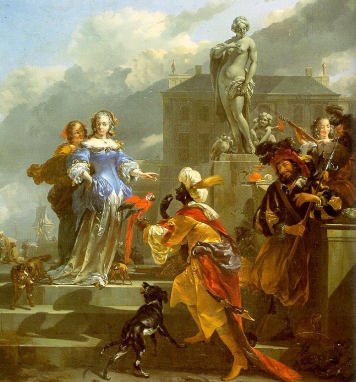
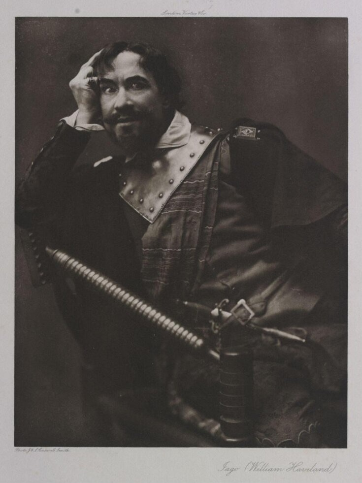
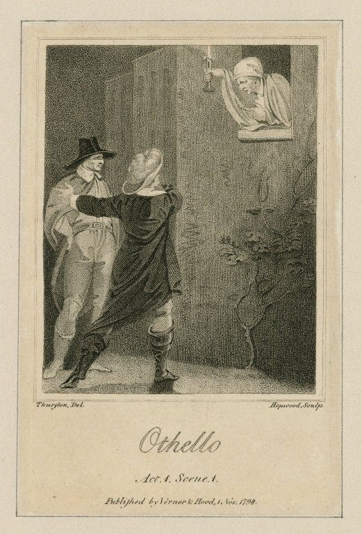

# Othello

## The Globe

{width="600"}
/// caption
The Globe Recreation Today
///

{width="600"}
/// caption
Sketch of how the original Globe looked like
///

## The Moor
{width="500"}
/// caption
Nicolaes Berchem, *A Moor Offering a Parrot to a Lady* (1660-70)
///

{width="300"}
/// caption
William Havilland as Iago (late 19th or early 20th century). His portrait picks up on the Vice tradition
///

## The Paintings

These paintings of Moors contemporeanous with the play show us how Othello might've been represented.

{width="400"}
/// caption
Jan Jansz Mostaert, *Portrait of an African Man (Christophle le More?)* (c. 1474-1552) 
///

{width="400"}
/// caption
Peter Paul Rubens, *Mulay Ahmad* (c. 1609)
///

{width="400"}
/// caption
Georgius Jehner von Orlamünde, Members of the Theban Legion
///

### Definition of a Moor

> a native or inhabitant of ancient Mauretania, a region of North Africa corresponding to parts of present-day Morocco and Algeria. Later usually: a member of a Muslim people of mixed Berber and Arab descent inhabiting northwestern Africa (now mainly present-day Mauritania), who in the 8th cent. conquered Spain. In the Middle Ages, and as late as the 17th cent., the Moors were widely supposed to be mostly black or very dark- skinned, although the existence of ‘white Moors’ was recognized. Thus the term was often used, even into the 20th cent., with the sense ‘black person.’ (*Oxford English Dictionary*, 2nd Ed.)

### Samuel Taylor Coleridge

Samuel Taylor Coleridge questioned Othello’s blackness in 1818, arguing for a light-skinned portrayal. This influenced the “Bronze Age of Othello,” a period when Othello was depicted as non-black.

> Can we imagine him [Shakespeare] so utterly ignorant
as to make a barbarous negro plead royal birth, – at a
time, too, when negroes were not known except as
slaves? . . . Besides, if we could in good earnest believe Shakespeare ignorant of the distinction [between a Moor and a ‘negro’], still why should we adopt one disagreeable possibility instead of a ten times greater and more pleasing probability? It is a common error to mistake epithets applied by the dramatis personae to each other as truly descriptive of what the audience ought to see or know. No doubt Desdemona saw Othello’s visage in his mind; yet, as we are constituted, and most surely as an English audience was disposed in the beginning of the seventeenth century, it would be something monstrous to conceive this beautiful Venetian girl falling in love with a veritable negro. It would argue a disproportionateness, a want of balance, in Desdemona, which Shakespeare does not appear to have in the least contemplated. (Coleridge, 385–6)

{width="400"}
/// caption
Roderigo: Sir your daughter has made...
///

{width="400"}
/// caption
Roderigo: Sir your daughter has made...
///

{width="400"}
/// caption
Roderigo: Sir your daughter has made...
///

{width="500"}
/// caption
William Salter, *Othello's Lamentation* (1857)
///

{width="400"}
/// caption
Roderigo: Sir your daughter has made...
///

{width="400"}
/// caption
Poster for an 1884 production starring Thomas Keene
///

{width="400"}
/// caption
Paul Robeson in the Savoy Theatre London production
///

{width="600"}
/// caption
Christopher Plummer as Iago and James Earl Jones as Othello in the Delacorte Theater, New York 1964 production
///

## Hugh Quarshie

> if a black actor plays Othello does he not risk making
racial stereotypes seem legitimate and even true? When
a black actor plays a role written for a white actor in
black make-up and for a predominantly white audience,
does he not encourage the white way, or rather the
wrong way, of looking at black men, namely that black
men, or ‘Moors’, are over- emotional, excitable and
unstable. . . . Of all parts in the canon, perhaps Othello is the one which should most defi nitely not be played by a black actor.

{width="600"}
/// caption
Frank Finlay as Iago and Laurence Olivier as Othello in the Stuart Burge film adaptation (1965)
///