# The Canterbury Tales:  The General Prologue

## The Spring Opening (lines 1-18)

```
Whan that Aprill with his shoures sote
The droghte of Marche hath perced to the rote,
And bathed ­ every veyne in swich licour,
Of which vertu engendred is the flour;
Whan Zephirus eek with his swete breeth
Inspired hath in ­ every holt and heeth
The tendre croppes, and the yonge sonne
Hath in the Ram his halfe cours y-­ ronne;
And smale fowles maken melodye,
That slepen al the night with open yë—
So priketh hem Nature in hir corages-
Than longen folk to goon on pilgrimages,
And palmeres for to seken straunge strondes,
To ferne halwes, couthe in sondry londes;
And specially, from ­ every shires ende
Of Engelond to Caunterbury they wende,
The holy blisful martir for to seke,
That hem hath holpen, whan that they­ were seke.
```


## The Pilgrims

### The Knight

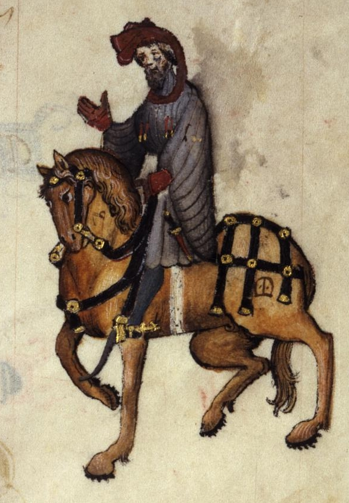

> Estava lá um Cavaleiro, um homem muito digno, que, desde que principiara a montar, amava a Cavalaria, a lealdade e a honra, a cortesia e a generosidade. Valente nas guerras de seu suserano, embrenhara-se mais do que ninguém pela Cristandade e pelas terras dos pagãos, sempre reverenciado pelo seu valor. (...) E, apesar de toda essa bravura, ele era prudente, e modesto na conduta como uma donzela. De fato, jamais em sua vida dirigiu palavras rudes a quem quer que fosse. Era um legítimo Cavaleiro, perfeito e gentil. Quanto aos bens que ostentava, tinha excelentes cavalos, mas o traje era discreto: o gibão que vestia era de fustão, manchado aqui e ali pela ferrugem da cota de malha. Regressara, havia pouco, de mais uma campanha, partindo em peregrinação logo em seguida. (trad. Paulo Vizioli)

### The Squire

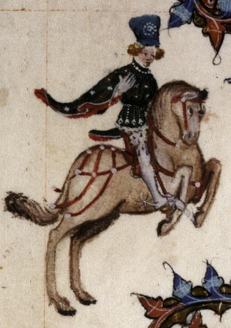

> Fazia-se acompanhar do filho, um jovem Escudeiro, um aspirante à Cavalaria, galante e fogoso, de cabelos com tantos caracóis que pareciam frisados. Calculo que devia ter uns vinte anos. Era de altura mediana, aparentando possuir notável agilidade e grande força. Já havia servido em combates na Flandres, no Artois e na Picardia, e, não obstante o pouco tempo, dera provas de coragem, tentando conquistar as graças de sua dama. Recoberto de bordados, parecia um prado cheio de lindas flores, brancas e vermelhas. Passava os dias a cantar e a tocar flauta, e tinha o frescor do mês de maio. Envergava um saio curto, com mangas longas e bufantes. Montava e cavalgava com destreza, compunha versos e com arte os declamava, sabia justar e dançar e desenhar e escrever. Amava com tal ardor que, à noite, dormia menos do que um rouxinol. Era cortês, humilde e prestativo; e à mesa trinchava para o pai.

### The Yeoman

> O Cavaleiro também tinha consigo um Criado, e mais nenhum outro serviçal nessa ocasião, pois assim preferia cavalgar. Vestia este um brial e um capuz de cor verde. Na mão trazia um arco possante e, à cinta, um feixe bem atado de flechas com plumas de pavão, luzentes e pontiagudas (cuidava bem de seu equipamento, não deixando setas soltas, caindo com as penas baixas). Com sua cabeça raspada e o rosto queimado de sol, era perito nas artes do caçador. Protegia o pulso com uma braçadeira colorida; pendiam-lhe do flanco uma espada e um broquel; e no outro lado se via um belo punhal, de bom acabamento, aguçado como ponta de lança. No peito, uma medalha de São Cristóvão, de prata reluzente. Trazia, enfim, um corno de caça, preso a um verde boldrié. Na verdade, tudo indicava que era um couteiro.

### The Prioress

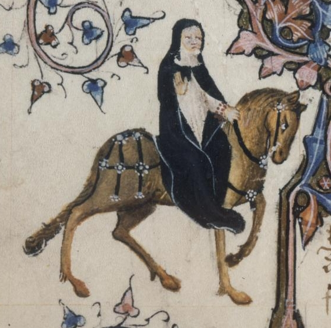

> Nos hábitos corteses achava a sua maior satisfação. Limpava tanto o lábio superior que, quando acabava de beber, não se via em seu copo nenhum sinal de gordura. E com que graça estendia a mão para apanhar as iguarias! Sem dúvida, era uma pessoa de ânimo alegre, agradável e sempre gentil na conduta, esforçando-se por imitar as etiquetas da corte a fim de adquirir boas maneiras e merecer a consideração de todos. Falando agora de sua consciência, era tão caritativa e piedosa que seria capaz de chorar se visse um rato morto ou a sangrar na ratoeira. Costumava alimentar os seus cãezinhos com carne assada ou com pão branquinho e leite; mas desfazia-se em pranto se um deles morresse ou levasse uma paulada. Era toda compaixão e ternura! Um amplo véu, com muitas dobras, envolvia-lhe a cabeça; seu nariz era reto, seus olhos, cinza-azulados como o vidro; a boca era pequena, vermelha e macia; e tinha uma bela testa, com quase um palmo de largura, eu creio (pois ela, certamente, não era um tipo miúdo). Pude notar também que sua capa era distinta; e que, em volta do braço, trazia um rosário de delicado coral, com as contas maiores — as contas do Padre-Nosso — de cor verde. Dele pendia um medalhão brilhante de ouro, onde se distinguiam um A, debaixo de uma coroa, e a escrita Amor vincit omnia.

### The Nun and Three Priests

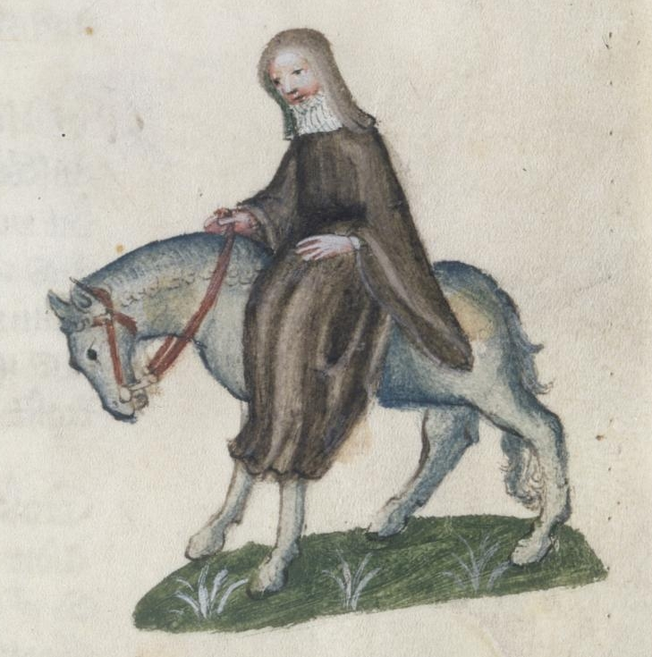

### The Monk

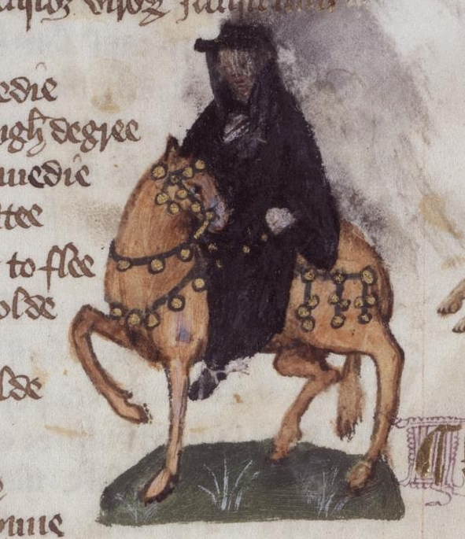

> E havia um Monge, personalidade verdadeiramente modelar, inspetor das propriedades do mosteiro e apaixonado pela caça, um homem másculo, que daria um bom Abade. No estábulo mantinha soberbos ca­valos; e, quando cavalgava, os guizos de seus arreios tilintavam claro e forte no sussurrar da brisa, lembrando o sino da capela onde ele era Prior. Considerando antiquadas e algo rigorosas as regras de São Mauro ou de São Bento, esse Monge deixava de lado as velharias e seguia o modo de vida dos novos tempos. (...) E eu disse que concordava com sua opinião: afinal, para que estudar no mosteiro e ficar louco em cima de algum livro, ou trabalhar com as próprias mãos e mourejar de sol a sol, como ordenou Santo Agostinho? Se fosse assim, quem iria servir ao mundo? Santo Agostinho que vá ele próprio trabalhar! (...) Era um senhor gordo, de muito boa presença. Seus olhos arregalados não paravam de mover-se, reluzentes como as chamas da fornalha debaixo do caldeirão. Os seus sapatos macios, o seu cavalo saudável; tudo mostrava que ele era um grande prelado. De fato, não tinha nada da palidez das almas atormentadas. Um cisne gordo era o assado de sua preferência. Seu palafrém era escuro como a framboesa madura.

### The Friar

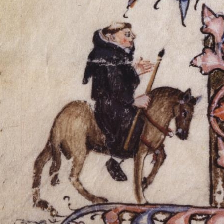

> Em todas as quatro ordens não havia ninguém que conhecesse melhor as artes do mexerico e da linguagem florida; e para as mocinhas que seduzia ele arranjava casamento às próprias custas. Era um nobre pilar de sua irmandade! Conquistara a estima e a intimidade de todos os proprietários de terras de sua região, assim como de respeitáveis damas da cidade — pois, conforme ele mesmo fazia questão de proclamar, por licença especial de sua ordem tinha poder de confissão maior que o do próprio cura. Ouvia sempre com grande afabilidade os pecadores; e agradável era a sua absolvição. Toda vez que esperava polpudas doações, eram leves as penitências que impunha, porque, do seu ponto de vista, nada melhor para o perdão de um homem que a sua generosidade para com as ordens mendicantes: quando alguém dava, costumava jactar-se, sabia logo que o arrependimento era sincero. Pois muita gente tem o coração tão duro que, mesmo sofrendo muito intimamente, não é capaz de chorar. Por isso, em vez de preces e prantos, é prata o que se deve ofertar aos pobres frades.

> (...)

> Sua capa andava recheada de faquinhas e fivelas para as mulheres bonitas; e, sem dúvida, melodiosa era a sua voz. Sabia cantar e dedilhar as cordas de uma rota, vencendo facilmente os torneios de baladas. (...) Conhecia bem as tavernas de todas as cidades, e tinha mais familiaridade com taverneiros e garçonetes que com lazarentos e mendigas. Não ficava bem para um homem respeitável de sua posição privar com leprosos doentes: lidar com esse rebotalho não trazia nem bom-nome nem proveito; por isso, preferia o contato com os abonados e os negociantes de mantimentos. Onde alguma vantagem pudesse vislumbrar, mostrava-se sempre cortês e prestativo. Não existia no mundo alguém mais capaz: era o melhor pedinte de seu convento! (...) E como parecia um cachorrinho novo em suas estripulias! Além disso, nos “dias do amor” ele era muito útil, graças ao respeito que incutia, pois não lembrava um frade enclausurado — com as roupas andrajosas de algum pobre clérigo — mas sim um Mestre, ou mesmo um Papa. Seu hábito curto era de lã de fio duplo, redondo com um sino saído da fundição. Como era afetado, ciciava um pouquinho ao falar, para tornar mais doce o seu inglês; e ao tocar harpa, nos intervalos do canto, seus olhos cintilavam como estrelas numa noite fria.

### The Merchant

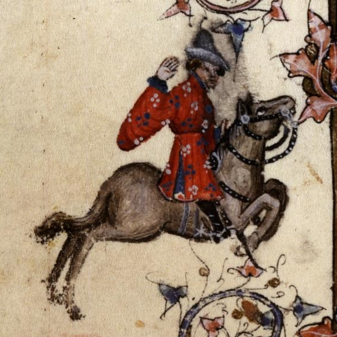

> Fazia parte da comitiva um Mercador, de barba bifurcada e roupa de várias cores. Vinha montado numa sela alta, e trazia na cabeça um chapéu flamengo feito de pele de castor. As fivelas de suas botas eram finas e elegantes. Manifestava as suas opiniões em tom solene, sempre falando em aumentar os lucros. Achava que o trecho de mar entre Mid­dleburg, na Holanda, e Orwell, na Inglaterra, devia ser protegido contra a pirataria a qualquer custo. Dava-lhe bons retornos o câmbio ilegal. Esse respeitável senhor, de fato, tinha tino comercial: conduzia os seus negócios com tamanha dignidade, com as suas vendas e os seus empréstimos, que ninguém diria que estava cheio de dívidas. Apesar de tudo, no entanto, era uma excelente pessoa. Só que, para dizer a verdade, não sei como se chamava.

### The Clerk

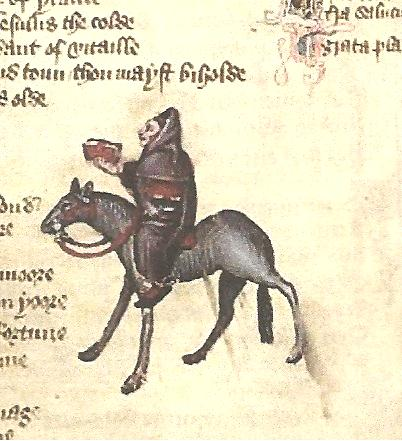

> E havia um Estudante de Oxford, que por muitos anos vinha se dedicando à Lógica. Montava um cavalo magro como um ancinho; e ele próprio, asseguro-lhes, não era nada gordo, com aqueles olhos encovados e seu jeito taciturno. Vestia uma capa toda puída, pois ainda não se tornara clérigo para merecer as vantagens de uma prebenda, e já não se achava tão ligado ao mundo para exercer ofícios seculares. Preferia ter à cabeceira de sua cama vinte livros de Aristóteles e sua filosofia, encadernados em preto ou em vermelho, a possuir ricos mantos, ou rabecas, ou um alegre saltério. Mas, não dispondo da pedra filosofal, apesar de ser filósofo, continuava com o cofre quase vazio. Tudo o que os amigos lhe emprestavam gastava em livros e aprendizagem, rezando constantemente pelas almas dos que contribuíam para a sua formação. Seus esforços e cuidados concentravam-se todos no estudo. Não dizia uma palavra mais que o necessário, e sua fala, serena e ponderada, era breve e precisa e cheia de pensamentos elevados, sempre voltados para a virtude moral. E aprendia com prazer, e com prazer ensinava.

### The Sergeant of Law

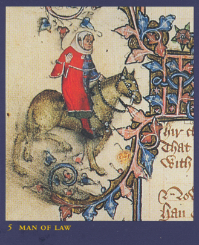

> Um Magistrado, sábio e cauteloso, que no passado frequentara muito o pórtico da igreja de São Paulo, também vinha conosco, um jurista de reconhecida competência. Da sensatez de suas palavras podia-se inferir que se tratava de um homem ponderado e digno de todo o respeito. Por diversas vezes exercera a função de juiz itinerante, com carta patente do Rei e com plena comissão. Graças à sua erudição e ao seu renome, colecionava gratificações e finos mantos. Em parte alguma haveria maior comprador de terras. E tudo negociado sem problemas de hipotecas ou quaisquer vícios legais. Nem havia em parte alguma homem mais ocupado — se bem que fosse menos ocupado do que fazia crer. Conhecia todos os casos e sentenças, desde os tempos de Guilherme, o Conquistador; e, conhecendo os precedentes, instruía muito bem os seus processos, e ninguém lhe criticava os pareceres. Sabia todos os estatutos de cor. Envergava um saio despretensioso, de fazenda de cor mista, preso por uma cinta de seda com listinhas enviesadas. E quanto à sua indumentária é o suficiente.

### The Franklin (O Proprietário de Terras): lines 331-360

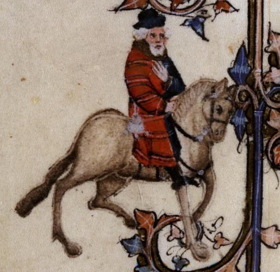

> Integrava igualmente a comitiva um Proprietário de Terras alo­diais, de barba branca como a margarida e compleição sanguínea. De manhã seu alimento favorito era pão embebido em vinho. Aliás, sua maior preocupação era agradar aos sentidos, pois era um legítimo filho de Epicuro, para quem a felicidade perfeita e verdadeira se encontra apenas nos prazeres. Era um anfitrião extraordinário, o São Julião de sua terra. Seu pão e sua cerveja não podiam ser melhores, e ninguém tinha adega tão fornida como a sua. Em sua casa não faltavam assados de peixe e de carne, e em tais quantidades, que ali parecia nevar comidas e bebidas e todas as delícias imagináveis. (...) Era ele quem presidia às reuniões dos juízes de paz; e mais de uma vez fora representante do condado no Parlamento. Pendentes do cinto, branco como o leite da manhã, trazia um punhal e uma bolsa toda de seda. Também tinha ocupado os cargos de xerife e de auditor. Não se poderia achar vassalo mais respeitável.


### The Five Guildsmen (Os cinco artesãos): lines 361-378

> Tínhamos em seguida um Armarinheiro, um Carpinteiro, um Tecelão, um Tintureiro e um Tapeceiro, todos vestidos com a mesma libré de uma importante e grande confraria. Suas ferramentas polidas eram novas em folha; os engastes de suas facas não eram de bronze, mas inteiramente de prata; e seus cintos e bolsas eram trabalhados com arte até nos pormenores. Cada um deles parecia um bom burguês, digno de tomar assento no estrado da sala de sua corporação ou de tornar-se, com sua perspicácia, membro da câmara de sua cidade. Todos dispunham de posses e rendas para tanto. E suas esposas bem que concordariam com isso (a menos que fossem tolas), pois não há mulher que não goste de ser chamada de “Madame” e de encabeçar as procissões, nas vigílias dos dias santos, com um manto às costas igual a uma rainha.


### The Cook (O Cozinheiro): lines 379-387

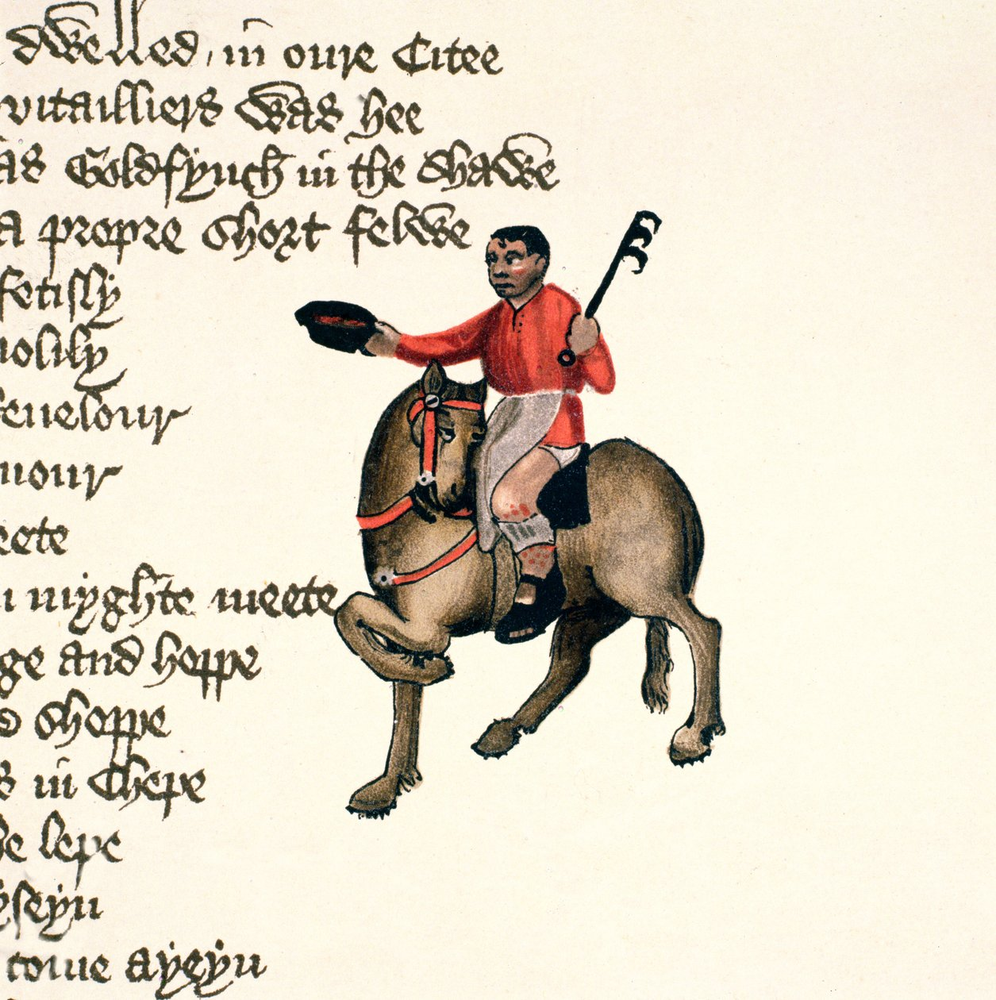

> Naquela ocasião, traziam consigo um Cozinheiro, para que não lhes faltasse o seu cozido de galinha com ossos de tutano, temperado com pimenta moída e ciperácea. Esse Mestre Cuca era profundo conhecedor da cerveja londrina. Sabia assar e cozer e grelhar e fritar, assim como preparar terrinas apetitosas e belas tortas. Mas me deu muita pena ver que tinha uma úlcera na canela da perna... A carne com molho branco que fazia era das melhores.


### The Shipman (O Homem do Mar): lines 388-410

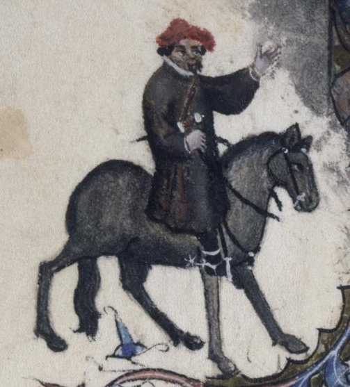

> Também nos acompanhava um Homem do Mar, um capitão de navio, originário do oeste do país... (...) Não tendo prática de cavalgar, montava o seu rocim do jeito que podia, metido num saio grosseiro de frisa, comprido até os joelhos. (...) O sol de verão tornara-lhe a pele morena. Era, sem dúvida, um bom sujeito. Toda vez que voltava de Bordeaux, aproveitava as ocasiões em que o Mercador dormia para surripiar-lhe parte de seu vinho. Na verdade, não tinha muitos escrúpulos de consciência: sempre que travava uma batalha, se fosse vencedor, soltava os prisioneiros jogando-os no alto-mar. Mas é preciso reconhecer que era um profissional muito competente, e não havia ninguém, de Hull a Cartagena, que calculasse melhor as marés, as correntes e os imprevistos que o cercavam, ou entendesse tão bem de atracação, luas e pilotagem. Era audacioso e astuto em suas decisões, pois muitas tempestades já tinham sacudido sua barba. Conhecia como a palma de sua mão todos os portos, desde Gotland no mar Báltico ao cabo Finisterra, bem como cada reen­trância nas costas espanholas e bretãs. Seu barco era o “Madalena”.


### The Physician (The Doctor of Medicine / O Médico): lines 411-444

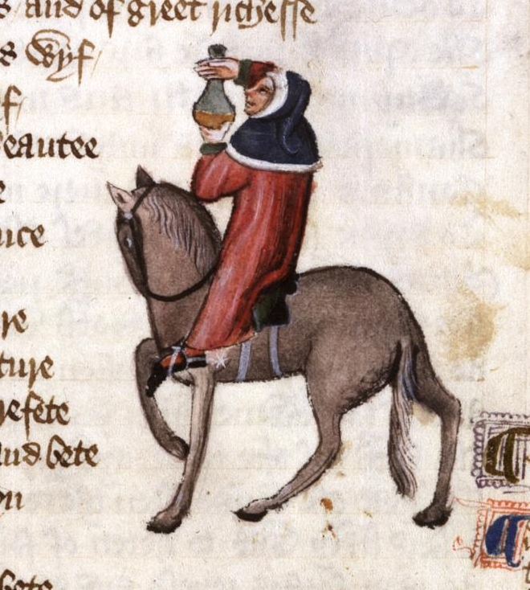

> Não havia no mundo maior especialista em cirurgia e medicina, tudo com boa base na astrologia, para poder orientar os seus pacientes sobre as horas mais propícias à cura por magia natural. Assim sendo, indicava-lhes com precisão os amuletos que deveriam usar, de acordo com os seus ascendentes. Sabia a causa de todas as doenças — de natureza quente ou fria ou seca ou úmida — e como se manifestava, e qual o seu fluxo humoral. Era um doutor irrepreensível, um médico de verdade. Descoberta a origem da enfermidade e a raiz do mal, receitava imediatamente as suas mezinhas. Seus boticários, sempre de prontidão, logo lhe mandavam drogas e remédios os mais diversos, porque essas duas classes sempre se ajudaram mutuamente, numa amizade muito antiga e proveitosa. (...) Seguia um regime alimentar bastante moderado, evitando os excessos e comendo apenas o que fosse nutriente e de fácil digestão. Quase nunca lia a Bíblia. O seu traje azul-céu e vermelho-sangue era todo guarnecido de cendal e tafetá. Isso não quer dizer que fosse perdulário, pois soube economizar muito bem o que ganhara durante a epidemia de peste. Como na medicina o pó de ouro é tido como remédio, demonstrava pelo ouro particular devoção.


### The Wife of Bath (A Mulher de Bath): lines 445-476

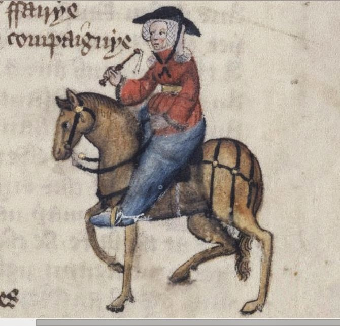

> Tinha tanta experiência como fabricante de tecidos que seus panos superavam os produzidos em Ypres e Gant. Nenhuma paroquiana ousava passar-lhe à frente na fila dos devotos que levavam ofertas à caixa de coleta, pois, se o fizesse, ela certamente ficaria furiosa, perdendo por completo as estribeiras. O capeirote, que aos domingos colocava na cabeça, era da melhor fazenda, e tão cheio de dobras, que eu juraria que pesava umas dez libras. De belo escarlate eram suas calças, bem justas, e seus sapatos eram de couro macio e ainda úmido de tão novo. Tinha um rosto atrevido, bonito e avermelhado. Havia sido em toda a vida uma mulher de respeito: tivera cinco maridos à porta da igreja — além de alguns casos em sua juventude (mas disso não é preciso falar agora). Em suas peregrinações já estivera três vezes em Jerusalém, atravessando muitos rios estrangeiros; também visitara Roma, Boulogne-sur-Mer, Colônia e Santiago de Compostela. Aprendeu muito nessas andanças. (...) Escondia os avantajados quadris com uma sobressaia, e nos seus pés se via um par de esporas pontiagudas. Em companhia, ria e tagarelava sem parar. Tinha remédios para todos os males de amor, pois dessa arte conhecia a velha dança.


### The Parson (O Pároco): lines 477-528

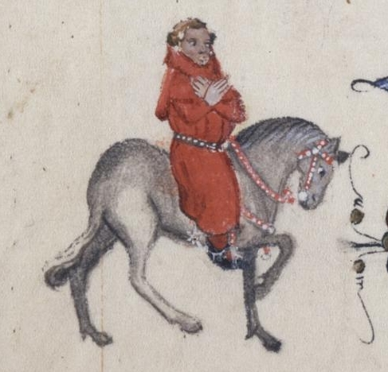

> ... Bondoso, e extraordinariamente dedicado, era paciente na adversidade — como o demonstrou em várias ocasiões. Insurgia-se à ideia de arrancar os seus dízimos com ameaças de excomunhão, preferindo mil vezes repartir as coletas da igreja e os próprios bens pessoais com os pobres do seu rebanho, pois com pouco se contentava. Sua paróquia era enorme, com casas muito apartadas. Nem por isso deixava ele, chovesse ou trovejasse, de visitar na doença e na desgraça seus mais distantes paroquianos, grandes e humildes, deslocando-se a pé e apoiando-se num bastão. O nobre exemplo que dava era que primeiro se deve praticar, para depois ensinar. A essas palavras, tiradas do Evangelho, acrescentava esta figura: se o ouro enferrujar, o que será do ferro? (...) Ele era um pastor, não um mercenário. E, embora fosse santo e virtuoso, jamais desprezou os pecadores ou falou com empáfia e arrogância, mas ensinava com humildade e amor, para atrair as pessoas ao Céu apenas com a força de seu bom exemplo. (...) Creio que nunca no mundo houve sacerdote melhor: não exigia pompa ou reverência, nem era um moralista intransigente; apenas ensinava as palavras de Cristo e dos seus doze Apóstolos, antes seguindo ele próprio o que ensinava.


### The Plowman (O Lavrador): lines 529-541

> Acompanhava-o seu irmão, um Lavrador, que já carregara muito esterco em sua vida. Era um trabalhador honesto e bom, vivendo em paz e praticando a caridade. Acima de tudo amava a Deus de todo o coração, na alegria e na tristeza; e, depois, amava o próximo como a si mesmo. Por amor a Jesus, ajudava aos mais pobres sempre que possível, joeirando, abrindo valas e cavando para eles, sem nada receber em troca. Pagava à Igreja todos os dízimos na íntegra, seja com seu trabalho, seja com os seus bens. Vinha montado numa égua, envolto por um tabardo.


### The Miller (O Moleiro): lines 545-566

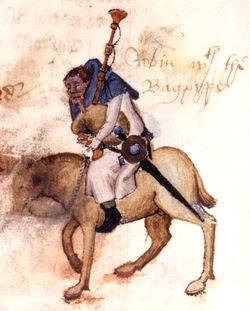

> O Moleiro, para começar, era um gigante. Enorme de músculos e de ossos, mostrava muito bem sua força nas lutas que disputava, sempre ganhando o carneiro oferecido como prêmio. Era entroncado e taludo, um colosso de encrenqueiro. Não havia porta que não pudesse arrancar do batente, ou, numa investida, quebrar com a cabeça. A barba, com a largura de uma pá, era arruivada como os pelos da porca ou da raposa. Tinha uma verruga bem no espigão do nariz, encimada por um tufo de cabelos vermelhos como as cerdas nas orelhas de uma porca. As narinas eram antros de negrura; e a boca, grande como uma grande fornalha. Prendia na cinta uma espada e um broquel. Sendo tagarela e boca-suja, vivia contando histórias de pecado e sacanagem. Roubava trigo, tirando para si três vezes mais farinha do que permitia a lei; e o fazia desviando-a com seu “polegar de ouro”, que todo Moleiro tem. Vestia um saio branco e um gorro azul. Tocava a gaita de foles com entusiasmo; e foi assim que, à frente da comitiva, guiou-nos para fora da cidade.


### The Manciple (O Provedor): lines 567-586

> ... um homem que todos os intendentes deveriam imitar, se quisessem aprender como se compram mantimentos. De fato, pagando à vista ou a prazo, ele observava tudo com muita atenção, e sempre se saía bem nas transações. Será que não é por alguma graça de Deus que homens sem cultura, como ele, conseguem com a astúcia sobrepor-se à sabedoria de tantos homens instruídos? Afinal, seus patrões, na corporação de advogados onde trabalhava, eram mais de trinta, todos profundos e hábeis conhecedores da lei. Além disso, pelo menos uma dúzia deles saberia muito bem exercer o cargo de senescal de renda e terras para qualquer senhor da Inglaterra, que assim poderia, sem dívidas (a menos que não tivesse juízo), viver folgado com os seus próprios recursos, ou, se preferisse, viver com frugalidade. E mais, eles tinham competência até para colaborar na administração de um condado, prontos para o que desse e viesse. No entanto, o nosso Provedor ludibriava a todos!


### The Reeve

### The Summoner

### The Pardoner

### The Host

## Chaucer's Narrative Methodology
