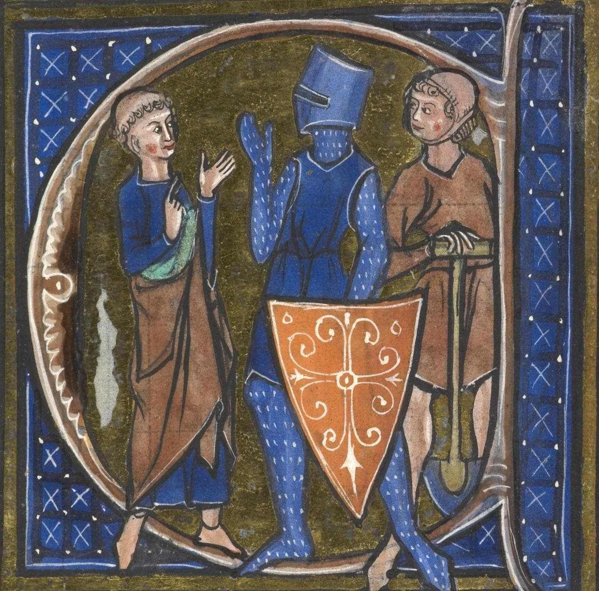
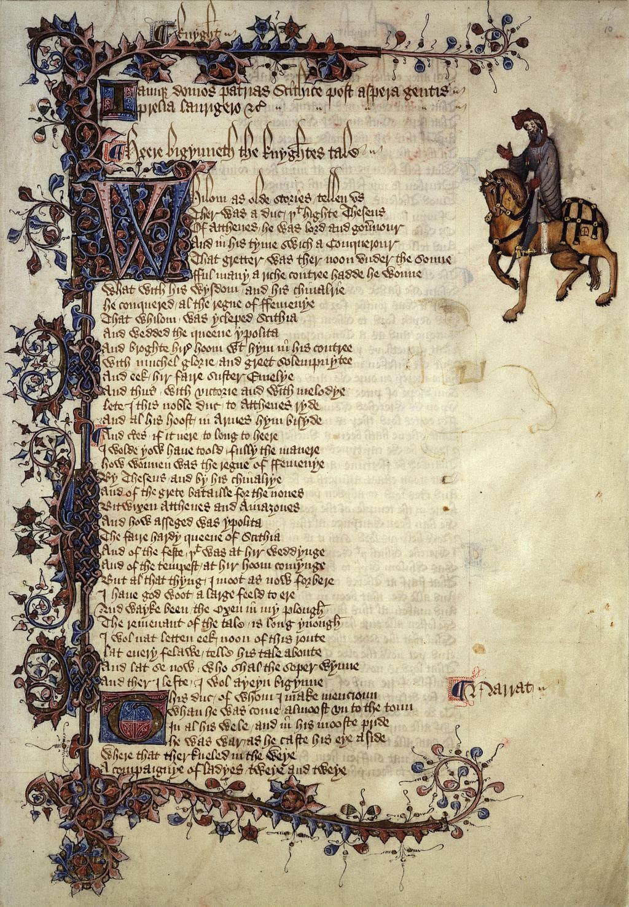
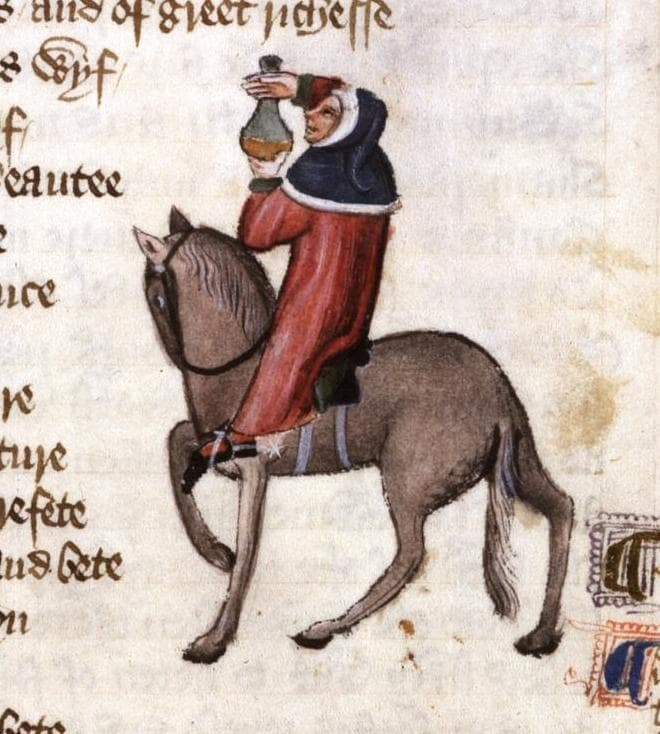
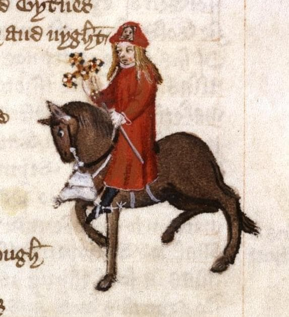

# English Literature I
## The Canterbury Tales
### The General Prologue

Prof. Pedro Groppo, UFPB


---

## Genre: Estates Satire

### Medieval System of the Three Estates (Ancien Régime)

| Estate | Function | Ideal |
|--------|--------|-------|
| **Those Who Pray** | Intercede | Parson |
| **Those Who Fight** | Protect | Knight |
| **Those Who Work** | Sustain | Plowman |

The estates satire is a widespread medieval genre that analyzes society by enumerating classes or professions and showing how they fall short of an ideal



---

## How does Chaucer differ from the tradition?

- Focuses on single individuals (e.g., "a Friar, not friars in general") though pilgrims are still primarily known by their profession
- Increases historical authenticity by choosing professions one would find realistically, like franklins, dyers, shipmen, manciples, and summoners, rather than kings or cardinals
- Uses irony through superlatives, often stating that pilgrims are "the best of their kind". 
- Moral judgment shifts to the reader's interpretation of cues


---

## Structure of the General Prologue

- The General Prologue shows how the tales came to be told and introduces the characters

1. **Opening** (lines 1-18)
2. **Portraits** (lines 19-714)
3. **Contest** (lines 715-858)

- Character arrangement follows **social hierarchy** with significant exceptions that reveal tensions
- The content of individual portraits varies, focusing on appearance, past life, self-image, ethics, or tastes

.jpg)

---

## The Opening: Middle English (Lines 1-18):
```
Whan that Aprill with his shoures sote
The droghte of Marche hath perced to the rote, 
And bathed ­every veyne in swich licour,
Of which vertu engendred is the flour; 
Whan Zephirus eek with his swete breeth 
Inspired hath in ­every holt and heeth
The tendre croppes, and the yonge sonne 
Hath in the Ram his halfe cours y-­ronne;
And smale fowles maken melodye, 
That slepen al the night with open yë— 
So priketh hem Nature in hir corages-
Than longen folk to goon on pilgrimages, 
And palmeres for to seken straunge strondes,
To ferne halwes, couthe in sondry londes; 
And specially, from ­ every shires ende
Of Engelond to Caunterbury they wende,
The holy blisful martir for to seke, 
That hem hath holpen, whan that they ­were seke.
```

---

## The Opening (lines 1-6)

| Middle English | Literal Translation | Modern English |
|----------------------|------------------------------|----------------|
| `Whan that Aprill, with his shoures soote` | When [that] April with his showers sweet | When April with its sweet showers |
| `The droȝte of March hath perced to the roote` | The drought of March has pierced to the root | has drenched March's drought to the roots, |
| `And bathed every veyne in swich licour,` | And bathed every vein in such liquor, | filling every capillary with nourishing sap |
| `Of which vertu engendred is the flour;` | From which goodness is engendered the flower; | prompting the flowers to grow, |
| `Whan Zephirus eek with his sweete breeth` | When Zephyrus even with his sweet breath | and when Zephyrus with his sweet breath |
| `Inspired hath in every holt and heeth` | Inspired has in every holt and heath | has coaxed in every wood and dale, to sprout |

---

## The  Opening (lines 7-10)

| Middle English | Literal Translation | Modern English |
|----------------------|------------------------------|----------------|
| `The tendre croppes, and the yonge sonne` | The tender crops; and the young sun | the tender plants, as the springtime sun |
| `Hath in the Ram his halfe cours yronne,` | Has in the Ram his half-course run, | passes halfway through the sign of Aries, |
| `And smale foweles maken melodye,` | And small birds make melodies, | and small birds that chirp melodies, |
| `That slepen al the nyght with open ye` | That sleep all night with open eyes | sleep all night with half-open eyes |

---

## The Opening (lines 11-14)

| Middle English | Literal Translation | Modern English |
|----------------------|------------------------------|----------------|
| `(So priketh hem Nature in hir corages);` | (So Nature prompts them in their courage); | their spirits thus aroused by Nature; |
| `Thanne longen folk to goon on pilgrimages` | Then folk long to go on pilgrimages. | it is at these times that people desire to go on pilgrimages |
| `And palmeres for to seken straunge strondes` | And pilgrims (palmers) [for] to seek new strands | and pilgrims (palmers) seek new shores |
| `To ferne halwes, kowthe in sondry londes;` | To far-off shrines (hallows), respected (couth, known) in sundry lands; | and distant shrines venerated in other places. |

---

## The Opening (lines 15-18)

| Middle English | Literal Translation | Modern English |
|----------------------|------------------------------|----------------|
| `And specially from every shires ende` | And specially from every shire's end | Particularly from every county |
| `Of Engelond, to Caunterbury they wende,` | Of England, to Canterbury they went, | from England, they go to Canterbury, |
| `The hooly blisful martir for to seke` | The holy blissful martyr [for] to seek, | in order to visit the holy blessed martyr, |
| `That hem hath holpen, whan that they were seeke.` | That has helped them, when [that] they were sick. | who has helped them when they were sick. |

---

### The Opening (lines 1-18)

- Reverdie: Spring song established genre in medieval literature
  - Ex: *Roman de la Rose* (translated by Chaucer) and *Piers Plowman* (William Langland) also begin with spring scenes
- Prologue begins with Western celebration of spring (general) and focuses on a local event of English society and Christendom (specific)
- Evolution from a natural activity to a human activity


---

**Secular Impulse**
- Spring awakens the natural desire for movement and renewal and human desire matches natural cycles
- After winter confinement, people want to travel and go on holiday 

**Sacred Impulse**
- People seek spiritual healing from saint
- Pilgrimage as religious duty and gratitude

**Both impulses can coexist** - the secular desire for renewal and pleasure, and the sacred quest for healing


---

## The Narrator, Chaucer the Pilgrim (lines 19-42)

```
Bifel that, in that seson on a day, 
In Southwerk at the Tabard as I lay 
Redy to wenden on my pilgrimage 
To Caunterbury with ful devout corage
```
- Chaucer employs the persona of "Chaucer the pilgrim," a fictional narrator who ignores the significance of much of what he sees
- Apparently naive and tends to employ superlatives to describe various figures, even those devoid of genuine virtue, leading to irony and critical distance


---

## The Narrator: Chaucer the Pilgrim (lines 19-42)

- The narrator appears **naive and accepting** - he describes shocking behavior without seeming to understand what's wrong with it
- This lets Chaucer criticize corrupt religious figures **indirectly** - readers see the problems even when the narrator doesn't
- Chaucer creates **three levels of understanding** that work at the same time:

1. **What each character thinks about themselves** → often shows self-deception and vanity
2. **What the narrator tells us** → sounds like praise but includes damaging details  
3. **What the reader actually sees** → the truth behind the appearances

---

# The Pilgrims' Portraits
## From the Knight to the Pardoner



---

## The Knight (43-78)

```
A Knight ther was, and that a worthy man,
That fro the tyme that he first bigan 
To ryden out, he loved chivalrye, 
Trouthe and honour, fredom and curteisye.
```

- Function of a knight: defense of Christendom through arms, maintain social order as elite warrior of feudal hierarchy.
- One of the few pilgrims described **without irony** by Chaucer, representing the medieval Christian ideal, with the Crusades as legitimate holy wars
- Sets up an ideal of perfectibilty to help us see how the others fall short


---

## O Cavaleiro / The Knight (Trad. Paulo Vizioli)

> Estava lá um Cavaleiro, um homem muito digno, que, desde que principiara a montar, amava a Cavalaria, **a lealdade e a honra, a cortesia e a generosidade**. Valente nas guerras de seu suserano, embrenhara-se mais do que ninguém pela Cristandade e pelas terras dos pagãos, sempre reverenciado pelo seu valor. (...) E, apesar de toda essa bravura, ele era **prudente, e modesto na conduta como uma donzela. De fato, jamais em sua vida dirigiu palavras rudes a quem quer que fosse.** Era um l**egítimo Cavaleiro, perfeito e gentil**. Quanto aos bens que ostentava, tinha excelentes cavalos, mas **o traje era discreto: o gibão que vestia era de fustão, manchado aqui e ali pela ferrugem da cota de malha**. Regressara, havia pouco, de mais uma campanha, partindo em peregrinação logo em seguida.

---

## The Squire (79-100)

```
Embrouded was he, as it­ were a mede
Al ful of fresshe floures, whyte and rede.
Singinge he was, or floytinge, al the day; 
He was as fresh as is the month of May.
```
- Young courtly lover (art, music, embroidery, youth) in contrast to his father, Christian warrior (crusades, modesty, experience)
- Skilled in courtly accomplishments like singing, playing flute, versifying, jousting, dancing, drawing and writing
- Represents the other side of chivalry: romantic love and artistic refinement rather than religious duty and warfare


---

## O Escudeiro / The Squire (Trad. Paulo Vizioli)

> Fazia-se acompanhar do filho, um jovem Escudeiro, um aspirante à Cavalaria, galante e fogoso, de cabelos com tantos caracóis que pareciam frisados. Calculo que devia ter uns vinte anos. Era de altura mediana, aparentando possuir notável agilidade e grande força. Já havia servido em combates na Flandres, no Artois e na Picardia, e, não obstante o pouco tempo, **dera provas de coragem, tentando conquistar as graças de sua dama.** **Recoberto de bordados, parecia um prado cheio de lindas flores, brancas e vermelhas. Passava os dias a cantar e a tocar flauta, e tinha o frescor do mês de maio.** Envergava um saio curto, com mangas longas e bufantes. **Montava e cavalgava com destreza, compunha versos e com arte os declamava, sabia justar e dançar e desenhar e escrever.** Amava com tal ardor que, à noite, dormia menos do que um rouxinol. Era **cortês, humilde e prestativo**; e à mesa trinchava para o pai.

---


## The Yeoman (101-117)

```
And on that other syde a gay daggere,
Harneised wel, and sharp as point of spere; 
A Cristofre on his brest of silver shene. 
An horn he bar, the bawdrik was of grene;
```
- The Knight's servant, **a forester** who travels with only the Knight and Squire
- **Portrait focuses entirely on external details**: his weapons, equipment, and Saint Christopher medal
- **Social position**: one step above a groom, represents the skilled working class who serve the nobility
- His well-maintained gear suggests **professional competence** and the Knight's ability to afford quality servants

---

## O Criado / The Yeoman (Trad. Paulo Vizioli)

> O Cavaleiro também tinha consigo um Criado, e **mais nenhum outro serviçal nessa ocasião, pois assim preferia cavalgar**. Vestia este um brial e um capuz de cor verde. Na mão trazia um arco possante e, à cinta, um feixe bem atado de flechas com plumas de pavão, luzentes e pontiagudas (cuidava bem de seu equipamento, não deixando setas soltas, caindo com as penas baixas). Com sua cabeça raspada e o rosto queimado de sol, era **perito nas artes do caçador**. Protegia o pulso com uma braçadeira colorida; pendiam-lhe do flanco uma espada e um broquel; e no outro lado se via um belo punhal, de bom acabamento, aguçado como ponta de lança. No peito, uma medalha de São Cristóvão, de prata reluzente. Trazia, enfim, um corno de caça, preso a um verde boldrié. Na verdade, tudo indicava que era um couteiro.[13]

---

## The Prioress (118-162)

```
At mete wel y-­taught was she with alle: 
She leet no morsel from hir lippes falle, 
Ne wette hir fingres in hir sauce depe.
Wel coude she carie a morsel, and wel kepe
That no drope ne fille upon hire brest.
```

- Nuns should dedicate themselves to prayer, charity and simplicity
- Focuses on refined etiquette instead of religious devotion; perhaps by imitation
- Description focuses on lady-like appearance and behavior
- Aspiring to aristocratic, potentially romantic, ideals
- Brooch: *AMOR* vs *CARITAS*


---

## A Prioresa / The Prioress (Trad. Paulo Vizioli)

> **Nos hábitos corteses achava a sua maior satisfação.** Limpava tanto o lábio superior que, quando acabava de beber, não se via em seu copo nenhum sinal de gordura. E com que graça estendia a mão para apanhar as iguarias! **Sem dúvida, era uma pessoa de ânimo alegre, agradável e sempre gentil na conduta, esforçando-se por imitar as etiquetas da corte a fim de adquirir boas maneiras e merecer a consideração de todos.** Falando agora de sua consciência, era tão caritativa e piedosa que **seria capaz de chorar se visse um rato morto ou a sangrar na ratoeira. Costumava alimentar os seus cãezinhos com carne assada ou com pão branquinho e leite**; mas desfazia-se em pranto se um deles morresse ou levasse uma paulada. Era toda compaixão e ternura! Um amplo véu, com muitas dobras, envolvia-lhe a cabeça; seu nariz era reto, seus olhos, cinza-azulados como o vidro; a boca era pequena, vermelha e macia; e tinha uma bela testa, com quase um palmo de largura, eu creio (pois ela, certamente, não era um tipo miúdo). Pude notar também que sua capa era distinta; e que, **em volta do braço, trazia um rosário de delicado coral, com as contas maiores — as contas do Padre-Nosso — de cor verde. Dele pendia um medalhão brilhante de ouro, onde se distinguiam um A, debaixo de uma coroa, e a escrita Amor vincit omnia.**


---

## Other religious figures: Another Nun and Three Priests (163-4)

```
Another Nonne with hire hadde she,
That was hir chapeleyne, and Preestes three.
```

- Chaucer does not individualize them; they function only as status symbols for the Prioress
- She travels as an aristocratic lady, not as a humble nun
- The silence about these characters contrasts with detailed descriptions of the corrupt


---

## The Monk (165-207)

```
The reule of Seint Maure or of Seint Beneit,
By cause that it was old and somdel streit,
This ilke monk leet olde thinges pace,
And held ­after the newe world the space.
```

- Monks take vows of poverty, chastity, silence, and obedience through cloistered asceticism and devotion
- This one disregards traditional monastic rules, using his own arguments to justify his worldly lifestyle
- Loves horses, hunting, and eating


---

## O Monge / The Monk (Trad. Paulo Vizioli)

> E havia um Monge, **personalidade verdadeiramente modelar, inspetor das propriedades do mosteiro e apaixonado pela caça, um homem másculo**, que daria um bom Abade. No estábulo mantinha soberbos ca­valos; e, quando cavalgava, **os guizos de seus arreios tilintavam claro e forte no sussurrar da brisa, lembrando o sino da capela** onde ele era Prior. Considerando antiquadas e algo rigorosas as regras de São Mauro ou de São Bento, esse Monge **deixava de lado as velharias e seguia o modo de vida dos novos tempos**. (...) E eu disse que concordava com sua opinião: afinal, **para que estudar no mosteiro e ficar louco em cima de algum livro, ou trabalhar com as próprias mãos e mourejar de sol a sol, como ordenou Santo Agostinho? Se fosse assim, quem iria servir ao mundo? Santo Agostinho que vá ele próprio trabalhar!** (...) Era um senhor gordo, de muito boa presença. Seus olhos arregalados não paravam de mover-se, reluzentes como as chamas da fornalha debaixo do caldeirão. Os seus sapatos macios, o seu cavalo saudável; tudo mostrava que ele era um grande prelado. De fato, não tinha nada da palidez das almas atormentadas. **Um cisne gordo era o assado de sua preferência.** Seu palafrém era escuro como a framboesa madura.


---

## The Friar (208-269)

```
In alle the ordres foure is noon that can 
So muchel of daliaunce and fair langage.
He hadde maad ful many a mariage 
Of yonge wommen, at his owne cost.
```

- Friars are mendicants who live on alms, preach outside monasteries, supported by donations, and serve the poor
- Seduces young ladies and pays for their wedding out of his own pocket as cover
- Should serve the poor and the sick but prefers taverns and wealthy people


---
## O Frade / The Friar (Trad. Paulo Vizioli)

> Em todas as quatro ordens não havia ninguém que conhecesse melhor **as artes do mexerico e da linguagem florida; e para as mocinhas que seduzia ele arranjava casamento às próprias custas**. Era um nobre pilar de sua irmandade! Conquistara a estima e a intimidade de todos os proprietários de terras de sua região, assim como de respeitáveis damas da cidade — pois, conforme ele mesmo fazia questão de proclamar, por licença especial de sua ordem tinha poder de confissão maior que o do próprio cura. **Ouvia sempre com grande afabilidade os pecadores; e agradável era a sua absolvição. Toda vez que esperava polpudas doações, eram leves as penitências que impunha**, porque, do seu ponto de vista, nada melhor para o perdão de um homem que a sua generosidade para com as ordens mendicantes: quando alguém dava, costumava jactar-se, sabia logo que o arrependimento era sincero. Pois muita gente tem o coração tão duro que, mesmo sofrendo muito intimamente, não é capaz de chorar. Por isso, em vez de preces e prantos, é prata o que se deve ofertar aos pobres frades.

---
## O Frade / The Friar (Trad. Paulo Vizioli)
> Sua capa andava recheada de faquinhas e fivelas para as mulheres bonitas; e, sem dúvida, melodiosa era a sua voz. Sabia cantar e dedilhar as cordas de uma rota, vencendo facilmente os torneios de baladas. (...) Conhecia bem as tavernas de todas as cidades, e **tinha mais familiaridade com taverneiros e garçonetes que com lazarentos e mendigas. Não ficava bem para um homem respeitável de sua posição privar com leprosos doentes: lidar com esse rebotalho não trazia nem bom-nome nem proveito; por isso, preferia o contato com os abonados e os negociantes de mantimentos. Onde alguma vantagem pudesse vislumbrar, mostrava-se sempre cortês e prestativo.** Não existia no mundo alguém mais capaz: era o melhor pedinte de seu convento! (...) E como parecia um cachorrinho novo em suas estripulias! Além disso, nos “dias do amor”,[23] ele era muito útil, graças ao respeito que incutia, pois não lembrava um frade enclausurado — com as roupas andrajosas de algum pobre clérigo — mas sim um Mestre, ou mesmo um Papa. Seu hábito curto era de lã de fio duplo, redondo com um sino saído da fundição. **Como era afetado, ciciava um pouquinho ao falar, para tornar mais doce o seu inglês; e ao tocar harpa, nos intervalos do canto, seus olhos cintilavam como estrelas numa noite fria.**

---

## Chaucer's Technique

Through his approach, Chaucer reveals a world where:

- **Physical details carry moral meaning**: a character's appearance and possessions reveal their true nature
- **The narrator describes without judging**: he tells us what he sees but doesn't explain what's wrong
- **Readers must figure out the truth**: we piece together the real story from the clues Chaucer gives us
- **Appearance contradicts reality**: characters often aren't what they seem to be

This technique lets Chaucer criticize medieval society without preaching - the characters reveal their own flaws through their actions and choices.

---

## Complexity of Characterization

Chaucer builds on medieval ideas about appearance revealing character, but makes them more complex:

- **Medieval convention**: beautiful = good, ugly = evil
- **Chaucer**: appearance still matters, but characters have individual personalities beyond their social roles
- **Dual nature**: each pilgrim represents their entire social class while also being a unique person

### Example
- **As a type**: The Monk represents all monks socially, and all corrupt religious figures who abandon their vows morally
- **As an individual**: This particular Monk with his shining bald head who loves eating roasted swan

---

## Recap: Medieval System of the Three Estates (Ancien Régime)

| Estate | Function | Ideal |
|--------|--------|-------|
| **Those Who Pray** | Intercede | Parson |
| **Those Who Fight** | Protect | Knight |
| **Those Who Work** | Sustain | Plowman |

New professional classes beyond the three estates


---

## The New Medieval Merchant Class

### Who are these "new rich" of the 14th century:

| Group | Description | Example in the Tales |
|-------|-----------|-------------------|
| **Merchants** | Long-distance traders | The Merchant (wool, wines) |
| **Organized artisans** | Urban corporations (guilds) | The Five Guildsmen |
| **Franklins** | Free rural landowners | The Franklin |
| **Professionals** | Lawyers, doctors, administrators | The Man of Law, The Physician |

| Merchant Class | Aristocracy |
|------------------|--------------|
| **Have money** | **Have hereditary prestige** |
| **Buy land** | **Inherit noble titles** |
| **Economic power** | **Traditional political power** |
| **Pay taxes** | **Privileges and exemptions** |

---

## The Merchant (270-284)

```
This worthy man ful wel his wit bisette:
Ther wiste no wight that he was in dette,
So estatly was he of his governaunce
With his bargaynes and with his chevyssaunce.
```
- Characterized by his fashionable attire and outward appearance
- Primarily concerned with increasing profits
- Involved with illegal exchange of currency
- Apparent success but possibly in debt


---

## O Mercador / The Merchant (trad. Paulo Vizioli)

> Fazia parte da comitiva um **Mercador**, de barba bifurcada e roupa de várias cores. Vinha montado numa sela alta, e trazia na cabeça um chapéu flamengo feito de pele de castor. As fivelas de suas botas eram finas e elegantes. **Manifestava as suas opiniões em tom solene, sempre falando em aumentar os lucros**. Achava que o trecho de mar entre Mid­dleburg, na Holanda, e Orwell, na Inglaterra, devia ser protegido contra a pirataria a qualquer custo. **Dava-lhe bons retornos o câmbio ilegal**. Esse respeitável senhor, de fato, tinha tino comercial: **conduzia os seus negócios com tamanha dignidade, com as suas vendas e os seus empréstimos, que ninguém diria que estava cheio de dívidas**. Apesar de tudo, no entanto, era uma excelente pessoa. Só que, para dizer a verdade, não sei como se chamava.

---

## The Clerk (285-308)

```
For hym was levere have at his beddes heed
Twenty bookes, clad in blak or reed,
Of Aristotle and his philosophie
Than robes riche, or fithele, or gay sautrie.
```

- Archetypal impoverished scholar, devoted to logic and philosophy, not material wealth
- Appearance: thin, threadbare clothes
- Refuses to serve the world (secular office), only speaks when necessary
- Social equal with the Merchant, Sergeant of the Law, etc.
- More of an ideal: contrast with the Monk and the Physician

.jpg)

---

## O Estudante de Oxford /The Clerk (trad. Paulo Vizioli)

> E havia um Estudante de Oxford, que por muitos anos vinha se dedicando à Lógica. Montava um cavalo magro como um ancinho; e ele próprio, asseguro-lhes, não era nada gordo, com aqueles olhos encovados e seu jeito taciturno. Vestia uma capa toda puída, pois **ainda não se tornara clérigo para merecer as vantagens de uma prebenda, e já não se achava tão ligado ao mundo para exercer ofícios seculares**. **Preferia ter à cabeceira de sua cama vinte livros de Aristóteles e sua filosofia, encadernados em preto ou em vermelho, a possuir ricos mantos, ou rabecas, ou um alegre saltério.** Mas, não dispondo da pedra filosofal, apesar de ser filósofo, continuava com o cofre quase vazio. Tudo o que os amigos lhe emprestavam gastava em livros e aprendizagem, rezando constantemente pelas almas dos que contribuíam para a sua formação. Seus esforços e cuidados concentravam-se todos no estudo. Não dizia uma palavra mais que o necessário, e sua fala, serena e ponderada, era breve e precisa e cheia de pensamentos elevados, sempre voltados para a virtude moral. E aprendia com prazer, e com prazer ensinava.

---

## The Sergeant of the Law (309-330)

```
Therto he koude endite and make a thyng,
Ther koude no wight pynche at his writyng;
And every statut koude he pleyn by rote
```

- Highly proficient and high-ranking figure within the legal profession
- Role: administration of the law, responsibility he shares with the Franklin, whom he rides in company
- Despite his apperance of wisdom, narrator suggests his primary aim is financial gain
- Less busy than he pretends to be

.jpg)

---

## O Magistrado / The Sergeant of Law (trad. Paulo Vizioli)

> Um Magistrado, sábio e cauteloso, que no passado frequentara muito o pórtico da igreja de São Paulo, também vinha conosco, um jurista de reconhecida competência. **Da sensatez de suas palavras podia-se inferir que se tratava de um homem ponderado e digno de todo o respeito**. Por diversas vezes exercera a função de juiz itinerante, com carta patente do Rei e com plena comissão. Graças à sua erudição e ao seu renome, colecionava gratificações e finos mantos. **Em parte alguma haveria maior comprador de terras. E tudo negociado sem problemas de hipotecas ou quaisquer vícios legais.** Nem havia em parte alguma homem mais ocupado — se bem que fosse menos ocupado do que fazia crer. **Conhecia todos os casos e sentenças, desde os tempos de Guilherme, o Conquistador; e, conhecendo os precedentes, instruía muito bem os seus processos, e ninguém lhe criticava os pareceres. Sabia todos os estatutos de cor.** Envergava um saio despretensioso, de fazenda de cor mista, preso por uma cinta de seda com listinhas enviesadas. E quanto à sua indumentária é o suficiente.

---

## The Franklin (331-360)

```
To lyven in delit was evere his wone,
For he was Epicurus owene sone,
That heeld opinioun that pleyn delit
Was verray felicitee parfit.
```

- A wealthy, hospitable, and respected landowner who embodies the ideal of generous, pleasureable living
- Renowned as an extraordinary host, compared to Saint Julian, the patron saint of hospitality
- Status that borders on the minor gentry and reflects a desire for upward social mobility


---

## O Proprietário de Terras / The Franklin (trad. Paulo Vizioli)

> Integrava igualmente a comitiva um Proprietário de Terras alo­diais, de barba branca como a margarida e compleição sanguínea. De manhã seu alimento favorito era pão embebido em vinho. Aliás, s**ua maior preocupação era agradar aos sentidos, pois era um legítimo filho de Epicuro, para quem a felicidade perfeita e verdadeira se encontra apenas nos prazeres**. Era um anfitrião extraordinário, o São Julião de sua terra. **Seu pão e sua cerveja não podiam ser melhores, e ninguém tinha adega tão fornida como a sua. Em sua casa não faltavam assados de peixe e de carne, e em tais quantidades, que ali parecia nevar comidas e bebidas e todas as delícias imagináveis.** (...) **Era ele quem presidia às reuniões dos juízes de paz; e mais de uma vez fora representante do condado no Parlamento**. Pendentes do cinto, branco como o leite da manhã, trazia um punhal e uma bolsa toda de seda. Também tinha ocupado os cargos de xerife e de auditor. Não se poderia achar vassalo mais respeitável.

---

## The Five Guildsmen - Haberdasher, Carpenter, Weaver, Dyer, Tapestry-maker (361-378)

```
And they were clothed alle in o lyveree
Of a solempne and a greet fraternitee.
Ful fressh and newe hir geere apiked was;
Hir knyves were chaped noght with bras
But al with silver, wroght ful clene and weel,
```

- Prosperous members of the rising middle class, focused on social advancement and material prosperity
- Belong to a large parish guild, dressed in matching clothing of the guild
- Considered `shaply for to been an alderman`, suitable for holding a high civic office, reflecting their aspirations for public recognition and political influence
- They have new and polished silver tools, and bring along a Cook -- desire to distinguish themselves from other pilgrims

---

## Os cinco artesãos / The Five Guildsmen (trad. Paulo Vizioli)

> Tínhamos em seguida um **Armarinheiro**, um **Carpinteiro**, um **Tecelão**, um **Tintureiro** e um **Tapeceiro**, todos vestidos com a mesma libré de uma importante e grande confraria. Suas ferramentas polidas eram novas em folha; os engastes de suas facas não eram de bronze, mas inteiramente de prata; e seus cintos e bolsas eram trabalhados com arte até nos pormenores. **Cada um deles parecia um bom burguês, digno de tomar assento no estrado da sala de sua corporação ou de tornar-se, com sua perspicácia, membro da câmara de sua cidade. Todos dispunham de posses e rendas para tanto**. E suas esposas bem que concordariam com isso (a menos que fossem tolas), pois não há mulher que não goste de ser chamada de “Madame” e de encabeçar as procissões, nas vigílias dos dias santos, com um manto às costas igual a uma rainha.

---

## The Cook (379-387)

```
But greet harm was it, as it thoughte me,
That on his shyne a mormal hadde he.
For blankmanger, that made he with the beste.
```
- Defined primarily by his extensive culinary abilities
- Most notable detail about the Cook is the open sore on his shin: probably from veneral disease
- The ulcer makes the food "nauseating" due to concerns of hygiene, rather than explicit sin

.jpg)

---

## O Cozinheiro / The Cook (trad. Paulo Vizioli)

> Naquela ocasião, traziam consigo um Cozinheiro, para que não lhes faltasse o seu cozido de galinha com ossos de tutano, temperado com pimenta moída e ciperácea. Esse Mestre Cuca era profundo conhecedor da cerveja londrina. Sabia assar e cozer e grelhar e fritar, assim como preparar terrinas apetitosas e belas tortas. **Mas me deu muita pena ver que tinha uma úlcera na canela da perna... A carne com molho branco que fazia era das melhores.**

```
But greet harm was it, as it thoughte me
That on his shyne a mormal hadde he.
For blankmanger, that made he with the beste.
```

---
## The Shipman (388-410)

```
If that he faught and hadde the hyer hond,
By water he sente hem hoom to every lond.
```
- Contrasts his professional competence and his significant moral failings
- Is a fine seaman and professionally very competent, with extensive geographical knowledge
- Is an expert in understanding of tides, currents, and navigational challenges
- Marked by thievery, piracy, and mass murder - often disguised by euphemistic metaphor


---

## O Homem do Mar / The Shipman (trad. Paulo Vizioli)

> Também nos acompanhava um Homem do Mar, um capitão de navio, originário do oeste do país... Pelo que sei, era de Dartmouth. Não tendo prática de cavalgar, montava o seu rocim do jeito que podia, metido num saio grosseiro de frisa, comprido até os joelhos. Seu punhal estava preso a uma correia que dava a volta ao pescoço e descia depois por sob um dos braços. O sol de verão tornara-lhe a pele morena. Era, sem dúvida, um bom sujeito. **Toda vez que voltava de Bordeaux, aproveitava as ocasiões em que o Mercador dormia para surripiar-lhe parte de seu vinho. Na verdade, não tinha muitos escrúpulos de consciência: sempre que travava uma batalha, se fosse vencedor, soltava os prisioneiros jogando-os no alto-mar.** **Mas é preciso reconhecer que era um profissional muito competente, e não havia ninguém, de Hull a Cartagena, que calculasse melhor as marés, as correntes e os imprevistos que o cercavam, ou entendesse tão bem de atracação, luas e pilotagem.** Era audacioso e astuto em suas decisões, pois muitas tempestades já tinham sacudido sua barba. Conhecia como a palma de sua mão todos os portos, desde Gotland no mar Báltico ao cabo Finisterra, bem como cada reen­trância nas costas espanholas e bretãs. Seu barco era o “Madalena”.

---

## The Physician (411-444)

```
He was a verray, parfit praktisour:
The cause yknowe, and of his harm the roote,
Anon he yaf the sike man his boote.
(...)
For gold in phisik is a cordial,
Therefore he lovede gold in special.
```

- Again, a contrast between professional competence and significant moral shortcomings
- Practice well-grounded in astrology (accepted practice at the time)
- Primary motivation: profit. `boote` means remedy, not necessarily "cure"
- Hardly ever reads the Bible



---

## Medieval Medicine - Theory of Humors

```
He knew the cause of everich maladye,
Were it of hoot, or coold, or moyste, or drye,
And where they engendred, and of what humour.
```

| Humor | Element | Qualities | Temperament | Characteristics |
|-------|----------|------------|--------------|----------------|
| **Blood** | Air | Hot and moist | Sanguine | Cheerful, brave, red |
| **Phlegm** | Water | Cold and moist | Phlegmatic | Calm, slow, pale |
| **Yellow bile** | Fire | Hot and dry | Choleric | Irritated, thin, yellowish |
| **Black bile** | Earth | Cold and dry | Melancholic | Sad, thoughtful, dark |

- Health was the perfect balance between the four humors. Disease would indicate the excess or lack of some humor.
- Some treatments were to restore the balance (e.g. bloodletting, purgatives)

---

## O Médico / The Physician / The Doctor of Medicine (trad. Paulo Vizioli)

> Não havia no mundo maior especialista em cirurgia e medicina, tudo com boa base na astrologia, para poder orientar os seus pacientes sobre as horas mais propícias à cura por magia natural. Assim sendo, indicava-lhes com precisão os amuletos que deveriam usar, de acordo com os seus ascendentes. Sabia a causa de todas as doenças — de natureza quente ou fria ou seca ou úmida — e como se manifestava, e qual o seu fluxo humoral. **Era um doutor irrepreensível, um médico de verdade. Descoberta a origem da enfermidade e a raiz do mal, receitava imediatamente as suas mezinhas. Seus boticários, sempre de prontidão, logo lhe mandavam drogas e remédios os mais diversos, porque essas duas classes sempre se ajudaram mutuamente, numa amizade muito antiga e proveitosa.** (...) Seguia um regime alimentar bastante moderado, evitando os excessos e comendo apenas o que fosse nutriente e de fácil digestão. **Quase nunca lia a Bíblia.** O seu traje azul-céu e vermelho-sangue era todo guarnecido de cendal e tafetá. Isso não quer dizer que fosse perdulário, pois **soube economizar muito bem o que ganhara durante a epidemia de peste. Como na medicina o pó de ouro é tido como remédio, demonstrava pelo ouro particular devoção.**

---
## The Wife of Bath (445-476)

```
Upon an amblere esily she sat,
Ywympled wel, and on hir heed an hat
As brood as is a bokeler or a targe;
A foot-mantel aboute hir hipes large,
 And on hir feet a paire of spores sharpe.
```

- Larger than life portrait; emphasizes her professional prowess and unconventional views on marriage, love, and female agency
- Somewhat deaf (later developed in her tale), but here indicates she prefers speaking rather than listening, and her loud voice
- Striking appearance, exaggerated


---

## The Wife of Bath (445-476)

```
She was a worthy womman al hir lyve:
Housbondes at chirche dore she hadde fyve
```

- Women often treated as a separate "estate", but the wife gives women a high profile
- An experienced cloth-maker by occupation, but clearly matrimony is her "main profession"
- The idea of a young woman cuckolding her old husband is noted as a source of entertainment in medieval society
- Her motives for pilgrimage are implied to be "less pure" than the Knight's, as wives proverbially used pilgrimages as a cover for other activities

```
In felaweshipe wel koude she laughe and carpe.
Of remedies of love she knew per chaunce,
For she koude of that art the olde daunce.
```
---

## A Mulher de Bath / The Wife of Bath (trad. Paulo Vizioli)

> Tinha tanta experiência como fabricante de tecidos que seus panos superavam os produzidos em Ypres e Gant. **Nenhuma paroquiana ousava passar-lhe à frente na fila dos devotos que levavam ofertas à caixa de coleta, pois, se o fizesse, ela certamente ficaria furiosa, perdendo por completo as estribeiras.** O capeirote, que aos domingos colocava na cabeça, era da melhor fazenda, e tão cheio de dobras, que eu juraria que pesava umas dez libras. De belo escarlate eram suas calças, bem justas, e seus sapatos eram de couro macio e ainda úmido de tão novo. Tinha um rosto atrevido, bonito e avermelhado. **Havia sido em toda a vida uma mulher de respeito: tivera cinco maridos à porta da igreja — além de alguns casos em sua juventude** (mas disso não é preciso falar agora). **Em suas peregrinações já estivera três vezes em Jerusalém, atravessando muitos rios estrangeiros**; também visitara Roma, Boulogne-sur-Mer, Colônia e Santiago de Compostela. **Aprendeu muito nessas andanças.** (...) Escondia os avantajados quadris com uma sobressaia, e nos seus pés se via um par de esporas pontiagudas. Em companhia, ria e tagarelava sem parar. **Tinha remédios para todos os males de amor, pois dessa arte conhecia a velha dança.**

---

## The Parson (477-528)

```
And was a povre PERSOUN OF A TOUN,
But riche he was of hooly thoght and werk.
```
- Model of Christian piety and an ideal clergyman, contrasted with the moral failings of other pilgrims
- A "true physician" in a spiritual sense, one who visits the sick and tends properly to the cure of souls
- Embodies the principle: `first he wroghte, and afterward he taughte.`
- Preaches, teaches and lives by the standards of the Gospel texts he refers to


---

## O Pároco / The Parson (trad. Paulo Vizioli)

> ... Bondoso, e extraordinariamente dedicado, era paciente na adversidade — como o demonstrou em várias ocasiões. **Insurgia-se à ideia de arrancar os seus dízimos com ameaças de excomunhão, preferindo mil vezes repartir as coletas da igreja e os próprios bens pessoais com os pobres do seu rebanho, pois com pouco se contentava.** Sua paróquia era enorme, com casas muito apartadas. Nem por isso deixava ele, chovesse ou trovejasse, de visitar na doença e na desgraça seus mais distantes paroquianos, grandes e humildes, deslocando-se a pé e apoiando-se num bastão. **O nobre exemplo que dava era que primeiro se deve praticar, para depois ensinar. A essas palavras, tiradas do Evangelho, acrescentava esta figura: se o ouro enferrujar, o que será do ferro?** (...) Ele era um pastor, não um mercenário. E, embora fosse santo e virtuoso, jamais desprezou os pecadores ou falou com empáfia e arrogância, mas ensinava com humildade e amor, para atrair as pessoas ao Céu apenas com a força de seu bom exemplo. (...) Creio que nunca no mundo houve sacerdote melhor: não exigia pompa ou reverência, nem era um moralista intransigente; apenas ensinava as palavras de Cristo e dos seus doze Apóstolos, antes seguindo ele próprio o que ensinava.

--- 

## The Parson (477-528)

- Metaphor: `if gold ruste, what shal iren do?` (compare with the gold from the Physician and the Monk)
- Refuses to extract **tithes** through threats of **excommunication**, preferring instead to share church collections and his personal wealth with the poor
- Metaphor: shepherds, sheep, wolves: `He was a shepherde and noght a mercenarie.`
- Not an "absentee" priest, or "rent out his parish" for personal gain in lucrative London positions
- Remains steadfast at his post, diligently guarding his flock from moral "wolves"
- Almost no physical description of the Parson: focuses instead on his spiritual and moral qualities
- Implicit critique of the corrupt clergy of the time

---

## The Plowman (529-541)

```
God loved he best with al his hole herte 
At alle tymes, thogh him gamed or smerte,
And thanne his neighebour right as himselve.
```

- An ideal and exemplary figure, representing the best of the laboring class and embodying true Christian charity and humility
- Described as an "honest and good" man, "living in peace and practicing charity"
- In post-Black Death England, workers demanded high wages; this plowman works `withouten hire` out of Christian love, helps the poor and pays tithes
- The Plowman is the Parson's brother: the ideals of Christian duty, which come by nature to him. 
- Harmonious link between the shepherd of souls (the Parson) with the tiller of the soil (the Plowman), bridging the sacred and secular realms

---

## O Lavrador / The Plowman (trad. Paulo Vizioli)

> Acompanhava-o seu irmão, um Lavrador, que já carregara muito esterco em sua vida. Era um trabalhador honesto e bom, vivendo em paz e praticando a caridade. **Acima de tudo amava a Deus de todo o coração, na alegria e na tristeza; e, depois, amava o próximo como a si mesmo. Por amor a Jesus, ajudava aos mais pobres sempre que possível, joeirando, abrindo valas e cavando para eles, sem nada receber em troca. Pagava à Igreja todos os dízimos na íntegra, seja com seu trabalho, seja com os seus bens.** Vinha montado numa égua, envolto por um tabardo.

---

## The Miller (545-566)

```
Upon the cop right of his nose he hade 
A werte, and theron stood a tuft of herys, 
Reed as the bristles of a sowes erys; 
His nosethirles blake were and wyde (554-557)
```

- Represents the less savory aspects of the laboring class, particularly their dishonesty
- Giant of a man, known for his brute strength, capable of breaking down doors with his head
- Appearance depicted in a grotesque close-up
- In medieval physiognomy, red hair indicated anger, lust, while a large mouth meant gluttony and boldness


---

## O Moleiro / The Miller (trad. Paulo Vizioli)

> O Moleiro, para começar, era um gigante. Enorme de músculos e de ossos, mostrava muito bem sua força nas lutas que disputava, sempre ganhando o carneiro oferecido como prêmio. Era entroncado e taludo, um colosso de encrenqueiro. **Não havia porta que não pudesse arrancar do batente, ou, numa investida, quebrar com a cabeça.** A barba, com a largura de uma pá, era arruivada como os pelos da porca ou da raposa. Tinha uma verruga bem no espigão do nariz, encimada por um tufo de cabelos vermelhos como as cerdas nas orelhas de uma porca. As narinas eram antros de negrura; e a boca, grande como uma grande fornalha. Prendia na cinta uma espada e um broquel. Sendo tagarela e boca-suja, vivia contando histórias de pecado e sacanagem. **Roubava trigo, tirando para si três vezes mais farinha do que permitia a lei; e o fazia desviando-a com seu “polegar de ouro”, que todo Moleiro tem.** Vestia um saio branco e um gorro azul. Tocava a gaita de foles com entusiasmo; e foi assim que, à frente da comitiva, guiou-nos para fora da cidade.


---

## The Miller (545-566)

```
Wel coude he stelen corn, and tollen thryes,
And yet he hadde a thombe of gold, pardee.
```

- His professional expertise is defined solely in terms of thievery
- Proverb about honest millers having "golden thumbs", implying his thumb is "golden" from the literal gold he acquires through dishonest means
- Plays the bagpipes with enthusiasm, the rustic instrument's noise is deemed appropriate for him
- Almost no physical description for the virtuous Parson and Plowman, but for the Miller, a detailed and repelling physical description, focusing on his flaws
- Represents one of the figures of the "those who labour" estate in medieval society; also one of the "**rascals**" along with the Manciple, Reeve, Summoner and Pardoner

---

## The Manciple (567-586)

```
Now is nat that of God a ful fair grace
That swich a lewed mannes wit shal pace
The wisdom of an heep of lerned men?
```

- Highly shrewd and financially astute, manages the provisions for a London law school
- Professional expertise defined by his outstanding financial acumen
- Described as being capable of outmaneuvering the legal experts
- No mention of his physical appearance, his horse, his temperament, his conversation, or his desires and morality


---

## O Provedor / The Manciple (trad. Paulo Vizioli)

> ... um homem que todos os intendentes deveriam imitar, se quisessem aprender como se compram mantimentos. De fato, pagando à vista ou a prazo, ele observava tudo com muita atenção, e sempre se saía bem nas transações. **Será que não é por alguma graça de Deus que homens sem cultura, como ele, conseguem com a astúcia sobrepor-se à sabedoria de tantos homens instruídos**? Afinal, seus patrões, na corporação de advogados onde trabalhava, eram mais de trinta, todos profundos e hábeis conhecedores da lei. Além disso, pelo menos uma dúzia deles saberia muito bem exercer o cargo de senescal de renda e terras para qualquer senhor da Inglaterra, que assim poderia, sem dívidas (a menos que não tivesse juízo), viver folgado com os seus próprios recursos, ou, se preferisse, viver com frugalidade. E mais, eles tinham competência até para colaborar na administração de um condado, prontos para o que desse e viesse. No entanto, **o nosso Provedor ludibriava a todos!**

---

## The Reeve (587-622)

```
His lord wel koude he plesen subtilly,
To yeve and lene hym of his owene good,
And have a thank, and yet a cote and hood.
```
- The Reeve is a feudal property manager, an overseer of a lord's estate 
- Master of overseeing and managing his lord's lands, capable of outclassing any auditor
- The Reeve and the Miller are depicted as rivals: The Miller aims to cheat everyone, while the Reeve's role is to "outwit fraud"
- Later they will quarrel over whose tale of a carpenter would be told


---

## O Feitor / The Reeve (trad. Paulo Vizioli)

> ... **Cuidava tão bem dos caixotes e dos celeiros, que nenhum auditor era capaz de incriminá-lo. Previa, conforme fosse tempo de chuva ou de seca, qual a produção das messes e dos pomares.** Seu patrão, desde a idade dos vinte anos, confiara-lhe a administração de todas as suas posses — ovelhas, gado, laticínios, porcos, cavalos, cereais e aves; e de tudo o Feitor prestava contas, cumprindo a sua parte no contrato. Como foi dito, **ninguém conseguia acusá-lo da falta de coisa alguma. Não havia bailio, pastor ou colono de quem ele não conhecesse as malandragens e manhas, e, por isso, todos o temiam como à peste**. Sua casa ficava num lindo prado, à sombra de verdes árvores. Como entendia de negócios mais que o seu empregador, amealhara muitos bens secretamente, e ainda fazia gentilezas ao patrão, astutamente cedendo-lhe ou **emprestando-lhe aquilo que era dele mesmo**. Em troca, além dos agradecimentos, recebia de presente um belo saio e capuz. (...)

---

## The Summoner (623-668)

```
As hoot he was and lecherous as a sparwe,
With scalled browes blake and piled berd.
Of his visage children were aferd.
```
- A highly corrupt and physically repulsive ecclesiastical officer (summons people to the church courts, functioning as an instrument of divine justice)
- He has a "fire-red cherubim's face" covered in pustules, with black scabious eyelashes and a very thin beard
- Possibly a form of leprosy linked to unclean living, suggesting inner corruption but outright sin


---

## O Beleguim / The Summoner (trad. Paulo Vizioli)

> Ali conosco estava um oficial de justiça eclesiástica, um Beleguim, cujo **rosto afogueado de querubim, com os olhos bem juntos, estava coberto de pústulas.** Quente e lascivo como um pardal, tinha **negras pestanas escabiosas e barba muito rala. As crianças morriam de medo da cara dele. Não havia mercúrio, litargírio, enxofre, bórax, alvaiade ou cremor de tártaro que pudesse limpá-lo e curá-lo, livrando-o das manchas esbranquiçadas e das bexigas nas faces**. Ele gostava muito de cebola e de alho, tanto comum quanto porro; e mais ainda de vinho forte, tinto como o sangue. Depois de beber, desatava a palrar e a gritar como louco; além disso, quando bêbado, só falava latim — se bem que poucas palavras, duas ou três, que aprendera de algum decreto. E não era para menos, pois não ouvia outra coisa o dia inteiro; e vocês sabem como um gaio é capaz de dizer “louro” tão bem quanto o Papa. Mas se alguém o inquirisse mais a fundo, veria que sua sabedoria não passava disso. Questio quid juris[44] era o que vivia dizendo 

---
## O Beleguim / The Summoner (trad. Paulo Vizioli)

> Era um sujeito canalha, mas bonzinho — melhor não se poderia achar: **em troca de um quarto de galão de vinho, permitia que um camarada ficasse com a amásia por doze meses a fio, sem denunciá-lo ao tribunal eclesiástico**; e, o que é mais, ele próprio fazia das suas às escondidas. Quando apanhava um pecador em flagrante, aconselhava-o a não recear a excomunhão do arcediago —** a menos que tivesse a alma em sua bolsa, pois era na bolsa que recaía o castigo.** E dizia: “A bolsa é o inferno do arcediago”. Neste ponto, porém, sei bem que estava errado: quem tem culpa deve acautelar-se contra o significavit que entrega o pecador ao braço secular; e deve temer a excomunhão, pois esta mata as almas tanto quanto a absolvição as salva. **Graças à intimidação, ele controlava os jovens da diocese, conhecendo-lhes os segredos e dando-lhes conselhos**. Pusera sobre a cabeça uma guirlanda, grande como as que se veem nos mastros às portas das tavernas; e levava um pão redondo, que, por brincadeira, fingia ser um escudo.

---

## The Summoner (623-668)

- He inverts the true function of his office, using it to collude with and profit from the very offenses he is supposed to suppress
- Despite his limited Latin, he constantly repeats "Questio quid juris" (The question is: what part of the law applies?)
- So corrupt that for a quarter-gallon of wine, he would allow a man to keep a concubine for a year without reporting him to the ecclesiastical court, and secretly engaged in such activities himself
- His effeminate appearance and his singing `Com hider, love, to me!` with the Pardoner suggest sexual deviancy, possibly homosexuality or bisexuality
- They are depicted as "inherent enemies" in medieval estates satire, representing a distorted complementary relationship between divine justice (Summoner) and divine mercy/love (Pardoner)
- Compare with the other pairings (e.g. Parson and Plowman)

---
## Physical Appearance

| **The Divine (Cherub)** | **The Corrupt (Pustules)** |
|-------------------------|------------------------------|
| Angelic purity | Venereal diseases |
| Celestial beauty | Grotesque deformity |
| Closeness to God | Carnal sin |

- **Beauty = Moral goodness** / **Grotesque = Spiritual corruption**
- Physical appearance **reveals** the state of the soul
- Pustules symbolize **internal moral putrefaction**


---

## The Pardoner (669-714)

- Sells papal indulgences and religious relics to raise money, often using false relics and deceptions to profit from people's faith
- Has waxy yellow hair, his eyes bulge like a hare's, and he has a thin, high voice like a goat. Face is smooth as if recently shaved
- Raises questions about his sexual identity: 
  - `I trowe he were a geldyng or a mare` implying. effeminacy or sexual deviancy, possibly a eunuch 



---

## O Vendedor de Indulgências / The Pardoner (Trad. Paulo Vizioli)

> **Seu canto era duas vezes mais potente que o som de qualquer trombeta. Esse Vendedor de Indulgências tinha cabelos amarelados cor de cera, que caíam sobre os ombros lisos como feixes de fios de linho, espalhando-se em madeixas finas e bem separadas umas das outras.** Por troça, não usava o capuz, preferindo trazê-lo enrolado na sacola, enquanto colocava na cabeça apenas um gorrinho, sobre os cabelos soltos. Imaginava assim estar na última moda. Seus olhos arregalados lembravam os de um coelho. Com uma “verônica” costurada no tal gorrinho, trazia à frente, sobre a sela, **uma sacola de viagem, recheada de perdões papais ainda quentes do forno**. Falava com a voz fina de uma cabra; e não tinha (nem nunca teria) barba no rosto, que era liso como se tivesse sido escanhoado aquele instante. Desconfio que era um castrado, ou um veado. 

---

## O Vendedor de Indulgências / The Pardoner(Trad. Paulo Vizioli)

> Levava em seu malote **uma fronha de travesseiro que garantia ser o véu de Nossa Senhora; e afirmava possuir também um pedaço da vela do barco de São Pedro no dia em que ele resolveu andar sobre as águas e teve que ser amparado por Jesus; e tinha uma cruz de latão cravejada de pedras falsas, assim como uma caixa de vidro contendo ossinhos de porco**. No entanto, com essas relíquias, quando calhava de topar com algum pobre pároco do campo, **coletava mais dinheiro num só dia do que o outro durante dois meses**. E assim, com falsos elogios e engodos, f**azia o pároco e os seus fiéis de bobos**. Entretanto, para fazer-lhe justiça, é preciso não esquecer que, **na igreja, era um clérigo dos mais dignos: lia muito bem o versículo do dia e a narrativa litúrgica, e, melhor que tudo, sabia cantar o ofertório**. Afinal, não ignorava que, encerrada essa parte da missa, chegava a hora de pregar e de afiar a língua para arrecadar tanto dinheiro quanto lhe fosse possível. Não é à toa que cantava com tal vigor e alegria.

---

## The Pardoner (669-714)

- He inverts the true function of his office: instead of helping people towards salvation and truth, he is entirely focused on fraud
- Claims powers of absolution that theological doctrine reserved to God
- Carries forged indulgences, which he advertises as `from Rome al hoot`
- Effective at his deceptive work, boasting he can collect more money in one day than a poor parson earns in two months, his life goal being `to wynne silver`
- Sells fake relics: a pillow-case he claims is the Virgin Mary's veil, a piece of the sail from St. Peter's boat, a brass cross embedded with fake stones, and pig bones
- Uses `feyned flaterye and japes` to make both the parish priest and the common people his `apes`
- When he is in church, described as a `noble ecclesiaste`, capable of reading lessons, telling stories, and singing the offertory exceptionally well because he knows this is when he can sharpen his tongue to collect as much money as possible

---

## Chaucer the Pilgrim's Narrative Methodology (714-746)

```
Crist spak hymself ful brode in hooly writ,
And wel ye woot no vileynye is it.
Eek Plato seith, whoso kan hym rede,
The wordes moote be cosyn to the dede.
```
- The narrator justifies his use of frank and direct language
- A faithful reporter has an obligation to reproduce the words and actions of his companions exactly as they were, even if they are coarse or indecent
- Failing to do so would result in a fictionalized account that deviates from reality
- Appeals to Christ, who used frank language in the Holy Scriptures, and Plato, who stated that "words should be twins of the act"
- Thus the characters **condemn themselves** - hypocrisy is exposed through their **own words**

---

## The Host (Harry Bailly) and the Contest (747-768)

- A real historical person of considerable distinction in London during the 1380s, owner of the Tabard Inn in Southwark
- Suggests the idea of each pilgrim telling two tales on the way to Canterbury and two on the way back to make the journey more entertaining
- Offers a free supper at the Tabard Inn as a prize for the pilgrim who tells the story with the `best sentence and moost solaas` (best meaning and most amusement)
- This reveals the medieval function of literature: **docere et delectare** (to educate and to give pleasure)
- Assumes the role of guide, judge, and marker of the stories, joining the company at his own expense
- To start the contest, he has the pilgrims draw straws, with the Knight drawing the shortest straw and thus going first

---

## References

CHAUCER, Geoffrey. *The Canterbury Tales*. London: Norton, 2012.
COOPER, Helen. *The Oxford Guide to the Canterbury Tales*. Oxford: Oxford UP, 2020.