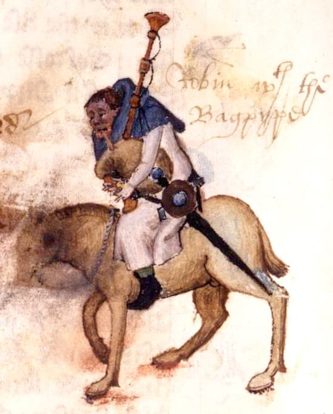

# *The Canterbury Tales* 
## Geoffrey Chaucer (1340-1400)
### Historical and Literary Context

Prof. Pedro Groppo (UFPB)

---

## England in the 14th Century

- "Mixed" country: half insular, half continental: often English kings had more interest in French soil than in England
- **The court spoke French** in both places, not English
- **Hundred Years' War (1337-1453)** - England loses French possessions, strengthens English national identity
- Chaucer writes **in English for the court**, after 300 years of subordination to Norman French - rebirth of English as a literary language

---

## The Black Death (1348) 
- **One third of the English population** dies during the epidemic and agricultural production falls dramatically
- **Scarcity of rural workers** transforms the economy
- **Surviving peasants demand higher wages** due to labor shortage
- Lords resist, leading to conflicts over compensation
- **Social discontent** grows among all classes
- Conditions were created for a **major popular revolt**

---

## The Peasants' Revolt (1381)

- Led by Wat Tyler, workers rebel against abuses to compensate for labor shortage, including the Poll Tax, which the parliament kept increasing
- First major **popular revolt** in English history: the commoners are fed up with the nobles and clergy getting rich off of their work
- Violent revolt that demonstrates the growing power of the **working classes**
- They storm the Tower of London and kill the Archbishop of Canterbury
- The ruling classes are terrified

---

## The Official Christian Doctrine: The Cycle of Sin and Absolution

> *[the] essence of Christian doctrine [was]: renunciation of the material world (...). God was positive and life on earth negative, that the world was incurably bad and holiness achieved only through renunciation of earthly pleasures, goods, and honors. To gain victory over the flesh was the purpose of fasting and celibacy, which denied the pleasures of this world for the sake of reward in the next. Money was evil, beauty vain, and both were transitory. Ambition was pride, desire for gain was avarice, desire of the flesh was lust, desire for honor, even for knowledge and beauty, was vainglory. Insofar as these diverted man from seeking the life of the spirit, they were sinful. The Christian ideal was ascetic: the denial of sensual man. The result was that, under the sway of the Church, life became a continual struggle against the senses and a continual engagement in sin, accounting for the persistent need for absolution. (Barbara Tuchman, A Distant Mirror, p. 80)*

- Any **material desire** - from financial gain to pursuit of knowledge - was considered **sinful**.
- **But learning served God**: clergy needed Latin, law, theology for Church duties

---

## Why Canterbury?

### Saint Thomas Becket (c. 1118-1170)

- Chancellor and best friend of King Henry II, Archbishop of Canterbury (1162)
- Henry II wanted to control ecclesiastical courts; Becket resisted; orders his assassination in the cathedral
- Aftershock throughout Christian Europe - archbishop killed in sacred place
- Canonized only 3 years after death (1173), due to reports of miracles

---

## How Relics Worked

- The **holy body** after death maintains direct connection with God
- There is **transfer of power** from the saint's objects, which absorb miraculous virtue
- Therefore **physical contact** with these objects gives direct access to divine power
- Common types of relics:
  - **Body parts**: Bones, teeth, hair exposed in reliquaries
  - **Clothing and personal objects**: Tunics, sandals, instruments of martyrdom

---
### Saints Mentioned in the Prologue

| **Saint** | **How It Appears in the Text** |
|-----------|---------------------------|
| **Saint Christopher** (Yeoman) | `A Cristopher on his brest of silver sheene` |
| **Saint Loy** (Prioress)| `Hire gretteste ooth was but by Seinte Loy` |
| **Saint Maur and Saint Benedict** (Monk)| `The reule of Seint Maure or of Seint Beneit` |
| **Saint Augustine** (Monk) | `Lat Austyn have his swynk to hym reserved!` |
| **Saint John** (Friar) | `So plesaunt was his "In principio"` |
| **Saint Mary** (Pardoner)| `Which that he seyde was Oure Lady veyl` |
| **Saint Peter** (Pardoner) | `That Seint Peter hadde, whan that he wente` |

---

## Other medieval saints and their specializations

| **Saint** | **Specialty** | **Pilgrimage Site** | **Famous for** |
|-----------|-------------------|---------------------------|-------------------|
| **Saint James** | Forgiveness of sins | Compostela, Spain | Second most important pilgrimage in Europe |
| **Saint Clare**  | Eyes and vision | Assisi, Italy | Founder of the Poor Clares (Order of Saint Clare) |
| **Saint Sebastian** | Plague and epidemics | Rome, Italy | Martyr of arrows = protection against "arrows" of disease |
| **Saint Agatha** | Breast diseases | Catania, Sicily | Martyrdom related to the body |
| **Saint Peter** | Papal authority | Rome, Italy | First Pope, "rock" of the Church |
| **Saint Mary** | Universal intercession | Multiple locations | Mother of Christ |

---

## Christian Doctrine: Why the pilgrimage?

> *More than comfort, the Church gave answers. For nearly a thousand years it had been the central institution that gave meaning and purpose to life in a capricious world. It affirmed that man’ s life on earth was but a passage in exile on the way to God and to the New Jerusalem, “our other home.” (...) What the Church offered was salvation, which could be reached only through the rituals of the established Church and by the permission and aid of its ordained priests.(Barbara Tuchman, A Distant Mirror, p. 74)*

### Religious Reasons
- Pilgrimage was a **recognized path to salvation** approved by the Church
- Visiting Becket's shrine could **cure illness and forgive sins**

### Practical Reasons  
- **Safety in numbers**: bandits attacked lone travelers on dangerous roads
- **Break from routine**: legitimate escape from daily obligations

---

## Historical Evolution of English

| Period | Form | Lord's Prayer opening | Characteristics |
|---------|-------------------|----------------------|-----------------|
| Until 1066 | Old English  | "Fæder ure þu þe eart on heofonum, si þin nama gehalgod" | Germanic tradition Complex declensions |
| 1066-1300 | Transition | [Limited written records during this period] | Court speaks French English evolves orally |
| 1300-1500 | Middle English | "Oure fadir þat art in heuenes halwid be þi name" | Simplified grammar French vocabulary mixed in |
| 1500- | Early Modern English | "Our father which art in heaven, hallowed be thy name" (KJV) | Recognizable to us Standardization begins |

*Source: The History of English website (thehistoryofenglish.com)*

---

# Why is Chaucer called "The Father of English Literature"?

| Aspect | Earlier Medieval Literature | Chaucer's Innovation |
|--------|---------------------------|---------------------|
| **Language** | French for court literature, Latin for learning | First major English literature for the court after 300 years of French domination |
| **Characters** | Symbolic figures representing abstract virtues or sins | Individual psychology with personal motivations and contradictions |
| **Narrative Voice** | Single, unanimous moral perspective | Multiple voices: each pilgrim reveals personality through their tale |
| **Social Scope** | Idealized or allegorical social types | Realistic observation drawn from direct experience with all social classes |
| **Sources** | Direct imitation or translation of French models | English synthesis combining continental forms with local experience |
| **Purpose** | Formal rhetoric as decoration | Dramatic rhetoric serving character and situation |

---

## Geoffrey Chaucer (1342-1400)

- Father an influential wine merchant. Chaucer possibly attended one of London's law schools
- Served as page to Prince Lionel, son of King Edward III, where he learned handling of arms, courtly etiquette, Latin and French
- Fought in France in 1359 during the Hundred Years' War
- Became valet to the king, beginning a long association with royalty
- Married Philippa de Roet, lady-in-waiting to the queen, whose sister Katherine was wife of John of Gaunt (son of King Edward III)

---

## Diplomatic Career and Cultural Influences

- The king frequently sent him on diplomatic missions abroad
- Discovered Italian literature in the works of three masters:
    - Dante (1265-1321) influenced his conception of narrative structure
    - Boccaccio (1313-1375) provided direct models for various tales
    - Petrarch (1304-1374) may have been known personally

,_f.1_-_BL_Add_MS_5141.jpg)

---

## Professional Career and Difficulties

- Was Customs Inspector, worked with the wool merchants
- Resided in the privileged upper rooms of Aldgate in London
- Lost his customs post when Richard II lost political power, complicating his economic situation
- In 1387 his wife Philippa died, leaving him alone and he suffered several debt lawsuits in old age
- Buried in Westminster Abbey near the kings, first man of letters to merit such honor
- His tomb began what we now know as "Poets' Corner"

---

## Canterbury Tales: Structure

### The Narrative Premise
- Twenty-nine pilgrims plus Chaucer the Pilgrim (narrator) travel to Canterbury, to the tomb of Saint Thomas Becket, English martyr saint
- The Host proposes that each tell two stories on the way there and two on the way back; the best narrator would win a dinner offered by all
- Original plan was 116 stories, only 24 were composed
- Work remained incomplete, survived in 10 manuscript fragments whose order is debated

---

## Overview of Medieval Life

### Comprehensive Social Representation
- The Prologue offers a **gallery of social types**
- Represents the different layers of **medieval English society**
- Allows a **critical look** at the different classes

### Modern Political Criticisms and Responses
- Some critics note absence of highest and lowest classes
- It's a matter of realism: nobles and beggars would not make this pilgrimage - cf. *palmeres*
- Nobles would travel with their own retinues and beggars would not have resources to pay for the journey

---

## Chaucer's Characterization Techniques

- Chaucer systematically links the **content** of the tale with the **personality** of the teller
- **What** each character chooses to tell reveals aspects of their character
- **How** they tell it (tone, emphases, omissions) adds layers of characterization
- **Contradictions** between teller's social function and content and tone of tale generate irony

### Different levels
- **Narrative content**: What the tale reveals about who tells it
- **Audience**: How the pilgrims react to both tale and teller
- **Irony**: Contradictions that the reader perceives but the characters don't

### Ironies and contrasts

Characterization that functions on various simultaneous layers, especially through the **adequacy** or **inadequacy** between teller and tale.

---

## Example of Contrast: Courtly Love vs. Sexual Reality

The Miller, irritated with the Knight's elevated tone after his tale, decides to "get back" at the previous tale with a story that **deliberately ridicules** his ideals.

- Similar structure: **two men fight over one woman**
- Systematic inversions: each **noble element becomes grotesque**
- Class criticism: **aristocratic ideals are unreal and hypocritical**
- The Miller **wants** to offend the more refined listeners, it's a deliberate provocation

---

## Example of Contrast: Courtly Love vs. Sexual Reality

| Aspect | The Knight's Tale | The Miller's Tale |
|---------|------------------------|----------------------|
| **Rivals** | Palamon and Arcite (noble prisoners) | Absalom and Nicholas (student and barber) |
| **Disputed woman** | Emily (virginal princess, distant) | Alison (young wife, sensual, available) |
| **Type of love** | Platonic, worship from afar | Explicit sexual, immediate seduction |
| **Social context** | Royal palace, tournaments, ceremonies | Middle-class house, bedrooms |
| **Duration** | Years of suffering and waiting | One night of trickery |
| **Resolution** | Heroic death, sacred marriage | Brawling, comic humiliation |
| **Implicit message** | Love ennobles man | Sexual desire is more honest than idealization |

---

## Distinctive characteristics of Chaucer's text

- **Metrical flexibility**: adapts verse form according to situation and characters, instead of following rigid patterns (e.g. Dante)
- **Precision and adequacy of images**: chooses visual details and metaphors that perfectly describe each character and situation, with few essential traits (e.g. Knight's clothing, Cook's ulcer)
- **Verbal irony**: direct, when the narrator or another character says something meaning the opposite, e.g.`Unto his ordre he was a noble post` ("He was a noble supporter of his order.") (Friar)
- **Dramatic irony**: indirect, reveals to the reader contradictions that characters don't see
- **Variety and realism**: Gallery of characters who seem like real people, instead of conventional literary figures - based on direct observation of 14th-century English society.

---

## Preparation for Next Classes

### Required Reading
- Prologue to the Canterbury Tales (next class: up to the Friar)
- Special attention to characterization techniques of each character
- Identification of social groups represented

### Preparatory Activities
- Choose one character from the Prologue for detailed analysis
- Research the profession or social function of this character in medieval times
- Try to find a modern/contemporary equivalent

---

## References

CHAUCER, Geoffrey. *The Canterbury Tales*. London: Norton, 2012.
COOPER, Helen. *The Oxford Guide to the Canterbury Tales*. Oxford: Oxford UP, 2020.
TUCHMAN, Barbara. *A Distant Mirror*. Ballantine Books.
VIZIOLI, Paulo. "Apresentação" apud CHAUCER, Geoffrey. *Contos de Canterbury*. São Paulo: Ed. 34.