# William Shakespeare: *The Tragedy of Othello, the Moor of Venice* (c. 1603)

## English Literature I

### Prof. Pedro Groppo - UFPB


---

## Introduction to Renaissance Drama

- Evolved from religious miracle plays (Bible stories) to secular plays about history and morality
- The Privy Council banned religious plays as "too Catholic," forcing this change
- Actors needed noble sponsorship to avoid arrest for vagrancy (hence names like "Lord Strange's Men")

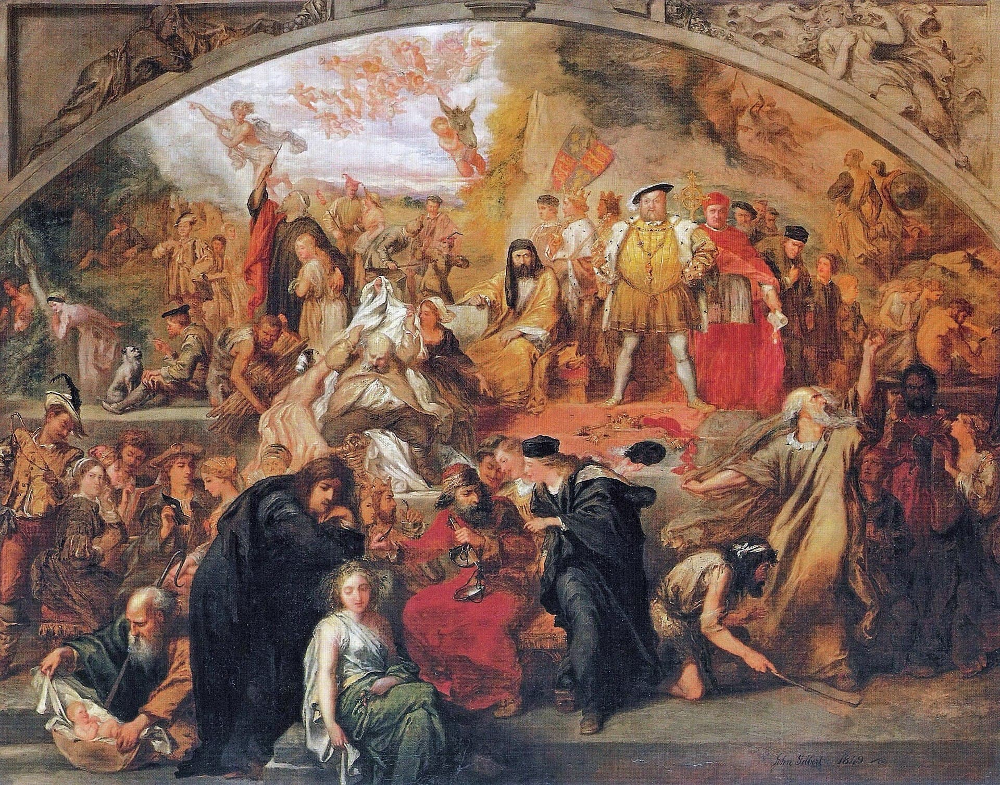


---

## Key Playwrights

- Christopher Marlowe (1564): Son of shoemaker, Cambridge-educated, wrote *Tamburlaine*, *Doctor Faustus*
- William Shakespeare (1564): Wrote 25+ plays including *Romeo and Juliet*, *Hamlet*, *Henry V*
- Ben Jonson: Former bricklayer/soldier, wrote *Every Man in His Humour*

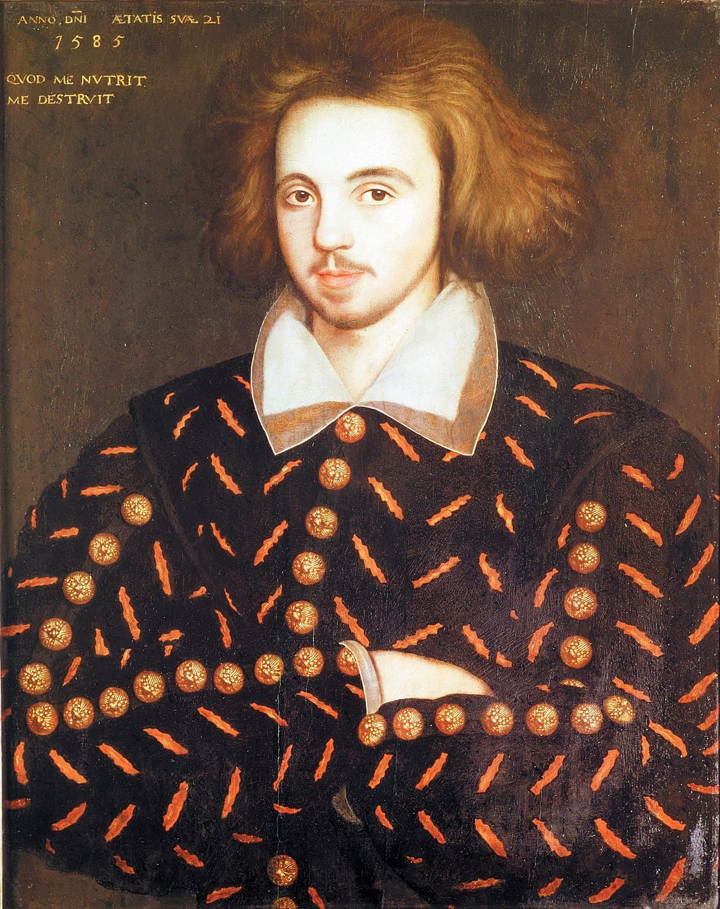

---

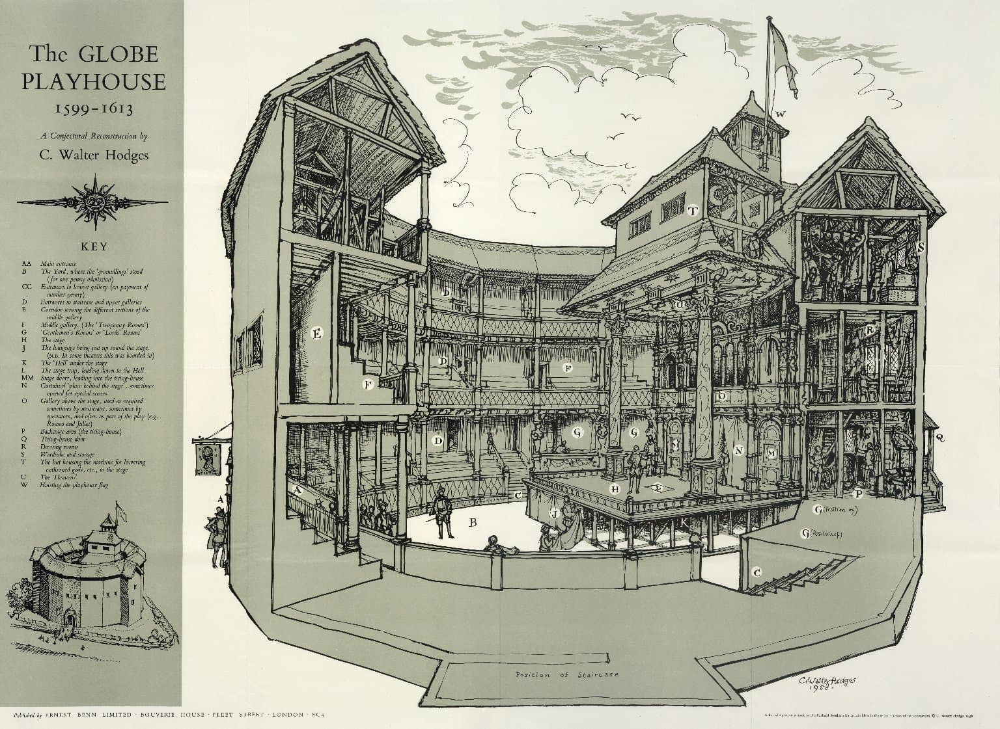

---

## The Theater Experience

- Cost: 1 penny to stand in yard, extra pennies for gallery seats, 6 pence for private box
- Working people, merchants, nobles, housewives
- Polygonal buildings, open-air with covered galleries
- Minimal props, elaborate costumes, actors performed directly to audience

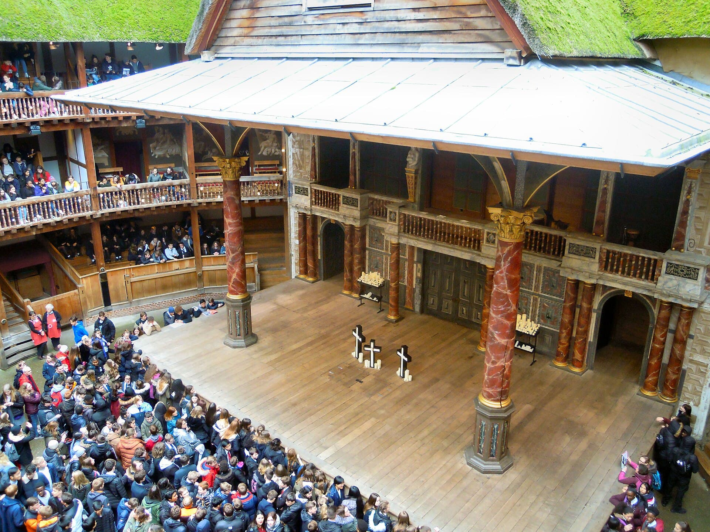

---

## The Theater Experience

- Women forbidden on stage; boys played female roles
- Both Puritans and moralists opposed theater as immoral
- Queen Elizabeth supported drama, created her own company (Queen's Men)
- By 1590s, best actors stayed in London rather than touring

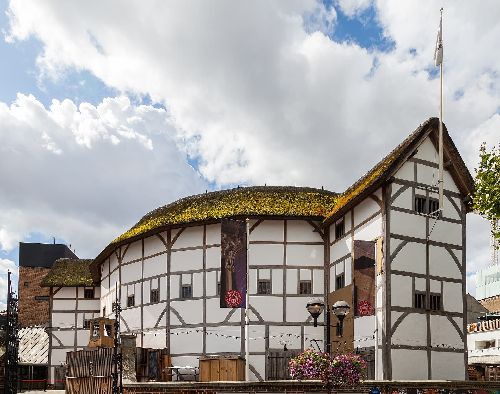

---

## The Text

- Written to be acted on the stage, not read
- What we have is a script made after the fact, not one the working scripts - published after Shakespeare's death
- No single, authoritative text of Shakespeare's plays - they varied even in early editions
- Unlike today's published plays, Shakespeare often integrates actions into the dialogue rather than relying on explicit stage directions
  - Desdemona: "Here I kneel"
- No elaborate scenery or lighting - imagery and descriptive language were crucial for creating the play's world
  - e.g. In Act 1, Iago's crude descriptions of Othello ("old black ram," "Barbary horse")

---

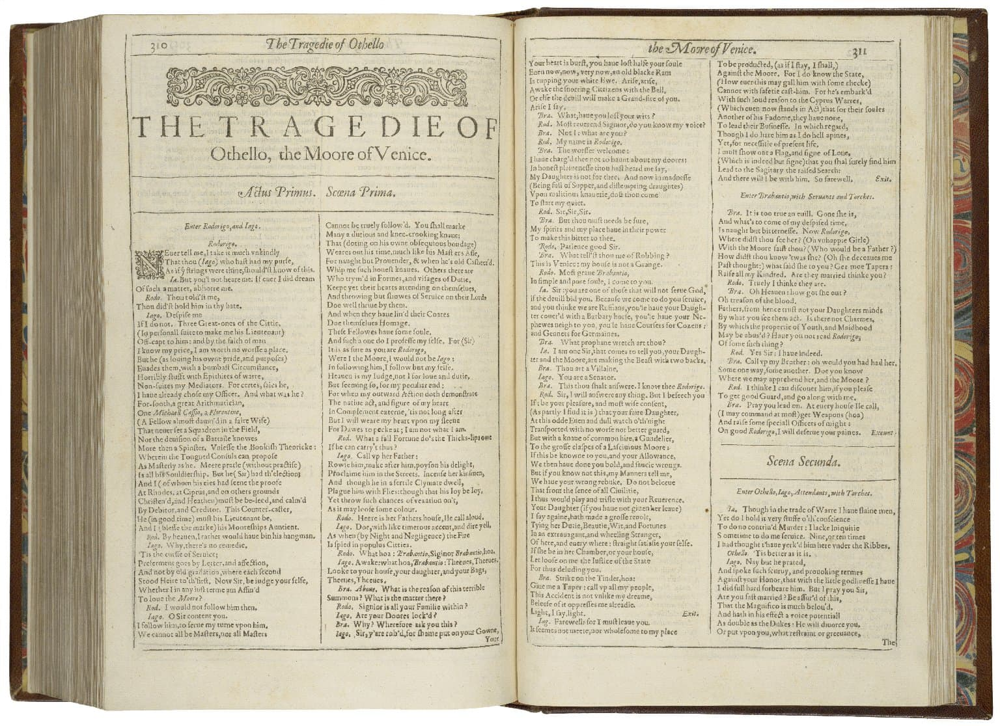

---

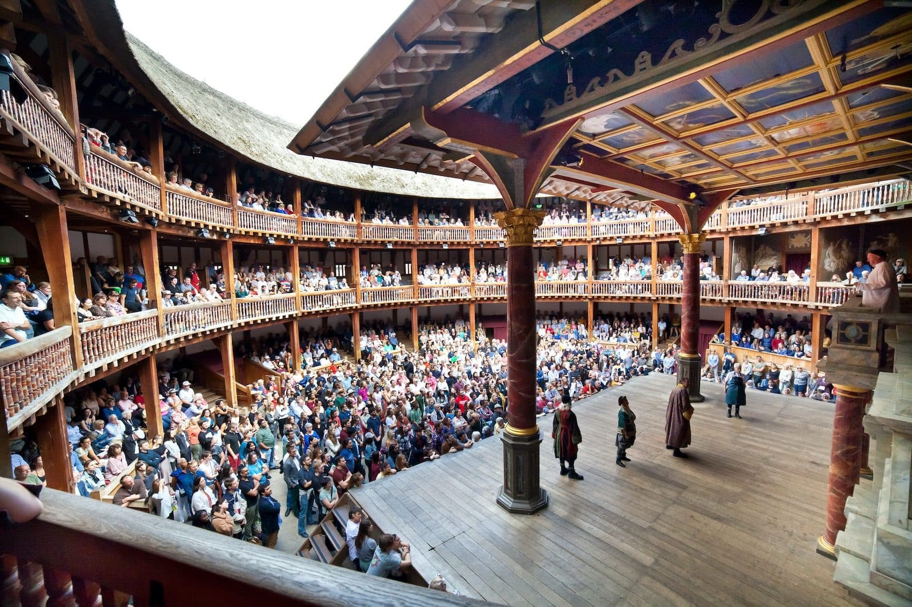

---

## Medieval Morality Plays

- Morality play - medieval allegorical theatrical form in which moral lessons were taught through characters who personify moral qualities, like charity or vice. 
- Example: *Mankind* (c. 1465) - Newguise, Nowadays and Nought), try to tempt Mankind, a farmer, away from Mercy and who actively endeavour to lure him to commit vices such as avarice, lust and gluttony.

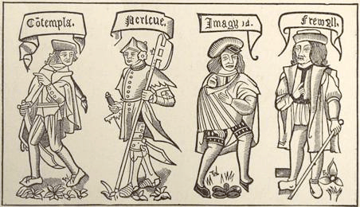)

---

## The Vice Character

- A temptation figure who embodies worldly pleasures;  often has the most important role
- The Vice interacts directly with the audience, often breaking the fourth wall
- Performs his worldliness by dressing as an Egyptian or a Turk with the aid of blackface and red-face makeup

### Shakespeare

- Incorporates elements of morality plays, such as the Vice figure and the struggle between good and evil, into his plays like *Richard III*, *Titus Andronicus,* and *Henry IV*
- Vice = Iago, not Othello: manipulates events and leads Othello down a path of destruction.

---

## Comedy vs Tragedy

- Shakespeare uses familiar aspects of the morality  play to mislead the audience’s expectations as well as comedy
- Comedic elements: the disobedient daughter (cf. *Midsummer Night's Dream*) and the cuckolded husband
- Chaucer influence: older husbands cuckolded by younger wives (The Merchant's Tale, The Miller's Tale)

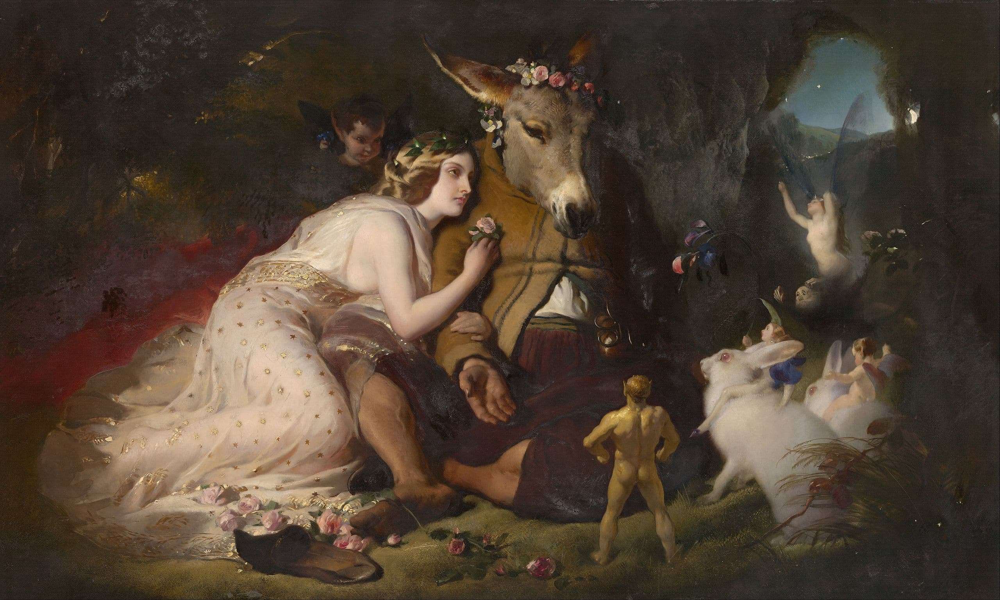

---

## Sources

- Giovanni Battista Giraldi (aka Cinthio), in *Gli Hecatommithi* (1565)

> I fear greatly that I shall be a warning to young girls not to marry against their parents’ wishes; and Italian ladies will learn by my example not to tie themselves to a man whom Nature, Heaven, and manner of life separate from us. 

(Disdemona)

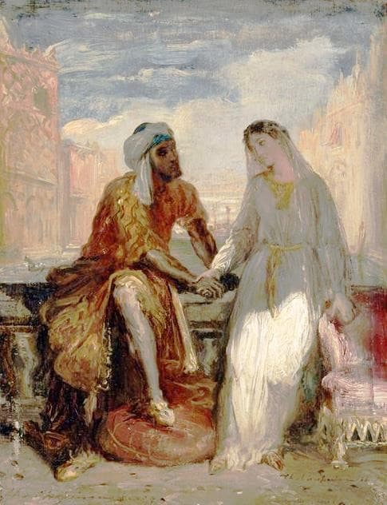

---

## What was a Moor?

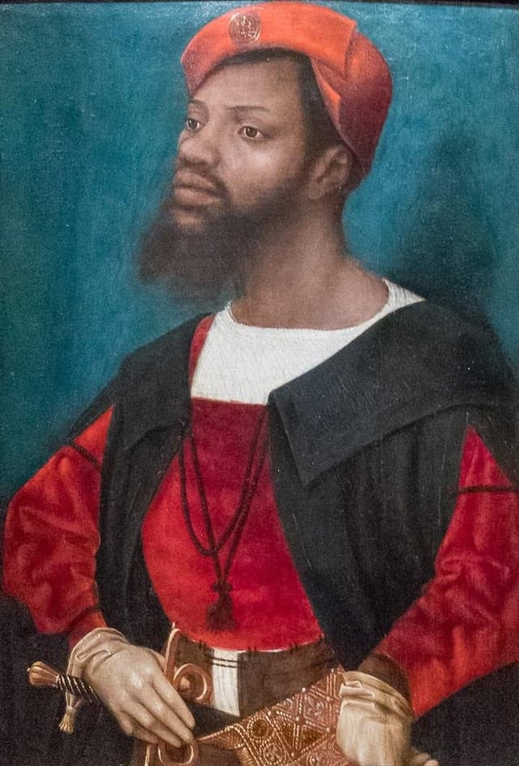

Elastic term that could refer to:

- Religious identity: Muslims in North Africa, Iberia, or the Ottoman Empire.
- Geographical origin: People from Africa
- Racial designation: People with darker skin, especially Black Africans.
- Cultural outsiders: sometimes “strangers” or non-Christians in general.

---

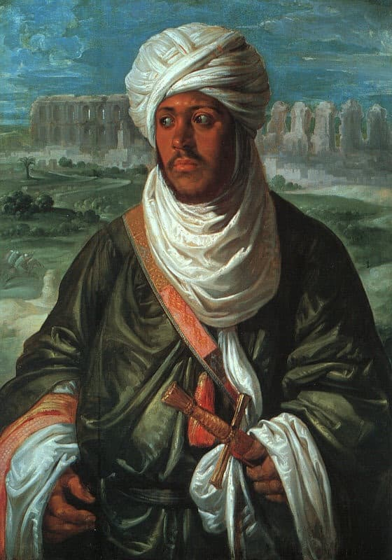

> native or inhabitant of ancient Mauretania [Morocco and Algeria]. Later ... a member of a Muslim people of mixed Berber and Arab descent inhabiting north-western Africa, who in the 8th C. conquered Spain. In the Middle Ages up to 17th C., Moors were mostly black or very dark-skinned, although the existence of ‘white Moors’ was recognized. Thus the term was often used, even into the 20th C., with the sense ‘black person.’ (OED)

---

## Is Othello Black?

- Text suggests he was portrayed as black on the early modern stage
- Racialized rhetoric comes from Roderigo, Iago and Brabantio before the audience ever sees Othello
- Is this metadramatic = how Othello should be performed?
- Only in the 19th century Othello’s blackness was questioned by scholars and actors

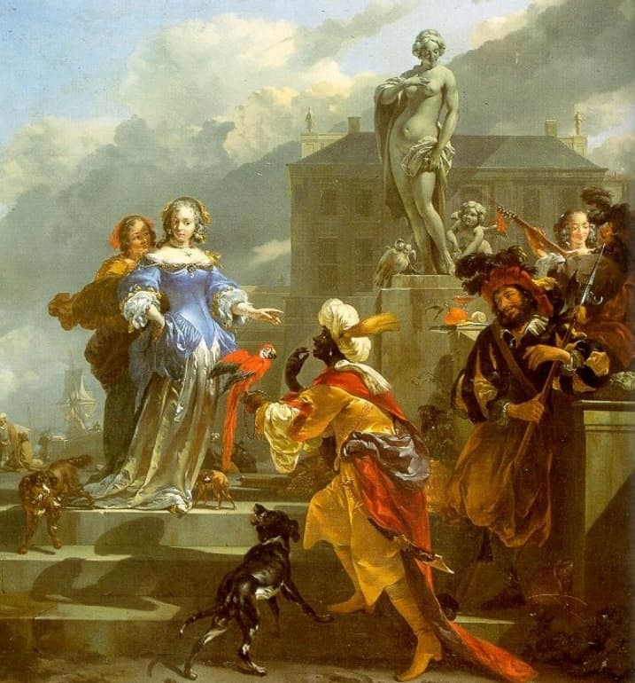

---

## Moor vs Turk

- Early modern English texts portrayed Turks as barbarous, cruel, despotic, tyrannical, and sexually voracious.
- The Turks were perceived as a threat to Western civilization militarily, economically, and sexually.
- The term “Turk” was used to refer to the Turkish people, Muslims in general, and the Ottoman Empire.

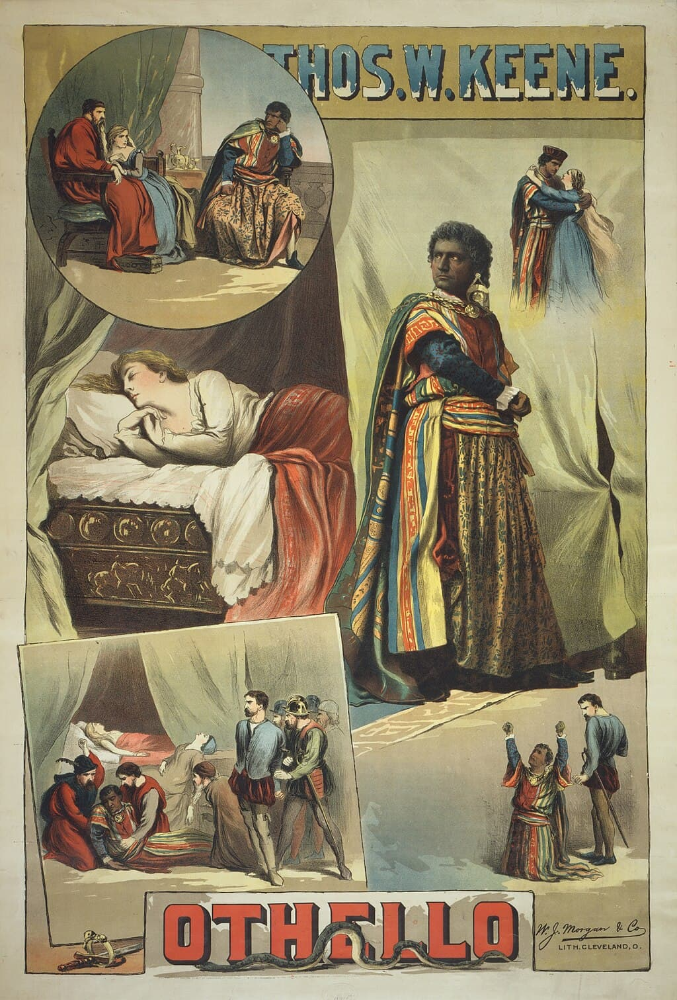	

---

## Othello and the audience

- Unlike other Shakespearean tragedies where the audience is on equal footing with the hero, Othello’s audience knows more, prompting a different emotional response.
- The audience’s knowledge often leads to discomfort and a desire to intervene, as seen in historical anecdotes.
- The play’s uneven structure forces the audience to choose a side.

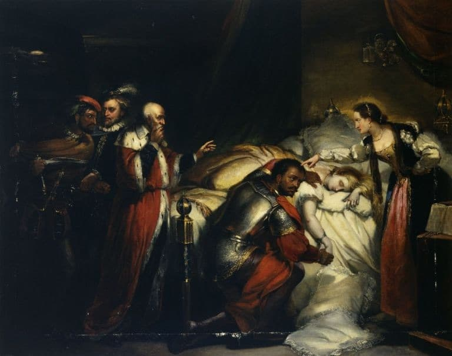

---

## Criticism

- A.C. Bradley: *Othello* is Shakespeare's best tragedy, surpassing *Hamlet* and *Macbeth*, due to its intense drama, modern themes, and relatable characters.
- Othello’s focus on **private matters**, particularly sexual jealousy, makes it more emotionally impactful than plays centered around state affairs.
- Challenged Coleridge’s interpretation of Othello’s race: Shakespeare **intended Othello to be black**.
- Shakespeare’s plays, particularly *Othello*, are better experienced through **reading** than performance: discomfort of seeing Othello’s race onstage.
- Shakespeare’s plays were primarily experienced as performances during his time, by the early 19th century, they were increasingly studied and read as literary works.

---

## Iago: a perfect combination of the two facts concerning evil (A.C. Bradley)

- "perfectly sane people exist in whom fellow-feeling of any kind is so weak that an almost absolute egoism becomes possible to them" + "exceptional powers of will and intellect"
- absurd "to compare Iago with the Satan of *Paradise Lost*" ... "so immensely does [he] exceed Milton's Fiend in evil".

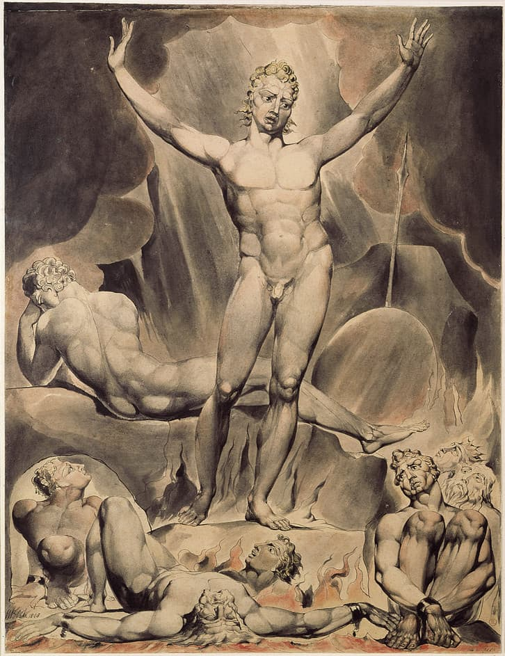

---

# Othello - Review
---

## Overview: The Power of Othello

- Shakespeare transforms a crude prose story into a play with intensity and immediacy.
- Audiences actively engaged in the unfolding tragedy, not passive.
- Bold choice to have a black man as a tragic hero.
- Domestic tragedy: tight focus, small cast, deep exploration of sexual jealousy.


---

## Textual Issues

- No authoritative text exists
- 1622: First printed in Quarto; 1623: First Folio (collected plays)
- Folio has ~160 more lines, includes Desdemona’s willow song; Emilia's role is more developed; over 1,000 differences
- Text instability explains variations in performance and interpretation.
- Evidences the nature of a collaborative, performative medium.


---

## Sources

- Giraldi Cinthio, *Hecatommithi* (1565) – only the heroine named; story unfolds over months.
- Shakespeare’s version condenses the timeline, introduces Roderigo, adds the storm, removes an ending where Othello is executed by Desdemona's relatives;
- Iago is clearly motivated only by career jealousy
- Cinthio emphasizes divine justice


---

## Tragedy: Theoretical Framework (Aristotle)

- Fall of a great person (a king, general, or noble) from high esteem to ruin or death.

- Caused partly by fate, but crucially by a character flaw (*hamartia*) such as pride or jealousy.

- To evoke *pity* and *fear*, leading to *catharsis* (an emotional purging and renewal for the audience)


---

## Comedy

### Classical (Aristotle, Plautus, Terence)

- Common, ordinary, and everyday rather than kings and generals.

- Provoke laughter and delight by showing human folly, mistaken identity, or social inversion.

- Comedy ends in resolution and harmony (often marriage or reunion).

### Shakespearean Comedy

- Misunderstanding, disguise, or mistaken identity (e.g., *Twelfth Night*).

- Witty dialogue, fools, or dupes (e.g., Roderigo in Othello has “the characteristics of the dupe of romantic comedy)

---

## Settings

### Venice

- Thriving commercial center; culturally sophisticated yet morally dangerous.
- Machiavellian associations; poisonings, political intrigue.

### Cyprus

- Frontier between Venetian civility and Ottoman power.
- Metaphor for Othello’s liminal social position and vulnerability to manipulation.
- Cyprus mirrors Othello’s colonized-but-not-assimilated status. (cf. Virginia Mason Vaughan)

---

### Virginia Mason Vaughan

> Othello's loss . . . does have frightening consequences for Venice, a city precariously balanced on the frontiers of Christian civilisation.

> In contrast to Othello, Venice seems sure of its identity as the play begins - urbane and civilised ... Centuries of legal and governmental tradition have defined Venice as the locus of rational judgment. . . Caught in a liminal zone between Venice's Christian civility and the Ottomite's pagan barbarism is Cyprus, a Venetian colony under siege. Cyprus is the frontier, the uttermost edge of western civilisation, simultaneously vulnerable to attack from without and subversion from within . . . Cyprus's geographical and political position mirror Othello's psychic situation.

---

### Virginia Mason Vaughan

> Like Cyprus, Othello can be colonised by Venice - he can be put to use. But he can never become wholly Venetian. This liminal positioning makes him vulnerable to Iago's wiles and, like Cyprus, if he is not fortified, he will 'turn Turk'.

- The opposition of Venetian and Turk continues through the play, culminating in Othello's final speech in which he ultimately conquers the threat presented by 'a turbaned Turk

> the precariousness of a nation's identity - not just an individual's - lurks behind the tragedy of Othello and his wife.

---

## Race and Color

- Blackness associated with sin, death, defilement; travel narratives emphasized savagery and depravity.
- Black people present in England; servants or slaves
- Aaron (*Titus Andronicus*): complex villain, both vicious and tender
- Prince of Morocco (*Merchant of Venice*): heroic, eloquent, accepts failure with dignity


---

### Critical Debate

Anthony Barthelemy:

> However successful Shakespeare's manipulation of the stereotype may be, Othello remains identifiable as a version of that type ... Shakespeare's black Moor never possesses the power or desire to subvert civic and natural order.

Karen Newman:

> Shakespeare was certainly subject to the racist, sexist, and colonist discourses of his time, but by making the black Othello a hero, and by making Desdemona's love for Othello, and her transgression of her society's norms for women in choosing him, sympathetic, Shakespeare's play stands in a contestatory relationship to the hegemonic ideologies of race and gender in early modern England.

---

## Marriage Expectations

- Pamphlets and Sermons: promoted women as silent, obedient, and malleable

- Book of Common Prayer (1552): Marriage vows -- “Wylte thou obey him, and serue him, love, honor, and kepe him”

- The prevailing model emphasized a husband’s authority and a wife’s submission, often reinforced by law, church, and custom.

---
## Sonnet 116

```
Let me not to the marriage of true minds
Admit impediments; love is not love
Which alters when it alteration finds,
Or bends with the remover to remove.
O no, it is an ever-fixed mark
That looks on tempests and is never shaken;
It is the star to every wand'ring bark.
Whose worth's unknown, although his height be taken.
Love's not Time's fool, though rosy lips and cheeks
Within his bending sickle's compass come;
Love alters not with his brief hours and weeks,
But bears it out even to the edge of doom.
If this be error and upon me proved,
I never writ, nor no man ever loved.
```

---

## In *Othello*

- Shakespeare gives us forceful, articulate female characters who challenge restrictive expectations of women.

- He emphasizes mutual respect and partnership in marriage, rather than simple obedience.

- He affirms a daughter’s right to choose her husband

- Love is framed as an enduring, equal bond (Sonnet 116: the “marriage of true minds” — love as constant and reciprocal, not submissive).

---

### Brabantio (Act 1 Scene 3, lines 176-8)

```
Come hither, gentle mistress; 
Do you perceive in all this noble company
Where most you owe obedience?
```

### Desdemona (Act 1 Scene 3, lines 178-87)

```
My noble father, 
I do perceive here a divided duty:
To you I am bound for life and education;
My life and education both do learn me
How to respect you. You are lord of all my duty;
I am hitherto your daughter. But here's my husband;
And so much duty as my mother showed
To you, preferring you before her father.
So much I challenge that I may profess
Due to the Moor my lord. 
```

---

### Emilia (Act 4 Scene 3, lines 89-97)

```
Let husbands know
Their wives have sense like them: they see, and smell.
And have their palates both for sweet and sour
As husbands have. What is it that they do
When they change us for others? Is it sport?
I think it is. And doth affection breed it?
I think it doth. Is't frailty that thus errs?
It is so too. And have not we affections.
Desires for sport, and frailty, as men have?
```

---

# Language

---

## Verse

- Written both in verse and prose, with the proportions varying from play to play.
- The shift between verse and prose sharpens perceptions and encourages members of an audience to feel and think
- At one moment they may identify with the individual confronting a dilemma, and then they will be prompted to reflect upon the epic dimension of a situation.
- Shakespeare preferred to use lines which do not rhyme (**blank verse**) and have the pattern of five units (or feet) in which an unstressed syllable is followed by a stressed syllable, i.e. unrhymed, **iambic pentameter**.

---

## Verse features

- **Rhythm** indicates tensions between thought and expression and for implying underlying motivations.
- **'end-stopped lines'** permit regular opportunities to take breath
- **mid-line break, or caesura**
- the sense of an utterance can **run over several lines**, perhaps indicating pressure of feeling, fluency or confidence
- **enjambement** can also be used to reveal a character who is determinedly using the run-on lines as a means of preventing interruption.

---

### End-stopped lines

Iago (Act 1 Scene 1, lines 20-2)

```
One Michael Cassio, a Florentine,
A fellow almost damned in a fair wife.
That never set a squadron in the field 
```

### Mid-line breaks

(Act 1 Scene 1, line 11)

`I know my price, I am worth no worse a place.`

(Act 1 Scene 1, lines 58-9)
```
Were I the Moor, I would not be Iago;
In following him, I follow but myself.
```

---

### Several lines

Othello:

```
Like to the Pontic Sea,
Whose icy current and compulsive course
Ne'er feels retiring ebb but keeps due on
To the Propontic and the Hellespont,
Even so my bloody thoughts with violent pace
Shall ne'er look back, ne'er ebb to humble love,
Till that a capable and wide revenge
Swallow them up.
```

 (Act 3 Scene 3, lines 454-61)

---

### Pauses, silence

- In a regular passage of verse, a line that is metrically deficient gives the character a pause. 

`And what was he?` (Act 1 Scene 1, line 18)

- The short line has only **two feet**. The **absent three feet** give three beats of silence to allow a dramatic pause before Iago gives the information.
- Short lines can also provide the space necessary for action. Othello announces:

```
                        Look here, Iago,
All my fond love thus do I blow to heaven;
'Tis gone.
```
(Act 3 Scene 3, lines 445-7)

---

### Completing half-lines

- The verse line also indicates how characters relate to each other through their dialogue. 
- The effect of one character finishing half-way through a line of verse and another character completing it can be to demonstrate a harmony between characters who intuitively respond to each other's rhythms.

---


---


---


---

## Stichomythia

---


---

## Rhyme

- Most of the play uses **blank verse**
- Rhyme is used by Iago to conclude his soliloquies
- Effect: shaped and completed utterance which, perhaps misleadingly in this case, suggests a clarity of purpose.
  
```
’Tis he. O brave Iago, honest and just,
That hast such noble sense of thy friend’s wrong!
Thou teachest me. Minion, your dear lies dead,
And your unblest fate hies; strumpet, I come.
Forth of my heart those charms, thine eyes, are blotted,
Thy bed, lust- stained, shall with lust’s blood be spotted.
```
(Act 5, Scene 1, 31-36)

---

## More rhyme

- Rhyme can give statements a symbolic quality or a proverbial force.
- Desdemona's couplet at the end of Act 4 has the form almost of prayer

```
Good night, good night. God me such uses send,
Not to pick bad from bad, but by bad mend!
```
(Act 4 Scene 3, lines 100-1)

---

## Prose

- Does not have the rhythmic pattern of verse but affords more flexibility about the delivery
- The shift from one form to another is a way in which **the tone and mood** of a scene can be changed. 
- **Distinction between verse and prose mirrors a class or hierarchical distinction** has some validity in a play such as *King Henry IV Part 1*
- Iago uses prose to re-establish Roderigo's trust at the end of Act 1 (`Put money in thy purse`) - impression of informality and dispels any sense of his manipulation of his friend. 
- Othello's only sustained prose speech signals his breakdown: it precedes his epileptic fit and fragmented speech effectively illustrates his loss of control, even before his physical collapse.

---

## Soliloquy

- A character alone on stage has a privileged opportunity to **forge a relationship with the audience**. A soliloquy can be introspective as a character s**peaks aloud inner thoughts and feelings**.
- Characters can speak **directly to the audience**, in a way which is challenging, confrontational, sinister, amusing or conspiratorial.
- Othello (character) does not rely on soliloquies, only two lines: 

  ```
  Why did I marry? This honest creature doubtless
  Sees and knows more, much more, than he unfolds.
  ```
  (Act 3, Scene 3, lines 244-5)

---

## Iago's many soliloquies

- So is Iago the central character?
- Which kind of soliloquy Iago offers?
- His direct presentation of commentary and strategy, which would seem to be telling the audience what he is doing
- Paradoxical situation -- soliloquy provides **less insight into character than is gained by observation of the behaviour of the hero in a social context**

---

## Imagery

### (Prologue to *Henry V*, lines 18, 23, 25-7)

> On your imaginary forces work.
Piece out our imperfections with your thoughts.
And make imaginary puissance.
Think when we talk of horses that you see them
Printing their proud hoofs i'th'receiving earth 

---


---


---

### Marriage of Black and White

- Conventional assumptions about the goodness of that which is white, virginal and pure are opposed to the stereotyped connections between blackness, corruption and evil

#### Othello (Act 3 Scene 3, lines 387-9)
> Her name, that was as fresh
As Dian's visage, is now begrimed and black
As mine own face.

---

## Opposition between the spiritual vs earthly love

- Desdemona uses religious imagery (Act 1, Scene 3) and announces 'to his honours and his valiant parts / Did I my soul and fortunes consecrate'; Othello uses the words 'heaven' and 'good souls'
- When they are reunited in Cyprus, Othello greets her as 'my soul's joy' and Desdemona appeals to the 'heavens' that their 'loves and comforts' might increase.
- Her response to the change in Othello is to pray 'O, heaven forgive us!' She reaffirms her love 'by this light of heaven' and offers supplication, 'Here I kneel'

---

## Iago's influence on Othello's language

- Iago: love 'merely a lust of the blood and a permission of the will'
- Refers to them 'making the beast with two backs' to inflame Brabantio
- Even if she and Cassio were 'as prime as goats, as hot as monkeys', Othello could not expect to 'see her topped'. When Othello leaves (in Act 4 Scene 1): 'Goats and monkeys!'
- He becomes brutal ('I will chop her into messes') and he redefines his relationship with his wife as one in which a man visits a brothel. 
- His 'soul's joy' becomes a 'cunning whore' or 'impudent strumpet'. 
- Final scene: imagery is reasserted as Desdemona becomes the 'pearl ... / Richer than all his tribe' which he foolishly 'threw' away. His 'subdued eyes' shed tears 'as fast as the Arabian trees / Their medicinable gum.'

---

## Traditional Criticism

## 1693 - Thomas Rymer

> So much ado, so much stress, so much passion and repetition about an Handkerchief! Why was not this call'd the Tragedy of the Handkerchief? Had it been Desdemona's Garter the sagacious Moor might have smelt a Rat but the Handkerchief is so remote a trifle ...

---

## William Hazlitt (early 19th century)

> Tragedy creates a balance of the affections. It makes us thoughtful spectators in the lists of life. It is the refiner of the species; a discipline of humanity ... Othello furnishes an illustration of these remarks. It excites our sympathy in an extraordinary degree. The moral it conveys has a closer application to the concerns of human life than almost any other of Shakespear's plays.

> [Shakespeare] knew that the love of power, which is another name for the love of mischief, is natural to man. He would know this ... merely from seeing children paddle in the dirt or kill flies for sport. Iago ... belongs to a class of character ... whose heads are as acute and active as their hearts are hard and callous.

---

## A.C. Bradley (1904)

> any man situated as Othello was would have been disturbed by Iago's communications, and ... many men would have been made wildly jealous.

Agrees with Coleridge:

> ... that Othello does not kill Desdemona in jealousy but in a conviction forced upon him by the almost superhuman art of Iago, such a conviction as any man would and must have entertained who had believed Iago's honesty as Othello did.

---

## T.S. Eliot (1924)

Challenges the notion of a 'noble Moor'. Othello, in his last speech is:

> ... cheering himself up. He is endeavouring to escape reality, he has ceased to think about Desdemona and is thinking about himself ... Othello succeeds in turning himself into a pathetic figure, by adopting an aesthetic rather than a moral attitude, dramatising himself against his environment.

---

## F.R. Leavis

Against Bradley: 
> completely wrong-headed - grossly and palpably false to the evidence it offers to weigh.

> Othello is the chief personage - the chief personage in such a sense that the tragedy may fairly be said to be Othello's character in action.

> Iago is subordinate and merely ancillary ... He is not much more than a necessary piece of dramatic mechanism.

> Othello yields with extraordinary promptness to suggestion, with such promptness as to make it plain that the mind that undoes him is not Iago's but his own.

---

### G. Wilson Knight

> [Iago is] 'the spirit of negation set against the spirit of creation' and 'a colourless and ugly thing in a world of colour and harmony'.

### William Empson

- Words 'honest' and 'honesty' are used 52 times -- there is no other play in which Shakespeare 'worries a word like that'.

### Caroline Spurgeon

- Image-clusters are a dominant feature through which the particular atmosphere or mood of a play is created
- *Othello*: imagery of animals, of the sea and of poisoning

---

## Barbara Heliodora

"Otelo, uma Tragédia Construída sobre uma Estrutura Cômica"
- *zanni* in the *Commedia dell'arte*: the mischievous engine of the complex plotting that characterises the improvised plays performed by the travelling Italian players

>... [Iago], spinning his web of lies, not only gets caught in it himself but sets in motion passions which he could neither feel emotionally nor understand intellectually. For once, in his long and varied career, *Zanni* blunders into a world of tragedy, but it took Shakespeare to see the full theatrical possibilities of such a blunder.

---

## Jane Adamson (1980)

- Rejects Leavis and Bradley: urges for an acknowledgment of the complex way in which the play examines how relationships are fraught with uncertainty and damaged by doubt
- Rejects the impulse to judge the characters in moral terms
- The experience of the play makes its audience 'acutely aware of our own needs for emotional and moral certainty, simplicity and finality' as a way of lessening the 'full brunt of the tragedy'.

---

# Feminist Criticism

- Male criticism often neglects, represses or misrepresents female experience, and stereotypes or distorts the women's point of view

- The handkerchief 'spotted with strawberries' carries weighty sexual symbolism -- the stained wedding sheets
    - Evidence of Othello and Desdemona's marital bond
    - How the purity of their love is marred

---

## The Handkerchief among Women

- Othello takes it to be 'ocular proof' of Desdemona's infidelity
- The women fail to recognise that what they have in common is greater than what divides them
- The female characters in Othello represent three kinds of women separated by a clearly defined social and moral hierarchy
- Virginia Mason Vaughan: gradations are a 'spectrum of female sexual mores ... with Bianca the prostitute, Emilia the earthy matron, and Desdemona the chaste bride'.
- The real tragedy for Desdemona, Emilia and Bianca is the way their marital and emotional bonding pre-empts or takes precedence over their common cause