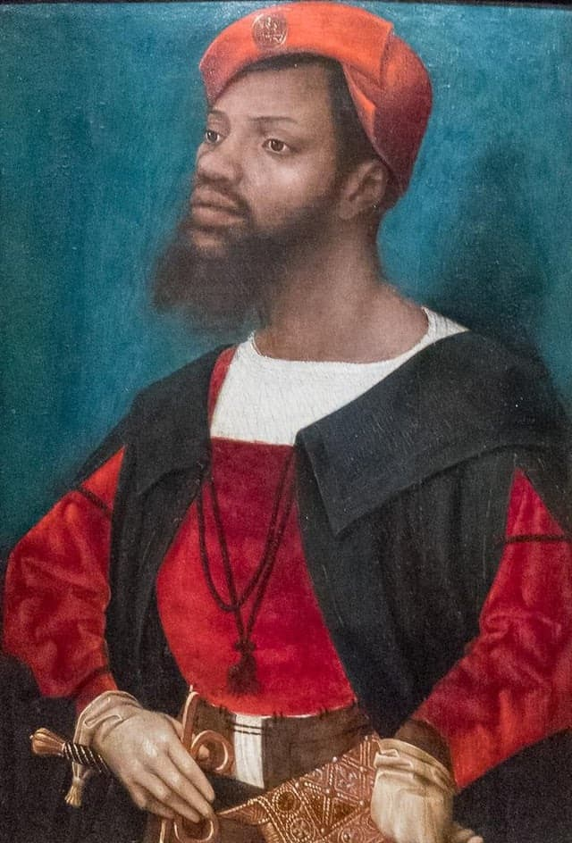

# William Shakespeare: *The Tragedy of Othello, the Moor of Venice* (c. 1603)
## English Literature I
### Prof. Pedro Groppo - UFPB

---

## Introduction to Renaissance Drama
- Evolved from religious miracle plays (Bible stories) to secular plays about history and morality
- The Privy Council banned religious plays as "too Catholic," forcing this change
- Actors needed noble sponsorship to avoid arrest for vagrancy (hence names like "Lord Strange's Men")

---

## Key Playwrights
- Christopher Marlowe (1564): Son of shoemaker, Cambridge-educated, wrote *Tamburlaine*, *Doctor Faustus*
- William Shakespeare (1564): Wrote 25+ plays including *Romeo and Juliet*, *Hamlet*, *Henry V*
- Ben Jonson: Former bricklayer/soldier, wrote *Every Man in His Humour*

---

---

## The Theater Experience
- Cost: 1 penny to stand in yard, extra pennies for gallery seats, 6 pence for private box
- Working people, merchants, nobles, housewives
- Polygonal buildings, open-air with covered galleries
- Minimal props, elaborate costumes, actors performed directly to audience

---

## The Theater Experience
- Women forbidden on stage; boys played female roles
- Both Puritans and moralists opposed theater as immoral
- Queen Elizabeth supported drama, created her own company (Queen's Men)
- By 1590s, best actors stayed in London rather than touring

---

## The Text

- Written to be acted on the stage, not read
- What we have is a script made after the fact, not one the working scripts - published after Shakespeare's death
- No single, authoritative text of Shakespeare's plays - they varied even in early editions
- Unlike today's published plays, Shakespeare often integrates actions into the dialogue rather than relying on explicit stage directions
    - Desdemona: "Here I kneel"
- No elaborate scenery or lighting - imagery and descriptive language were crucial for creating the play's world
    - e.g. In Act 1, Iago's crude descriptions of Othello ("old black ram," "Barbary horse")

---

---

---

## Medieval Morality Plays

- Morality play - medieval allegorical theatrical form in which moral lessons were taught through characters who personify moral qualities, like charity or vice. 
- Example: *Mankind* (c. 1465) - Newguise, Nowadays and Nought), try to tempt Mankind, a farmer, away from Mercy and who actively endeavour to lure him to commit vices such as avarice, lust and gluttony.

)

---

## The Vice Character

- A temptation figure who embodies worldly pleasures;  often has the most important role
- The Vice interacts directly with the audience, often breaking the fourth wall
- Performs his worldliness by dressing as an Egyptian or a Turk with the aid of blackface and red-face makeup

### Shakespeare
- Incorporates elements of morality plays, such as the Vice figure and the struggle between good and evil, into his plays like *Richard III*, *Titus Andronicus,* and *Henry IV*
- Vice = Iago, not Othello: manipulates events and leads Othello down a path of destruction.

---

## Comedy vs Tragedy

- Shakespeare uses familiar aspects of the morality  play to mislead the audience’s expectations as well as comedy
- Comedic elements: the disobedient daughter (cf. *Midsummer Night's Dream*) and the cuckolded husband
- Chaucer influence: older husbands cuckolded by younger wives (The Merchant's Tale, The Miller's Tale)

---

## Sources

- Giovanni Battista Giraldi (aka Cinthio), in *Gli Hecatommithi* (1565)

> I fear greatly that I shall be a warning to young girls not to marry against their parents’ wishes; and Italian ladies will learn by my example not to tie themselves to a man whom Nature, Heaven, and manner of life separate from us. 

(Disdemona)

---

## What was a Moor?

- Elastic term in the early modern period, could encompass 
	- Muslims (religious), 
	- Africans (geographical), 
	- blacks (racial), 
	- atheists (non-religious) and other groups

---

> native or inhabitant of ancient Mauretania [Morocco and Algeria]. Later ... a member of a Muslim people of mixed Berber and Arab descent inhabiting north-western Africa, who in the 8th C. conquered Spain. In the Middle Ages up to 17th C., Moors were mostly black or very dark-skinned, although the existence of ‘white Moors’ was recognized. Thus the term was often used, even into the 20th C., with the sense ‘black person.’ (OED)

---

## Is Othello Black?

- Text suggests he was portrayed as black on the early modern stage
- Racialized rhetoric comes from Roderigo, Iago and Brabantio before the audience ever sees Othello
- Is this metadramatic = how Othello should be performed?
- Only in the 19th century Othello’s blackness was questioned by scholars and actors

---

## Moor vs Turk

- Early modern English texts portrayed Turks as barbarous, cruel, despotic, tyrannical, and sexually voracious.
- The Turks were perceived as a threat to Western civilization militarily, economically, and sexually.
- The term “Turk” was used to refer to the Turkish people, Muslims in general, and the Ottoman Empire.

	

---

## Othello and the audience

- Unlike other Shakespearean tragedies where the audience is on equal footing with the hero, Othello’s audience knows more, prompting a different emotional response.
- The audience’s knowledge often leads to discomfort and a desire to intervene, as seen in historical anecdotes.
- The play’s uneven structure forces the audience to choose a side.

---

## Criticism

- A.C. Bradley: *Othello* is Shakespeare's best tragedy, surpassing *Hamlet* and *Macbeth*, due to its intense drama, modern themes, and relatable characters.
- Othello’s focus on **private matters**, particularly sexual jealousy, makes it more emotionally impactful than plays centered around state affairs.
- Challenged Coleridge’s interpretation of Othello’s race: Shakespeare **intended Othello to be black**.
- Shakespeare’s plays, particularly *Othello*, are better experienced through **reading** than performance: discomfort of seeing Othello’s race onstage.
- Shakespeare’s plays were primarily experienced as performances during his time, by the early 19th century, they were increasingly studied and read as literary works.

---

## Iago: a perfect combination of the two facts concerning evil (A.C. Bradley)
- "perfectly sane people exist in whom fellow-feeling of any kind is so weak that an almost absolute egoism becomes possible to them" + "exceptional powers of will and intellect"
- absurd "to compare Iago with the Satan of *Paradise Lost*" ... "so immensely does [he] exceed Milton's Fiend in evil".

