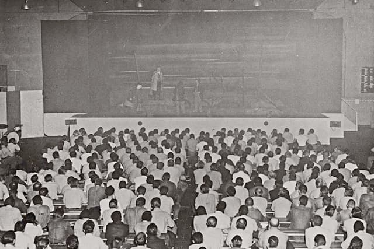
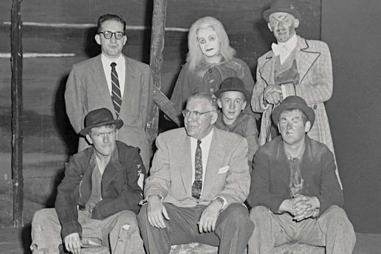

# The Theater of the Absurd
Adapted from Martin Esslin, [*The Theater of the Absurd*](../readings/esslin-absurd.pdf) (1961)

## San Quentin 1957 production

In 19 November 1957, a group of actors from the San Francisco Actors’ Workshop performed to 1,400 convicts at the San Quentin penitentiary in Northern California. And what had bewildered the sophisticated audiences of Paris, London, and New York was immediately grasped by an audience of convicts. 

### Article in the prison paper

> It was an expression, symbolic in order to avoid all personal error, by an author who expected each member of his audience to draw his own conclusions, make his own errors. It asked nothing in point, it forced no dramatized moral on the viewer, it held out no specific hope. . . . We’re still waiting for Godot, and shall continue to wait. When the scenery gets too drab and the action too slow, we’ll call each other names and swear to part forever—but then, there’s no place to go! (qtd. in Esslin 26)

In 1988 there was another performance in San Quentin, [which you can watch on YouTube](https://youtu.be/Q77jgal4Gto). :vhs: 

### Why such a success?

Why did a supposedly esoteric avant-garde play make so immediate and so deep an impact on an audience of convicts? 

* It "confronted them with a situation in some ways analogous to their own."

or:

* They were "unsophisticated enough to come to the theatre without any preconceived notions and ready-made expectations,
so that they avoided the mistake that trapped so many established critics who condemned the play for its lack of plot, development, characterization, suspense, or plain common sense."

### 🎭 Traditional conventions of the theater

Avant-garde, "theater of the absurd" plays such as those of Beckett, Eugene Ionesco and Harold Pinter, sometimes deemed full of nonsense and mystification. But the San Quentin production proves that *have* something to say and *can* be understood. 

> Most of the incomprehension with which plays of this type are still being received by critics and theatrical reviewers, most of the bewilderment they have caused and to which they still give rise, come from the fact that they are part of a new and still developing stage convention that has not yet been generally understood and has hardly ever been defined. Inevitably, plays written in thus new convention will, when judged by the standards and criteria of another, be regarded as impertinent and outrageous impostures. If a good play must have a cleverly constructed story, these have no story or plot to speak of; if a good play is judged by subtlety of characterization and motivation, these are often without recognizable characters and present the audience with almost mechanical puppets; if a good play has to have a fully explained theme, which is neatly exposed and finally solved, these often have neither a beginning nor an end; if a good play is to hold the mirror up to nature and portray the manners and mannerisms of the age in finely observed sketches, these seem often to be reflections of dreams and nightmares; if a good play relies on witty repartee and pointed dialogue, these often consist of incoherent babblings.

(from Martin Esslin, *The Theater of the Absurd*, 1961)

## The Theater of the Absurd

- The sense that the certitudes and unshakable basic assumptions of former ages have been swept away, that they
have been tested and found wanting, that they have been discredited as cheap and somewhat childish illusions. 
- The decline of religious faith was masked until the end of the Second World War by the substitute religions of faith in
progress, nationalism, and various totalitarian fallacies. All this was shattered by the war. 
- By 1942, Albert Camus was calmly putting the question why, since life had lost all meaning, man should not seek escape in suicide. 

### Camus' *The Myth of Sisyphus* :rock:

> A world that can be explained by reasoning, however faulty, is a familiar world. But in a universe that is suddenly deprived of illusions and of light, man feels a stranger. His is an irremediable exile, because he is deprived of memories of a lost homeland as much as he lacks the hope of a promised land to come. This divorce between man and his life, the actor and his setting, truly constitutes the feeling of Absurdity. (qtd. in Esslin 28)

### Ionesco's absurd

> Absurd is that which is devoid of purpose. . . . Cut off from his religious, metaphysical, and transcendental roots, man is lost; all his actions become senseless, absurd, useless. (qtd. in Esslin 28)

### Comparison with Sartre and Camus

- It's not just about "the senselessness of life, of the inevitable devaluation of ideals, purity, and purpose" -- those are present in Sartre and Camus and others
- For Sartre, Camus, etc. have a sense of "irrationality of the human condition in the form of highly lucid and logically constructed reasoning"
- The Theater of the Absurd tries to convey the sense of the "senselessness of the human condition and the inadequacy of the rational approach by the open abandonment of rational devices and discursive thought"
- The Theater of the Absurd goes "a step further in trying to achieve a unity between its basic assumptions and the form in which these are expressed"
- In the plays of Sartre (existentialism), for instance: he "argues that existence comes before essence and that human personality can be reduced to pure potentiality and the freedom to choose itself anew at any moment, he presents his ideas in plays based on brilliantly drawn characters who remain wholly consistent and thus reflect the old convention that
each human being has a core of immutable, unchanging essence—in fact, an immortal soul."
- The Theater of the Absurd renounces "arguing about the absurdity of the human condition; it merely presents it in being—that is, in terms of concrete stage images. This is the difference between the approach of the philosopher and that of the poet"

The Theater of the Absurd shares its subject-matter and themes with existentialism but it strives for an **integration between the subject-matter and the form**.

### Devaluation of language

- Radical devaluation of language, toward a poetry that is to emerge from the concrete and objectified images of the stage itself. 
- What happens on the stage transcends, and often contradicts, the words spoken by the characters. 
- Part of an ‘anti-literary’ movement that encompasses abstract painting, with its rejection of ‘literary’ elements in pictures; or in the ‘new novel’ in France, with its reliance on the description of objects and its rejection of empathy and
anthropomorphism.