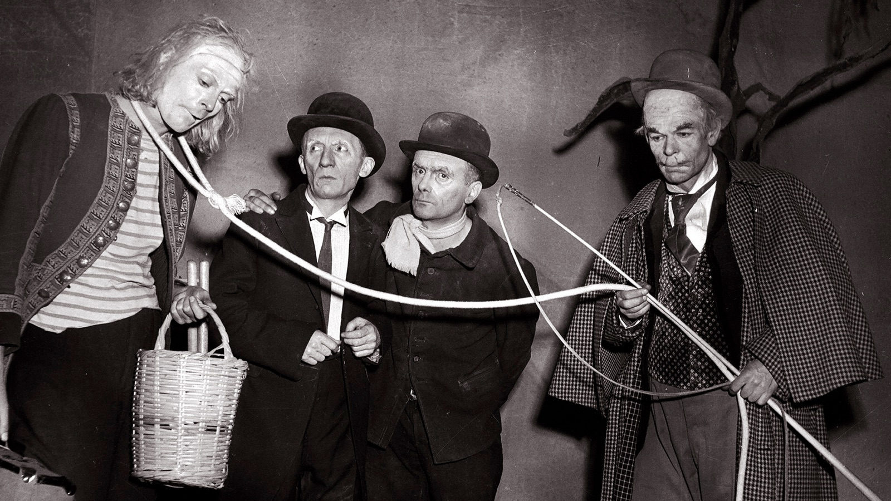
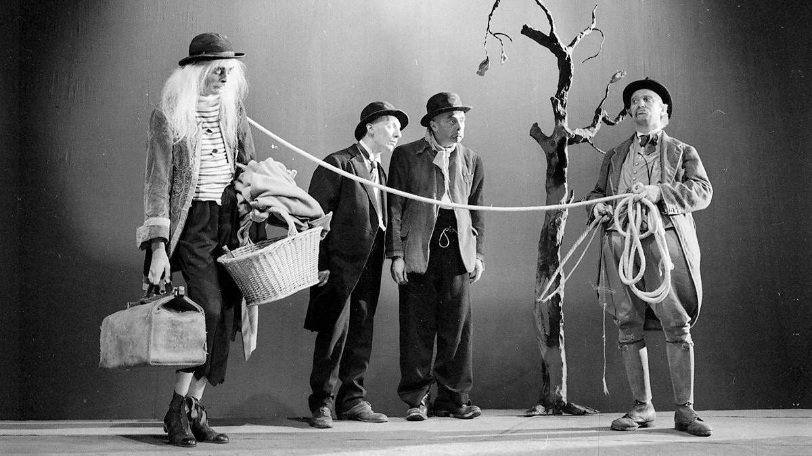
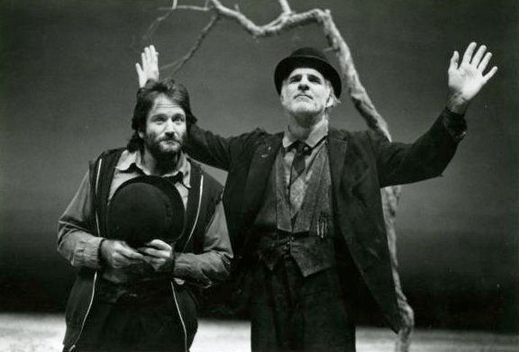
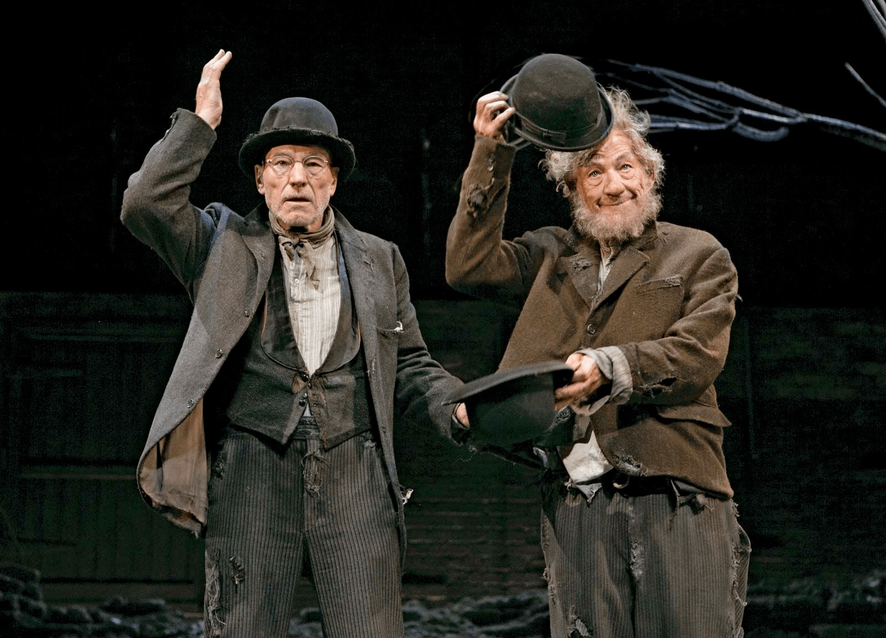

# Waiting for Godot Notes

## The account of the crucifixion in Luke 23: 32–43

> One of the criminals who were hanged railed at him, saying ‘Are you not the Christ? Save yourself and us!’ But the other rebuked him, saying, ‘Do you not fear God, since you are under the same sentence of condemnation? And we indeed justly; for we are receiving the due reward of our deeds; but this man has done nothing wrong.’ And he said, ‘Jesus, remember me when you come into your kingdom.’ And he said to him, ‘Truly, I say to you, today you will be with me in Paradise.’

### Beckett to Harold Hobson

> I take no sides about that . . . I am interested in the shape of ideas even if I do not believe in them. There is a wonderful sentence in Augustine. I wish I could remember the Latin. It is even finer in Latin than in English. ‘Do not despair; one of the thieves was saved. Do not presume; one of the thieves was damned.’ That sentence has a wonderful shape. It is the shape that matters. (Hobson, p. 154)

## 'Godot'

Colin Duckworth
> the name itself ‘is a trouvaille of the first order’, a lucky find or a godsend, ‘opening up several associations of ideas, through punning and analogy, in both English and French’. 

* Godillot = hobnailed boot’ or ‘shapeless old shoe’
* Godasses = ‘military boots’
* Godailler = ‘to go pub-crawling’
* Goddam = slang for ‘an Englishman’
* Goder = ‘to pucker’, or ‘gather cloth into folds’, also slang for having an erection. 
* Godille = the word for ‘a scull’, or ‘small racing boat’, has a vulgar connotation: ‘to
* fornicate’
* Godenot = ‘a juggler’s puppet’, ‘a joker’, ‘a misshapen little man’
* Godet = a popular cognac, but also ‘a wooden bowl’ or ‘mug’ (like the bowl of a pipe (smoked by Pozzo who carelessly refers to Godot as Godet) and a small glass of wine (which washes down Pozzo’s chicken)

## Lucky's Think

* When *Godot* was first performed around the world, the speech tended to be read as some sort of demented, show-stopping aria: a mix of gibberish, parody, and portentous symbolism
    * Fast: that it could not be comprehended by an audience (and remained unintelligible to a reader); 
    * Parodic: because it was clearly a mocking version of a theological proof (‘Given the existence of a personal God . . . therefore . . .’); 
    * Symbolic: because the allusions to Shakespeare’s The Tempest, to lyrics by Verlaine and Holderlin, to Samuel Johnson (in the early British edition) and Bishop Berkeley (in the American) 
    * Fragmentary: advanced stage in man’s mechanical thinking about the collapse of Western civilization

### Beckett's Schiller Theater Production (1975)

* Rehearsals would begin with Lucky’s speech, for it was here, he said, that the ‘threads and themes’ of the play ‘are being gathered together’. 
* The monologue’s theme is ‘to shrink on an impossible earth under an indifferent heaven’, 
    * a. an apathetic divinity
    * b. dwindling man, and 
    * c. indifferent nature. 

## Original Production Stills

## Contemporary Actors playing Vladimir and Estragon

