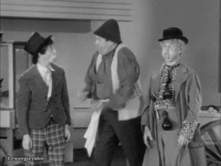

# *Waiting for Godot* Notes
Adapted from John Fletcher, *A Faber Critical Guide* (Faber) and Lawrence Graver, *Landmarks of World Literature: Waiting for Godot* (Cambridge)

Page numbers refer to the Faber edition.

### Tragicomedy

A tragicomedy in two acts - 'a play, combining the qualities of a tragedy and a comedy, or containing both tragic and comic elements; a play mainly of tragic character, but with a happy ending.' (SOED). The play is called a 'tragicomedy' in the English translation only.

### Beckett's Schiller Theater (1975) Structural Divisions

#### Act One
1. pp. 1-5 ('bloody ignorant apes')
2. pp. 5-14 ('Like to finish it?')
3. pp. 14-2.1 (Vladimir's second vehement 'Let's go!')
4. pp. 2.1-31 (,You see my memory is defective' / Silence)
5. pp. 31-41 ('Adieu!' / Long silence)
6. p. 41 to the end of Act One

#### Act Two
1. pp. 48-S6 ('Ah! que voulez-vous. Exactly' / Silence)
2. pp. 56-69 ('Pity! On me!')
3. pp. 69-74 ('We are men' / Silence)

### Cast

Cast - listed in order of first appearance; Pozzo is pronounced Po'dzo. According to Beckett, no significance attaches to the choice of names: there
is no intention on his part, for instance, to 'internationalise' the play by giving the characters French, Russian, English and Italian names. In any case these are not fixed: If Vladimir calls himself 'Vladimir' (for instance on p. 1), he is addressed by the boy as 'Mister Albert' on p. 42., and Estragon gives his name as 'Adam' (p. 30), evidently in order to discourage further enquiry from Pozzo.

**Gogo and Didi** - In Beckett's earliest manuscript Estragon is named throughout the first act as 'Levy' (a Jewish name with obvious biblical overtones), and when questioned by Pozzo gives his name as 'Magregor'.

**Godot** - not suggested by the English word 'God', but by *godillots* and *godasses*, French slang words for boots (Beckett to Roger Blin).

**Lucky** (a character originally envisaged by Beckett as a railway-station porter) -- pun on 'lackey' (footman or manservant in livery); 'to lackey' means 'to dance attendance on'.

## Act One

STB refers to Beckett's direction notes for the Schiller Theater in Berlin, 1975.

### A tree

A tree - Beckett sees the tree as simple and bare, like the rest of the set. In a production in Paris in 1961 the tree was designed by Beckett's friend the
sculptor Alberto Giacometti (1901-66).

### Hope deferred...

Hope deferred ... who said that? - the answer is the writer of the Book of Proverbs in the Bible (Proverbs 13: 12): *Hope deferred maketh the heart sick, but when the desire cometh it is a tree of life*.

Beckett, an avid reader of Dickens in his youth, may have remembered the
quotation being used in Bleak House (1852) to describe the misery inflicted on litigants by the delays and complexities of the legal process.

### The two thieves

only one speaks of a thief being saved - Luke 23:43 (the same idea was used by Beckett in Murphy, 1938, where Neary says, 'Do not despair ... Remember also one thief was saved', p. 213). On the next page Vladimir refers to Matthew's version, in which both robbers abused Jesus ('The thieves also, which were crucified with him, cast the same in his teeth,' Matthew 27: 44)·

#### The account of the crucifixion in Luke 23: 32–43

> One of the criminals who were hanged railed at him, saying ‘Are you not the Christ? Save yourself and us!’ But the other rebuked him, saying, ‘Do you not fear God, since you are under the same sentence of condemnation? And we indeed justly; for we are receiving the due reward of our deeds; but this man has done nothing wrong.’ And he said, ‘Jesus, remember me when you come into your kingdom.’ And he said to him, ‘Truly, I say to you, today you will be with me in Paradise.’

#### Beckett to Harold Hobson

> I take no sides about that . . . I am interested in the shape of ideas even if I do not believe in them. There is a wonderful sentence in Augustine. I wish I could remember the Latin. It is even finer in Latin than in English. ‘Do not despair; one of the thieves was saved. Do not presume; one of the thieves was damned.’ That sentence has a wonderful shape. It is the shape that matters. (Hobson, p. 154)

### Written note from Godot

I must have made a note of it - in the manuscript Beckett wrote 'He', but changed the pronoun to 'I' later. This withdrew the suggestion of a concrete,
real and active Godot in favour of a more shadowy, problematic figure. Similarly, as we have seen, Beckett early on dropped the idea that the men had a written assignation from Godot: a note, however unhelpful, made the existence of Godot more definite than he wished.

### Englishman dirty joke and mandrakes

The story of the Englishman in the brothel is an old French joke about the alleged preference of the English male for sodomy (known in France as *le vice anglais*). Mandrakes are an ancient fertility symbol and were believed to grow below gibbets for the reason that Vladimir gives here; it is certainly true that strangulation may provoke an erection.

### Pozzo's spray

sprays his throat - an old performer's trick. The famous soprano Dame Nellie Melba (1861-1931) used a 'Melba mixture' in a similar way before going onstage.
 

### Atlas, son of Jupiter

He wants to cod me - obsolete slang for 'fool me'. - Atlas, son of Jupiter! - Pozzo's knowledge of Greek mythology is not as sound as he thinks. Atlas was the son of Iapetus, a Titan. For his part in the revolt of the Titans Atlas was condemned to support the heavens on his shoulders; he is frequently depicted doing so in European art. 

Later Pozzo refers (correctly this time) to Pan, the Greek god of flocks and shepherds best known for the playing of his pipes; Pozzo quotes the composer Robert Schumann (1810-56), who in the course of a long walk with a friend in the country spoke two words only: 'Pan sleeps.'

### Waggerim

waagerrim - at the fifth time of asking, because his question is slurred by repetition, Vladimir succeeds in attracting Pozzo's attention. The way things get dropped, and then either lost sight of completely (e.g., 'Like to finish it?' on p. 14) or picked up again later ('You want to get rid of him?' here) is characteristic of the random inconsequentiality of everyday conversation which Beckett is imitating. 

### Tray bong

Oh tray bong - French for 'oh very good' pronounced with a strong English accent. Beckett does a lot of bilingual jokes; d. 'Que voulez-vous?'
(P.56), 'What can you do?'

### Lucky's bags

The fallacy in Vladimir's reasoning is obvious, but not to Pozzo. It is correct that Lucky put down his bags in order to dance, but this means he was holding them before that, thereby provoking the query - as Vladimir inconsistently concedes in saying that Pozzo has already explained why Lucky does not put them down. There then follows a long passage in the original
French which has not been translated, the burden of which is that Lucky does not refuse (Estragon's question) because he wants to make Pozzo feel sorry for him and so keep him. This was cut at the first production of the play because Roger Blin felt that it was unactable and made for a sort of hiatus
in the action. The passage is indeed rather weak, but at least it provides an answer to Estragon's query, albeit one very similar to the answer to his first question (about the bags).

### Lucky's hat

He can't think without his hat - this is comic, because we have just seen that the other three cannot think with their hats; indeed Lucky's thinking is abruptly terminated on p. 38 by the removal of his hat, almost as if he had had the plug pulled on him. Such is the prestige of Lucky's hat that Vladimir adopts it as his own on p. 64.

### Lucky's think

The 'think' itself has led to much critical ink being split in earnest attempts to explain it, but Beckett's own summary of the monologue's theme: *to shrink on an impossible earth under an indifferent heaven.*

Rehearsals in the Schiller Theater in 1975 began with Lucky’s speech, for it was here, Beckett said, that the ‘threads and themes’ of the play ‘are being gathered together’. 

Another interpretation: *if God exists, He is absent, unresponsive to us, and despite heralded strides in nutrition, personal hygiene, medicine, and communication, human beings waste and pine, shrink and dwindle.*

#### Allusions

- Puncher and Wattmann -literally, 'ticket-puncher' and 'tram-driver'.
- apathia ... athambia ... aphasia - respectively, 'freedom from, and insensibility to, suffering'; 'imperturbability' and 'muteness, inability to
communicate' .
- Miranda - Prospero's gentle daughter in Shakespeare's The Tempest.
so blue ... so calm - a quotation from the poem
'Le Ciel' in Sagesse by Paul Verlaine (1844-96).
- crowned ... couronnees (literally, 'crowned') is a French academic cliche for the attribution of a prize, and caca and popo children's words for excrement and chamberpot respectively. 
- 'Testew', 'Fartov' and 'Belcher' are invented names of vulgar
origin. 
- 'Cunard' may refer to Nancy Cunard, the heiress to the shipping fortune, who was Beckett's patron in the 1930S, but the word also has an obvious vulgar connotation. 
- 'Public works' (French, travaux publics) is a more respectable pun, like Essy-in-Possy (Latin esse, to be, and posse, to be able).
- 'Conating' is a philosophical term for the act of willing and desiring, and 'camogie' is an Irish form of women's hockey.
- Feckham ... an invented place name (the other three are real). George Berkeley (1685-1753) was an Irish philosopher and fellow of Trinity College,
Dublin, for whom Beckett had a high regard.
- 'Steinweg' and 'Peterman' are invented names that pun on words for 'stone'; cf. 'abode of stones' below. 
- 'Labours lost', of course, is Shakespeare.

### Boy Messenger

The Boy provides answers to fascinate symbol-hunting literary critics (‘I mind the goats, Sir’ his brother ‘minds the sheep, Sir’ and gets beaten) is part of the provocation of the scene. One was damned, the other was saved, but why?

### Night falls

At last! - i.e., night has come. Beckett is not interested in naturalism, so night falls uncommonly rapidly. 

'Pale for weariness' is a quotation from 'To the Moon' by Percy Bysshe Shelley (1792-1822); Estragon, the poet naturally quotes poetry.

### They do not move

## Act Two

### Vladimir's Dog Song

And dug the dog a tomb - this is a German round-song, translated by Beckett, and an appropriate choice for a play based on cycles and the return of
leitmotifs. Likewise 'Come here till I embrace you' (an Irishism, incidentally) demonstrates the play's asymmetrical nature. In Act One, Estragon was joined on stage by Vladimir; vice versa here.

### Leaves in the tree

### The Same Pus

the same pus - a sour twist on the saying of the pre-Socratic philosopher Heraclitus (who lived around 500 BC) that we can never step twice into the same stream (that is, all is continually changing and time is irreversible).

### Cackon Country

Cackon country - another pun on the French child's word for excrement, *caca*. It was Estragon, of course, who brought up the Rhone episode on p. 47.

### Hat Gag

the 'three hats for two heads' routine was one used by the Marx Brothers in the film *Duck Soup* (1933); it was also a Laurel and Hardy gag.

### Enter Pozzo and Lucky

do the tree - a gymnastic exercise that involves standing on tiptoe with outstretched arms. Soon afterwards Pozza and Lucky enter from the opposite side to the one used by them in Act One. Although this is not specified in the stage-directions, Beckett wrote: 'In all productions of Godot I have had anything to do with P. and L. in Act Two come in from the opposite side. They go to and fro.' They were returning from the fair--Pozzo had not been able to find a buyer for Lucky.

### Pozzo's blindness

Vladimir's doubt as to whether Pozzo really is blind (pp. 82-3) is based on a
suggestion in Beckett's manuscript that Pozzo may only be pretending. Moreover, in the play's early stages Beckett toyed with the idea that Pozzo might be Godot, and the assonance of the two names does suggest a link between the two, but with each production the possibility has become more remote, and this interpretation does not now seem acceptable.

### 'Aphoristic for once'

The last two words are a significant addition in the definitive text. As for Vladimir's eloquence, he owes it, no doubt, to Lucky's hat, which he adopted on p. 64.

### Falls

falls - the multiple fall Beckett saw as 'the visual expression of their common situation, related to the threat in the play of everything falling'. The bodies form an intersection: Pozzo lies at right-angles across Lucky in the direction in which he is to crawl, and Vladimir lies diagonally across Pozzo to form a kind of armchair into which Estragon fits. It must not, Beckett said, 'be an untidy heap, but has to function'. Such multiple tumbles are common in children's games and in circus acts.

### Blind sight

see into the future - the blind were once supposed to have the gift of prophecy; Tiresias, the seer of Greek mythology, was blind. In Berlin, great stress was laid on the word 'blind', which was twice repeated, to emphasise how worrying Vladimir finds this change in Pozzo's circumstances.

### *Memoria praeteritorum bonorum*

Intoned, as if in church (STB). The words mean 'memory of past happiness'; note that Estragon understands this Latin tag.

### Dumb

Dumb! - note the repetition of this word, to balance with 'blind' on p. 77 (STB), and that whereas in Act One Pozzo was reluctant to leave, this time he is impatient to get away.

### White beard

I think it's white, sir - according to Beckett, the whiteness indicates to Vladimir that Godot is very old: 'If he were less experienced there might be some hope.' Beckett probably said this with his tongue in his cheek, as he was wont to do when making a rare pronouncement about the meaning of his work; but it does at least prove that the play is meant to end on a bleak note of utter hopelessness, and that interpretations which suggest that in spite of everything *Waiting for Godot* holds out the prospect of a happy ending are sentimental wishful thinking.

### Trousers

trousers . .. fall about his ankles - even at this desperate juncture the clowning goes on. But Vladimir is not amused; he grimly faces the audience as he tells Estragon to pull up his trousers (STB).

### They do not move

