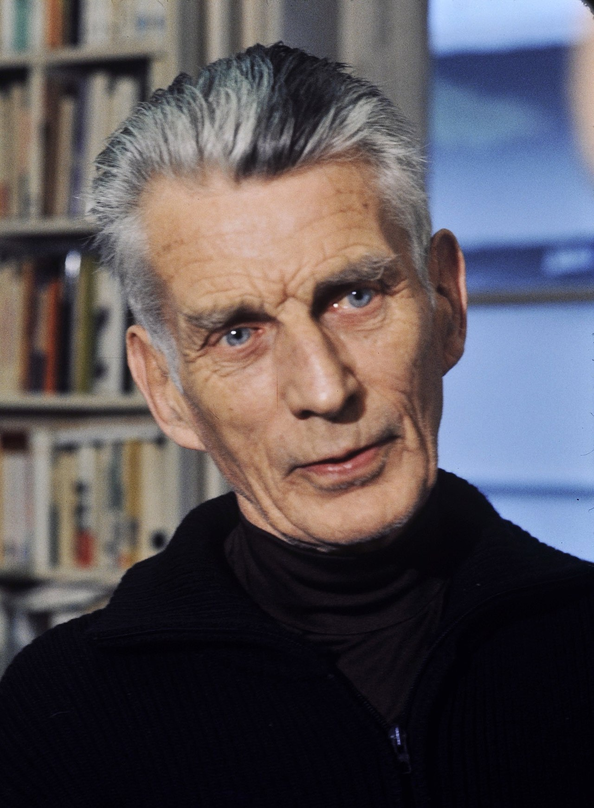
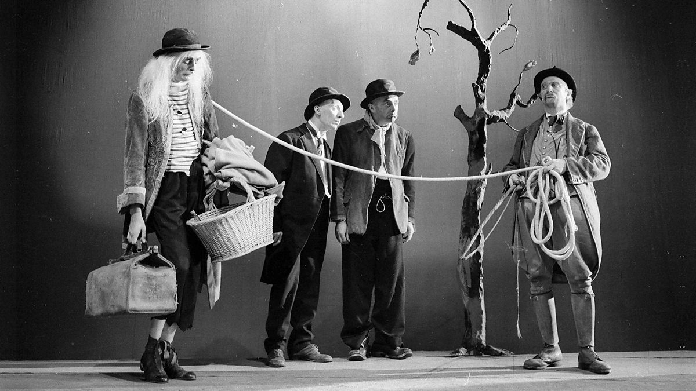
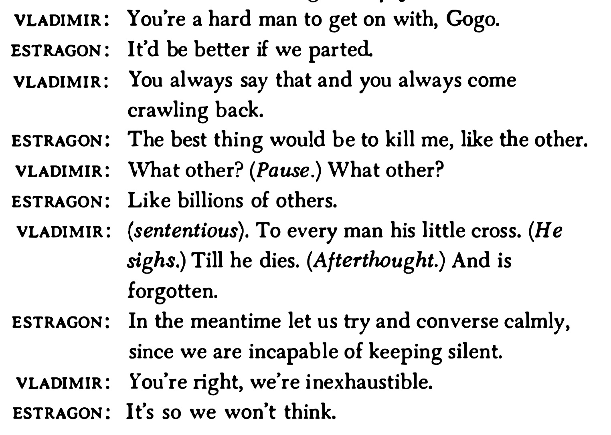
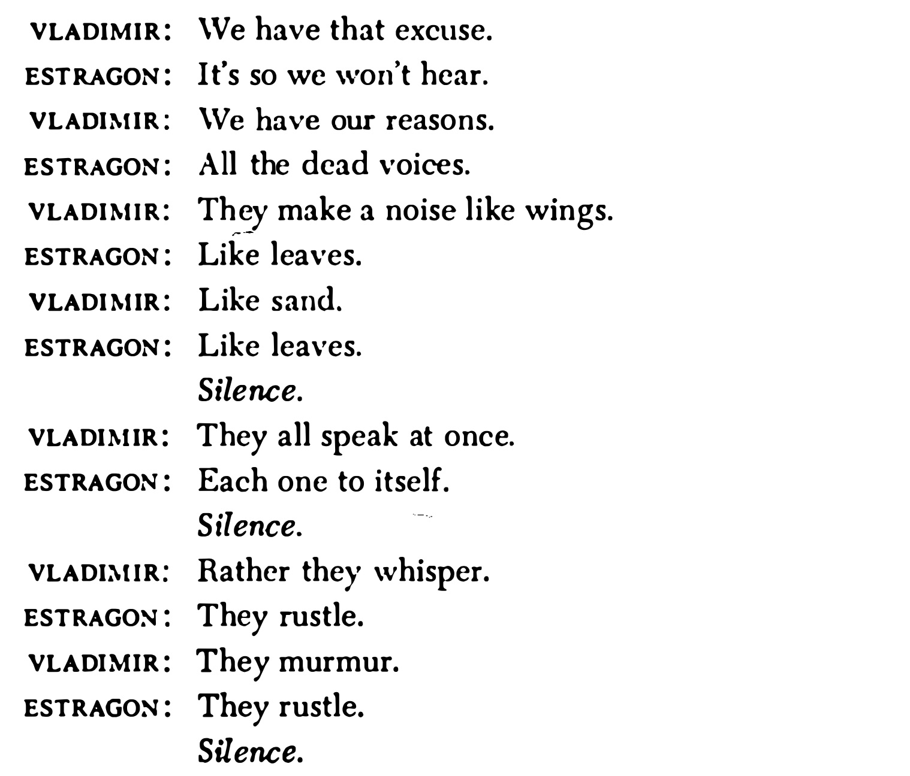
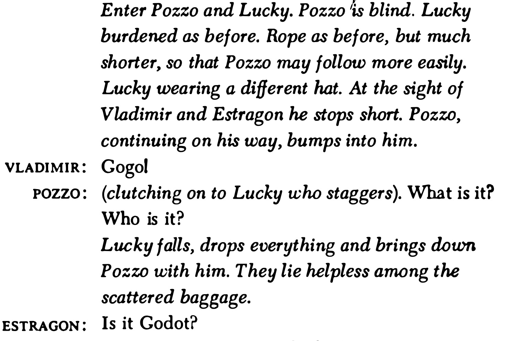
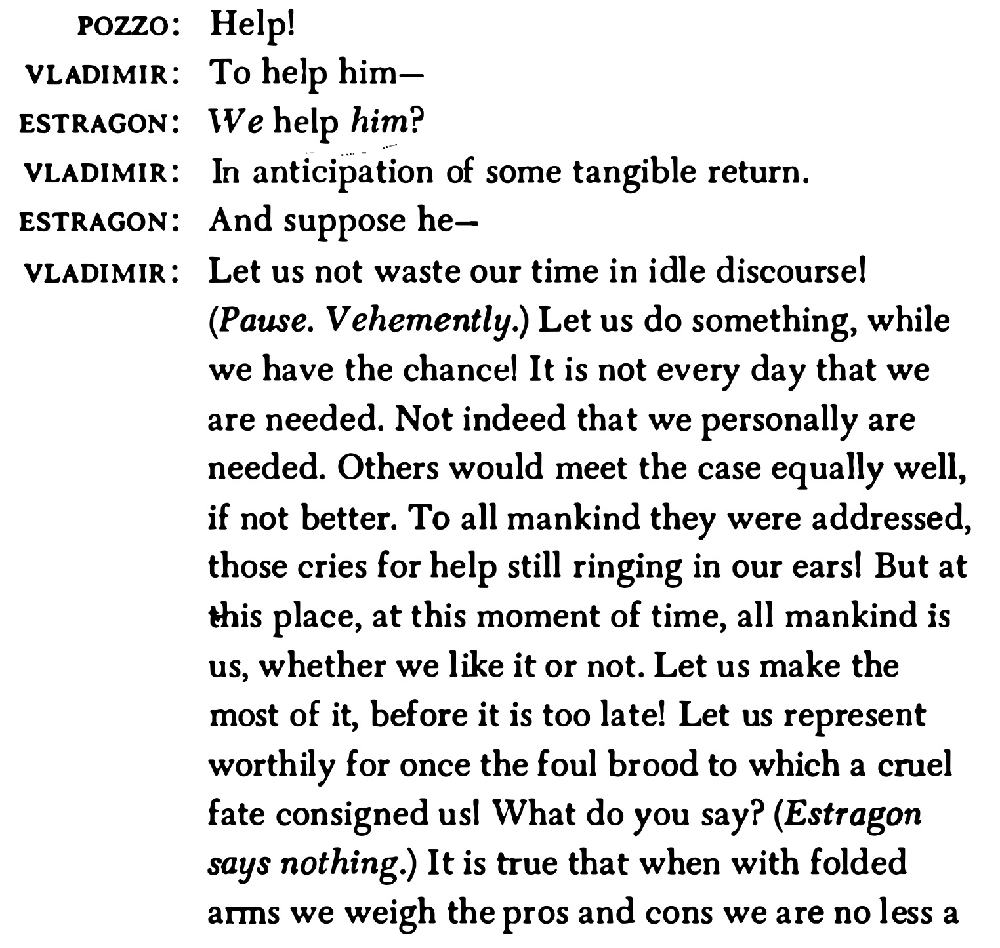
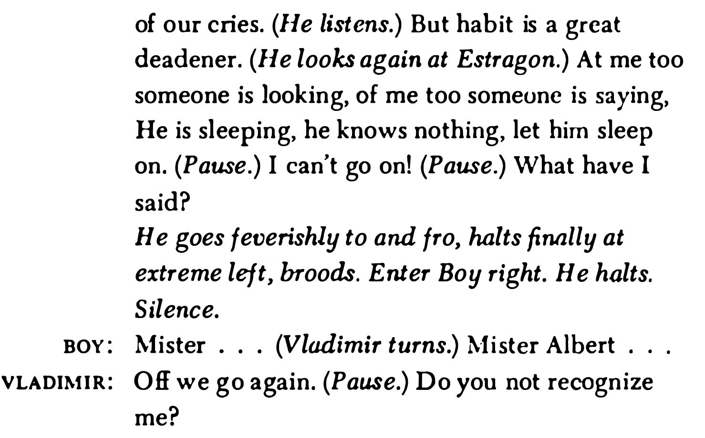

# Waiting for Godot
## Samuel Beckett

### English Literature V
Prof. Pedro Groppo (UFPB)

---

## Samuel Beckett (1906-1989)

- Irish writer, playwright, Nobel Prize laureate (1969)
- Wrote in English and French, translated his own works
- Associated with the *Theater of the Absurd*
- Sparse settings, repetitive dialogue, silences, focus on the limits of language
- *Molloy, Malone Dies, The Unnameable, Endgame, Murphy*

---

## Waiting for Godot (1952)

"A tragicomedy in two acts."

### Setting 
A lonely country road near a tree

### Characters
- Estragon ('Gogo') and Vladimir ('Didi') - two middle-aged men waiting
- Pozzo - a local landowner 
- Lucky - Pozzo's servant
- The Boy - messenger

They wait for someone named Godot, who never comes but promises to arrive "tomorrow"

---

|Traditional 20th Century Theater|Waiting for Godot|
|-|-|
|Modernism|Postmodernism|
|character psychology|(pastiche, fragments, parody, breaking apart traditional forms)
|
|deep self-reflection|No narrative arc|
|examination of the individual's inner world (cf. stream of consciousness)|no typical exposition|
|Chekhov, Ibsen, Strindberg|Beckett, Ionesco|
|character psychology|No climax/denouement
|
|Clear exposition|cyclical structure / diminishing spiral |

---

---

---

## Two personalities

### Estragon
- Usually played by a short, stocky actor 
- *"On the ground and belongs to the stone"* (Beckett) 
- More dreamy, instinctive man, absorbed by his own bodily functions and likely to respond viscerally to everything going on around him. 

### Vladimir  
- More contemplative, self-conscious about issues and ideas
- More restless and peripatetic
- *‘Vladimir is light [...] he is oriented towards the sky. He belongs to the tree.’* (Beckett) 
- Usually tall and thin, reaching for the sky

---

---

---

### The account of the crucifixion in Luke 23: 32–43

> One of the criminals who were hanged railed at him, saying ‘Are you not the Christ? Save yourself and us!’ But the other rebuked him, saying, ‘Do you not fear God, since you are under the same sentence of condemnation? And we indeed justly; for we are receiving the due reward of our deeds; but this man has done nothing wrong.’ And he said, ‘Jesus, remember me when you come into your kingdom.’ And he said to him, ‘Truly, I say to you, today you will be with me in Paradise.’

### Beckett to Harold Hobson

> I take no sides about that . . . I am interested in the shape of ideas even if I do not believe in them. There is a wonderful sentence in Augustine. I wish I could remember the Latin. It is even finer in Latin than in English. ‘Do not despair; one of the thieves was saved. Do not presume; one of the thieves was damned.’ That sentence has a wonderful shape. It is the shape that matters. (Hobson, p. 154)

---

## 'Godot'

> the name itself ‘is a trouvaille of the first order’, a lucky find or a godsend, ‘opening up several associations of ideas, through punning and analogy, in both English and French’. (Colin Duckworth)

* Godillot = hobnailed boot’ or ‘shapeless old shoe’; 
* Godasses = ‘military boots’
* Godailler = ‘to go pub-crawling’
* Goddam = slang for ‘an Englishman’
* Goder = ‘to pucker’, or ‘gather cloth into folds’, also slang for having an erection. 
* Godille = the word for ‘a scull’, or ‘small racing boat’, has a vulgar connotation: ‘to fornicate’

---

## 'Godot' 

* Godenot = ‘a juggler’s puppet’, ‘a joker’, ‘a misshapen little man’
* Godet = a popular cognac, but also ‘a wooden bowl’ or ‘mug’ (like the bowl of a pipe (smoked by Pozzo who carelessly refers to Godot as Godet) and a small glass of wine (which washes down Pozzo’s chicken)

---

---

---

---

---

---

---

---

---

---

---

---

---

---

---

---

---

---

---

---

---

---

---

---

---

---

---

---

---

---

---

---

---

---

---

---

---

---

---

---

---

---

---

---

---

---

---

---

---

---

---

---

---

---

---

