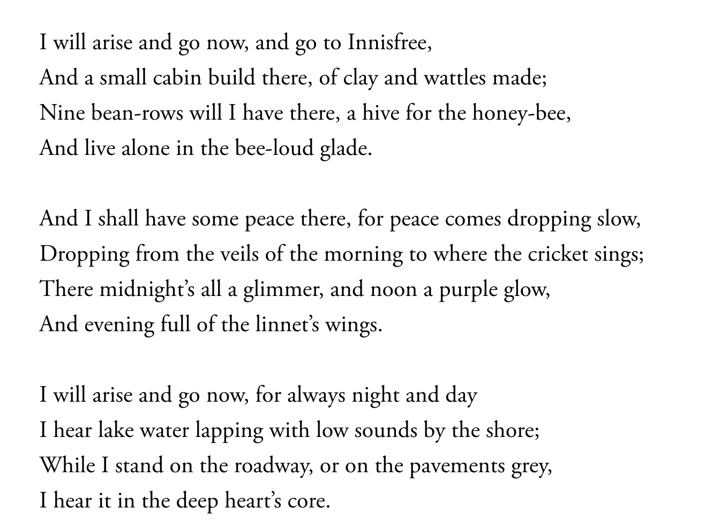
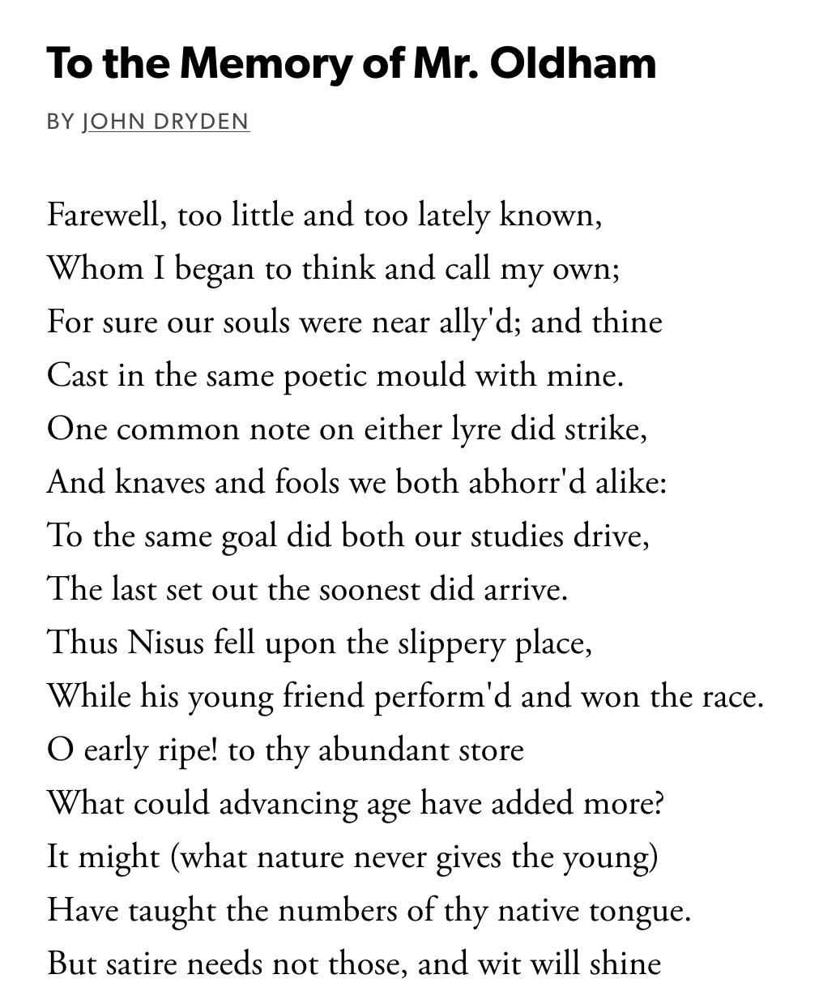
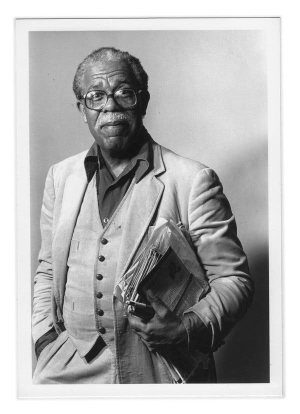
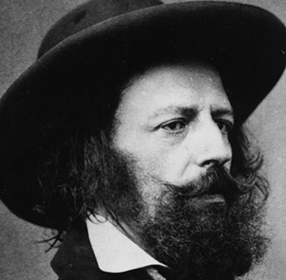
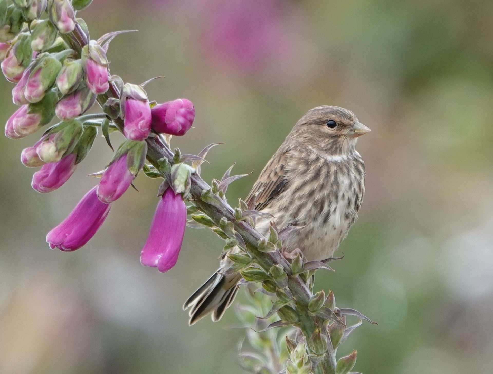

# William Butler Yeats, "The Lake Isle of Innisfree"

--- 

--- 

---

--- 

---

---

---

---

---

---

# Innisfree

---

---

# Lake Isle

---

---

# Wattles

---

---

# Bean row

---

---

# Glade

---

---

# Bee-loud

---

---

# Linnet

---

---

# Heather

---

---

---

---

---

---

---

---

---

---

---

---

---

---

---

---

---

---
