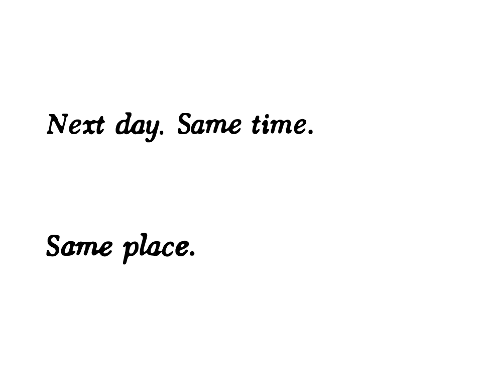
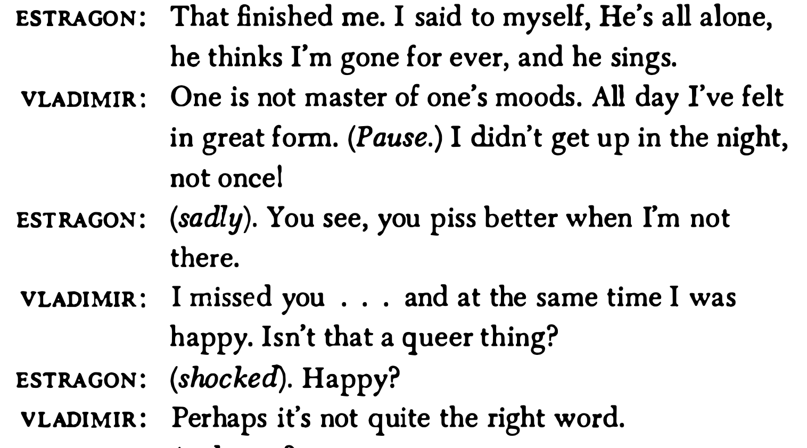
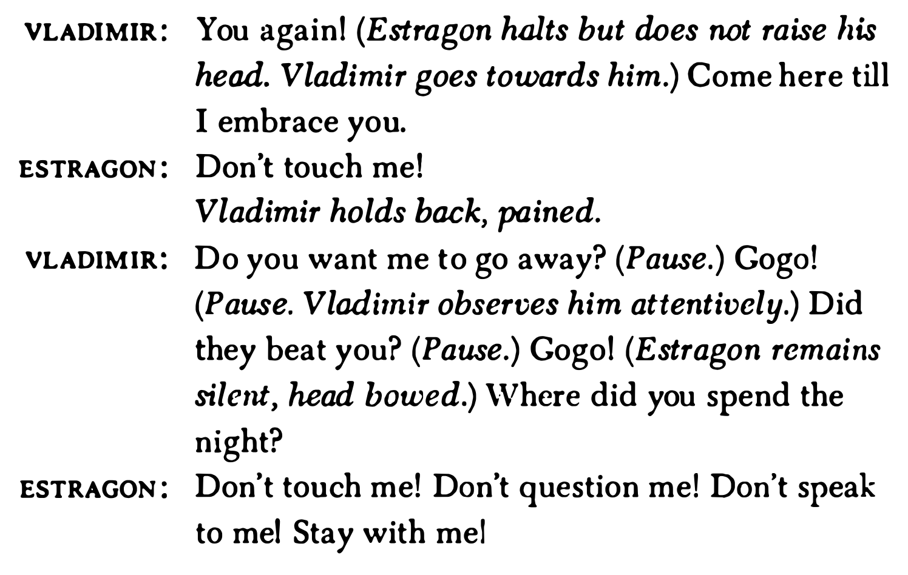
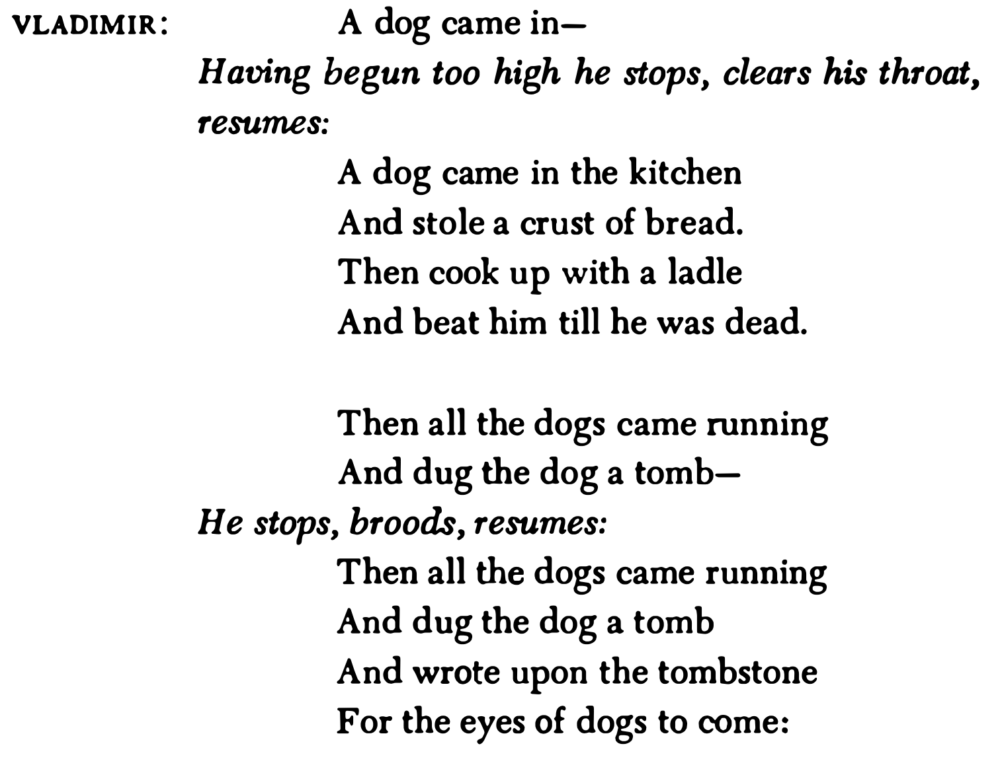
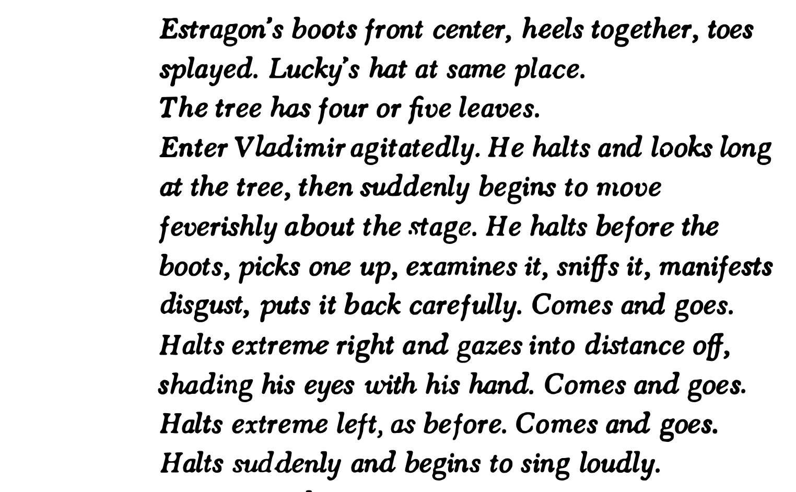
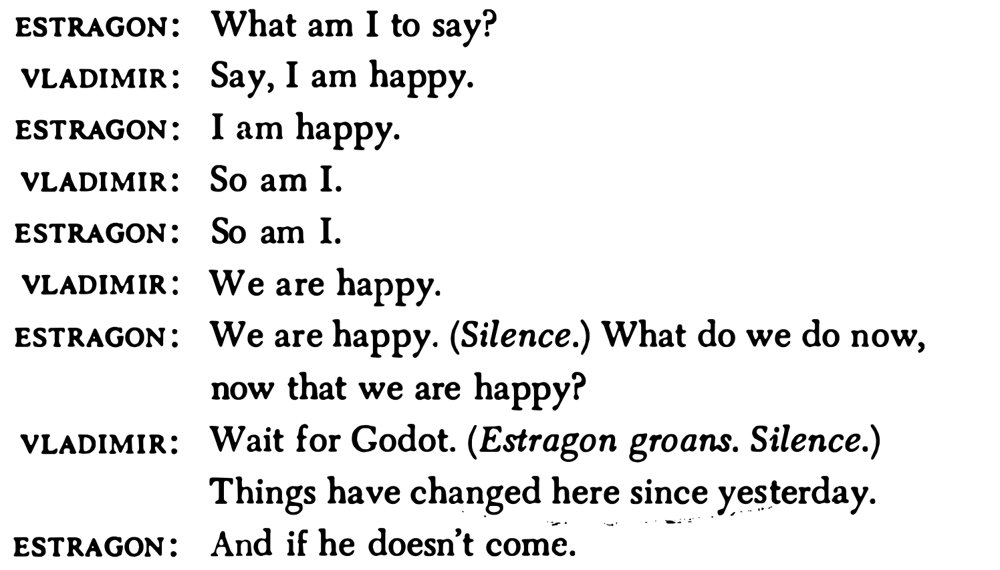
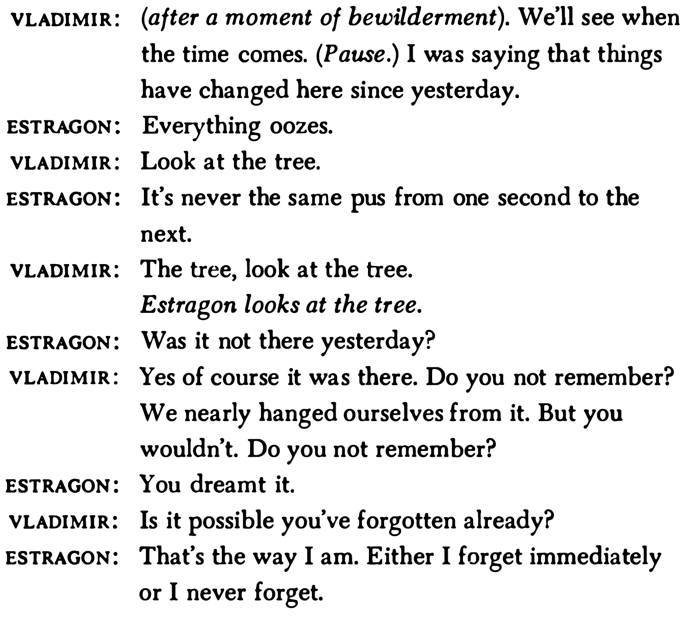
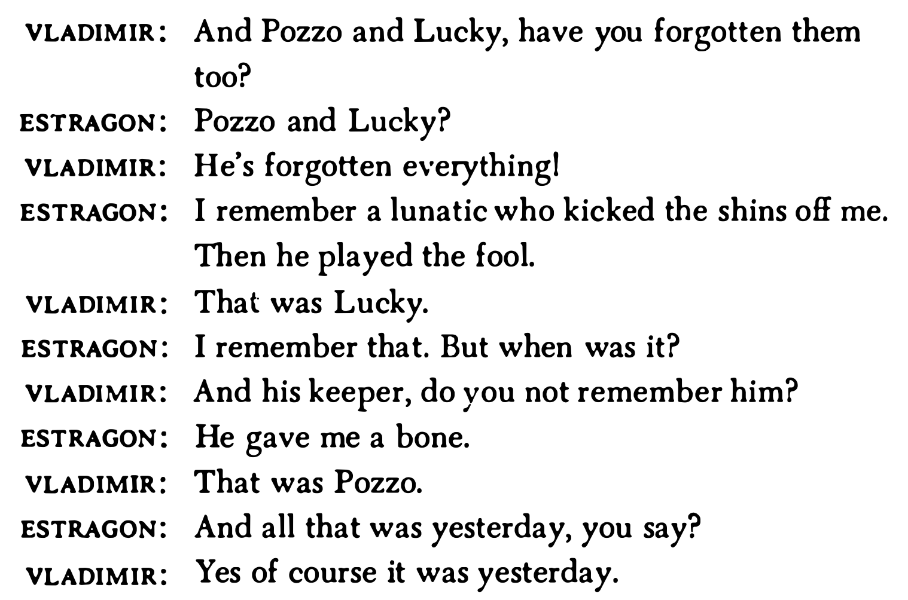
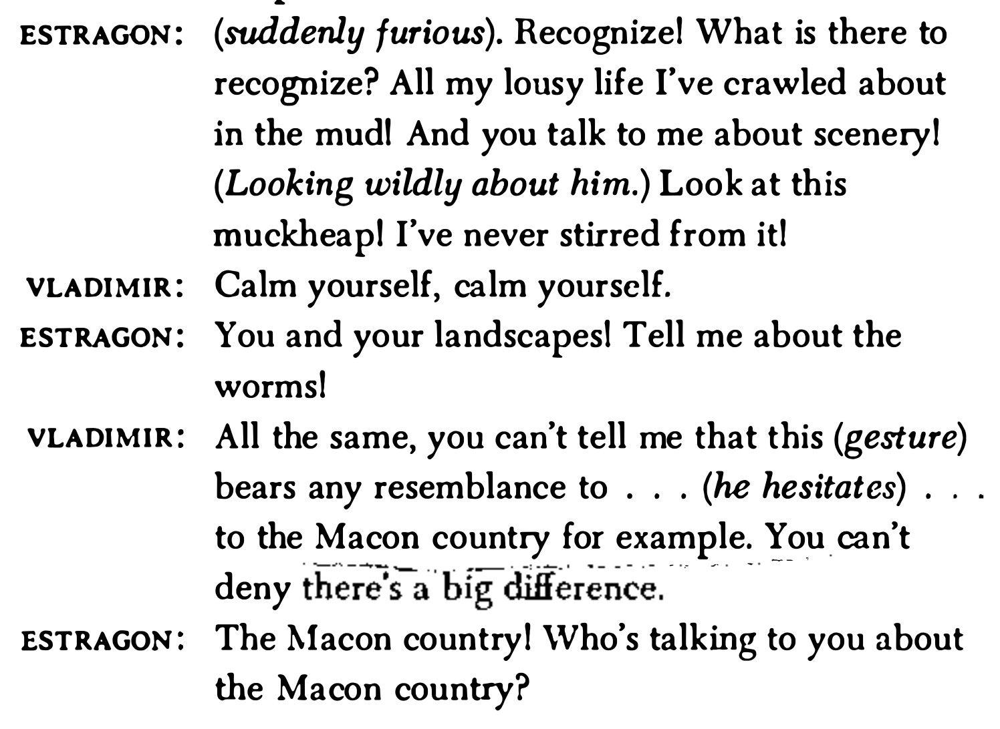

# Waiting for Godot

---

## Synopsis

Setting: A lonely country road near a tree

Characters: 
- Estragon ('Gogo') and Vladimir ('Didi') - two middle-aged men waiting
- Pozzo - a local landowner 
- Lucky - Pozzo's servant
- The Boy - messenger

They wait for someone named Godot, who never comes but promises to arrive "tomorrow"

---

## Structure

> "Nothing happens, twice" - but this misses the point

Act 1: Tree is bare, characters meet Pozzo and Lucky, boy brings message
Act 2: Tree has sprouted leaves, similar events but with variations
- Pozzo is now blind, Lucky is mute
- Patterns repeat with differences

The play relies on *repetition with variation* rather than traditional dramatic arc

---

## Theatrical Conventions & Innovation

- In medias res: "So there you are again" - assumes previous history
- Meta-theatrical: Characters seem they're in a theater
- Time: Theatrical rather than realistic
- Questions: 24% of all utterances end in question marks

### Influences
- Music Hall: Cross-talk routines, straight man vs funny man
- Circus: Pratfalls, hat-swapping, physical comedy
- Vaudeville: Individual turns and double-acts

---

## Dialogue

### Communication Patterns
- Misunderstandings are pure vaudeville
- Characters pursue independent lines of thought
- Stichomythia: Rapid alternation mimicking music-hall routines
- Modulates from "banal to metaphysical and back again"

### Example
Estragon: "There's man all over for you, blaming on his boots the faults of his feet."
Vladimir: "This is getting alarming."
Estragon: "One of the thieves was saved."
Vladimir: "It's a reasonable percentage."

---

## Character Dynamics

### Vladimir & Estragon
- Vladimir: Intellectual, loquacious, "feminine" personality
- Estragon: Intuitive, taciturn, "masculine" personality
- Together for 50 years - bicker like an old married couple
- Symbiosis: Need each other to escape monotony of waiting

### Pozzo & Lucky
- Master-servant relationship with sadomasochistic undertones
- Pozzo needs audience and Lucky's services
- Lucky needs a master
- Transformation: Act 2 shows Pozzo blind, Lucky mute

---

## Visual and Physical Elements

### Pantomime as Foundation
- Silent episodes establish physical reality first
- Feeling comes before language
- Man struggling against despair, thinking about thinking

### Key Props
- Boots (Estragon) vs Hats (Vladimir)
- Tree: Central symbol - bare in Act 1, leafy in Act 2
- Rope: Lucky's bondage, Estragon's fear of being tied

### Tableaux
Beckett called these "Wartestelle" - waiting points where "silence threatens to swallow everything up"

---

---

. True. (He buttons his fly.) Never.png>)

---

---

---

## The account of the crucifixion in Luke 23: 32–43

> One of the criminals who were hanged railed at him, saying ‘Are you not the Christ? Save yourself and us!’ But the other rebuked him, saying, ‘Do you not fear God, since you are under the same sentence of condemnation? And we indeed justly; for we are receiving the due reward of our deeds; but this man has done nothing wrong.’ And he said, ‘Jesus, remember me when you come into your kingdom.’ And he said to him, ‘Truly, I say to you, today you will be with me in Paradise.’

---

## The Two Thieves 

- The only version in the Gospels in which a thief is saved
- ‘Of the other three two don’t mention any thieves at all and the third says that both of them abused him.’ 
- Two different reactions
- "return the ball" -- speed of a game

---

---

---

- Swiftness and lapidary quality of this dialogue paradoxically enhances both the seriousness and the comedy
- Seriousness comes from an imitation of the familiar *stichomythic verse of Greek drama*
  - Two characters speak passionately and sometimes contentiously in alternate lines of verse.
  - Sharp retorts are part of this kind of debate in which one speaker tries to gain an advantage over the other

---

## Two personalities

### Estragon
- Usually played by a short, stocky actor 
- *"On the ground and belongs to the stone"* (Beckett) 
- More dreamy, instinctive man, absorbed by his own bodily functions and likely to respond viscerally to everything going on around him. 

### Vladimir  
- More contemplative, self-conscious about issues and ideas
- More restless and peripatetic
- *‘Vladimir is light [...] he is oriented towards the sky. He belongs to the tree.’* (Beckett) 
- Usually tall and thin, reaching for the sky

---

---

---

---

- Two halves: complementary friends, individuals in a marriage, poles of a mind/body dichotomy, or figures who are associated with and may even connect the earth
and the sky
- Beckett's Schiller Theater production: dressed to suggest that each supplies what is lacking in the other to make a complete whole
  - E.g. Vladimir may wear striped trousers, which fit well, and a black jacket, which is too small for him, because it had once belonged to Estragon. Estragon wears well-fitting black trousers, and Vladimir’s old striped jacket, which is too big for him.

---

- Vladimir x Estragon = same number of letters; Pozzo x Lucky
- Interlocked, joined in a complex sado-masochistic relationship
- V: neurotic; E: placid intuitive type; P the bullying extrovert; L the timorous introvert
- V sympathizes with Lucky, and E has fellow feeling with Pozzo
    * E is afraid of being tied, L is tied
    * V kow-tows to authority, P asserts it forcibly

---

## Beckett's reply to Harold Hobson
 
> I take no sides about that . . . I am interested in the shape of ideas even if I do not believe in them. There is a wonderful sentence in Augustine. I wish I could remember the Latin. It is even finer in Latin than in English. ‘Do not despair; one of the thieves was saved. Do not presume; one of the thieves was damned.’ That sentence has a wonderful shape. It is the shape that matters. 

- Not a question whether a thief was actually saved or damned but rather the perception that dualities are at the heart of what human beings think and feel
- So yes, *Waiting for Godot* is a play about relationships
  - At different times two halves of a couple: married, single, external, internal, separating, and coming back together
  - Vladimir: ‘at this place, at this moment of time, all mankind is us, whether we like it or not’

---

## Rituals and routines

- Basic structural unit is not the *scene* but the self-contained *routine* or ritual
- Our couple blends the cross-talk and patter of the vaudeville and music hall with the speculative vocabulary of philosophical discourse
- 
- . But if each routine stands
sturdily by itself, each is related to the others by what might be called
the principle of accrual, rather than by the more familiar theatrical
patterns of progressive plot, developing character, or the rise and
fall of an action featuring a notable climax or denouement.
In the first act, for instance, every routine starts with a brief
pantomime; indeed, this is the distinctive demarcation separating
the discrete units. To open, the panting Estragon is seen sitting on
the low mound trying several times unsuccessfully to take off his
boot. Minutes later, after the introductory greetings, the brief clash
about pain, and Estragon’s surprising success in removing the boot,
Vladimir silently engages in a meticulous inspection of the inside
of his hat. A third routine – following the exchange about the two
thieves – begins with Estragon in pain limping off to the left and then

* after a choreographed scene featuring Vladimir staring into his hat and Estragon into his newly removed boot
* The nature of man - a creature who blames on his boots the faults of his feet
* “One of the thieves was saved”, ‘a reasonable percentage’ / Estragon: ‘what’?
* Possibility of repentance; but what they have to feel contrite about? — doesn’t go into detail
* ‘Our being born’?
* Physical x spiritual — Vladimir walks with short, stiff strides, with legs wide apart
* Pain urinating — strangury


* Laughter is a mode of expression that isn’t permitted anymore; smiling is too modest a response to the dilemma

Vladimir laughed originally at the prospect of trying to repent
one’s having been born, an obvious contradiction in terms if one
believes in original sin. Here, though, laughter becomes a mode of
expression that for an unstated reason isn’t permitted any more.
Only smiles are allowed, and they are not the same thing, theApproaching the play 29
implication being that the situation in which the two men now
find themselves is too serious a matter for laughter, while smiling is
too modest a response to the dilemma. Extending the quirky logic of
this a bit further, we end up perceiving that the situation of Vladimir
and Estragon might justifiably call for a more substantial response,
and that in fact is what Vladimir is leading up to.
His subsequent gloss on the story of the two thieves takes as its
main text the account of the crucifixion in Luke 23: 32–43, the most
pertinent passage of which reads as follows:

---

---

---

## Changed conventions: What we don't have

- No **plot** (beginning, middle, end; exposition, twists and turns of intrigue, crisis and unravelling)
  - Vladimir and Estragon try to invent a plot, 'waiting for Godot'
  - Only a situation: two men loitering with intent, under a tree
- No **structure** (organization of the action into three or five acts, with scenes advancing in logical sequence, entrances and exits motivated and the whole wrapped up at the end)
  - Only tableaux with gaps that don't really seem to move with purpose
- **Dialogue** is enigmatic and leads nowhere and none of the characters really seems to expect it to

---

## Changed conventions: What we do have

- Activity starts from a minimal point, develops and proliferates, and then dwindles down again, to be followed by a pause and then a fresh beginning on a new link.
- Something crops up - an object, a person, or even idea - that is a pretext for doing. 
- Surprise and disorientation are built into the structure and experienced by characters and audience

---

## Possible divisions

- Each act contains the same three points
  - before Pozzo and Lucky arrive; 
  - with Pozzo and Lucky; 
  - after, including the coming of the Boy and the fall of night. 
- Beckett (Schiller theater 1975) - Act 1 has 6 scenes and Act 2 has 5.

- Circle: closed, endlessly repetitive nature of the kind of life these characters are caught in. 
- Second act doubles the first = endless series of empty echoes (see Vladimir's monologue at the end foreseeing tomorrow's rehearsal of the same old thing)

---

---

- Vladimir ponders on Estragon dreaming, re-enacting in his dreams the repressions, fears and failures of his waking life, and wonders if someone is watching him as he watches Estragon. 
- There is not just the one simple circle of history being enacted on stage, but a whole series of circles, in many dimensions, countless closed and enclosing perspectives focused on the simple action Vladimir sees.
- There are no fundamental realities to be pinned down. There is only layer on layer of multiple, changing perceptions, which can never be grasped in a single vision

---

- In the human perspective, things get a little worse each day. 
- In Act 2, there is less of everything: carrots, fresh radishes, vision, speech, and time. 
- As the actors come closer to the death that is the underlying fact of all life, everything seems to speed up. 
- Here again the structure of the play itself presents an important concept: the time we know, like all the reality we know, is subjective. - The nearer we are to the end, the faster it seems to slip through our fingers.
- The structuring principle of the double runs all through the text.
- Sometimes there is straight duplication. Gesture or mime repeat or underline verbal statements. Events are duplicated. Everything has an echo. This technique has a critical function. An observer cannot make sense of something without something else to compare and contrast it with. Duplication gives a critical perspective and with it the chance to think and make judgements about the doubled material.

---

More often than not, the doubling produces contrasts, oppositions,
and contradictory meanings. The drama as we watch falls into
ambiguity, double meaning. Everything seems to come in pairs:
positive and negative, body and spirit. The drama reproduces life as
we have learned to see it, and we have learned from our teachers,
theologians and philosophers to see double.
In his book on Proust, Beckett admired Proust's perception of the
way all things seem, to the human observer, to fall into two
contradictory parts. He thought it the great achievement of Proust
that he managed, at occasional, privileged moments, to join the
doubles together again through the magic of art, so that a hero who
passes most of his life in a sense of anguish, anxiety and incomplete-
ness in the end experiences the liberating relief of finally being whole:
'Thus at the end as in the body of his work, Proust respects the dual
significance of every condition and circumstance of life' (Proust,
p.69).

---

Feeling torn in two and longing to be whole is not a necessary part
of being human. We experience it in our culture as a hangover, be it
46
from rationalism, Romanticism, or Christianity. Bec~ett's drama
makes no comment on the truth or otherwise of our symptoms. All
he's interested in is making us aware of the shape they have come in.
When critics say that the drama of the two thieves is the basis of this
play, it is not because there is any hard information about salvation or
damnation to be extracted from that episode. It is because that
'either-or' pattern is the only way we know how to give form to our
struggles to find a meaning. 

---

> I am interested in the shape of ideas even if I do not believe in
them. There is a wonderful sentence in Augustine. I wish I could
remember the Latin. It is even finer in Latin than in English. 'Do
not despair; one of the thieves was saved. Do not presume; one of
the thieves was damned.' That sentence has a wonderful shape. It
is the shape that matters. (Quoted in Harold Hobson, 'Samuel
Beckett, Dramatist of the Year', International Theatre Annual,
No 1., London, John Calder, 1956, pp.153-55)

---

Ruby Cohn has listed the incidence of doubling in Godot in her
article in Journal of Beckett Studies. There are two acts, two days,
and two similar sets of incidents within them. There are two couples.
Each couple is a unity of opposites. One'tends more to the intellect,
one tends more to the body. (The clown character they all share is
itself traditionally a double blend of the pathetic and the grotesque.)
The doubling is given physical shape on stage. In Beckett's own
Schiller Theater version, the link within each couple was expressed
by costume. Vladimir and Estragon both wore hats and dinner-suits.
In Act 1, Vladimir had a dark coat and striped trousers while
Estragon had the reverse; in Act 2, vice versa. Lucky's trousers and
Pozzo's jacket were both grey; Lucky's jacket and Pozzo's trousers
were brown check. (The Boy wore a plain light shirt and trousers,
presumably to indicate that he was still a relatively blank sheet.) Tilll
thin Vladimir contrasted with short plump Estragon, but both walked
in step, fell in the same way, and rose simultaneously. Even the
object-couple, tree and stone, mirrored the same pattern, tall and
squat, organic and inorganic. Cohn points out: 'The doublet is
Beckett's main scenic rhythm'.

---

She adds though that triplets are also an important part of the
structure. (Any lyrical or rhetorical statement, aiming to persuade,
from a love song to a speech by a politician or a general, will give
evidence of how basic to language exchanges the triplet pattern is.)
There are three degrees of light in each act (twilight, darker twilight
after Pozzo and Lucky leave, and moonlight after the Boy goes).
47
When Beckett directed Lucky's speech, he specified three speeds
(slow, speedup, frenzy) for its three-part statement (God, Man,
Nature). Between them, these double and triple rhythms carve shape
into the otherwise formless anguish of waiting for Godot.

---

One final point. Audiences, well-primed by critics, are now able to
understand that Godot is a very carefully structured play. The
original watchers, confronted with unfamiliar patterns, were forced
to struggle to make sense of a language they hadn't yet learned and
that struggle was itself part of the meaning of the play. There is a
pleasant irony here, that afflicts all avant-garde theatre. Eventually,
the techniques a dramatist uses to challenge his public's habits and
conventions themselves become familiar and automatic, and lose
their subversive force. As a reviewer commented when Roger Blin
revived the play at the Theatre de France in 1961

---

> This is theatre marked out with a compass and built with a
plumb-line ... Eight years ago ... this was not as perceptible.
Construction was effaced by surprise. Surprise is dead, what
remains is a somewhat too methodical arrangement. (Pierre
Marcabru, Arts-Spectacles, 10-16 May 1961, cit. and tr. The
Critical Heritage)

---

## Characterization

Shaped as they are by the same culture, the characters share a
number of common features. Each is split by the same contradiction.
On the one hand, he knows himself chiefly as a separate, isolated
individual. At best, he is indifferent to other people's needs:
Vladimir and Estragon consistently disregard each other's suffering,
preoccupied with their own pain. At worst, he consciously refuses to
part with anything of himself or his possessions. Pozzo declares
himself owner of all the land about, conceding others may pass
through on the road but it's 'a disgrace'. He hoards his food in his

---

picnic basket, giving away only the bones. He isn't self-possessed, in
fact, for he depends on Lucky for his place in the world; but he says
he is, and that authoritative self-confidence gives him his power over
others. The retreat into self is also a defence mechanism, a product of
fear of others which to a large extent would seem to be justified by
experience.
On the oth~r hand, each is driven to form some kind of relationship
with others, by need, greed, and sometimes by compassion. A
solitary existence is a material impossibility. But relationships can be
of very different kinds. Pozzo and Lucky, master and slave, are
joined artificially and by force, with their rope, while the partnership
of Vladimir and Estragon, though not a voluntary one, seems to be
based on genuine mutual need and relative equality.

---

Even so, all the relationships between characters are to different
degrees based on the exploitation and abuse that Beckett observed in
a Europe occupied by Hitler and an Ireland occupied by Britain and
the Churches. Vladimir and Estragon make use of each other to ward
off the fear of loneliness or the unknown. But they also share each
other's fears (huddling together cringeing at the sound of Pozzo's
approaching cry, standing 'back to back like in the good old days' to
protect their space against imagined terrors). Together they tum
anxiety into something useful, making conversation to make the time
pass. In the Pozzo-Lucky pair, there is no co-operation. Lucky is the
paid entertainer who qoes all the work, while Pozzo takes all the
credit.
Pozzo's attitude is infectious. Vladimir and Estragon quickly learn
to despise Lucky and enjoy watching him forced to perform for them.
Vladimir even wants to play-act their degrading relationship after-
wards, though Estragon resists. The symptoms appear in them of the
violence that exploitation thrives on and breeds. Pozzo's rope scars
Lucky's neck; Lucky kicks Estragon; Estragon kicks Lucky, when
he's down. As Estragon comments in Act 2, after the pair have gone,
crucifying one's neighbour seems to be normal practice.

---

Poverty, scarcity and lack have left their mark on all the characters
except the Pozzo of Act 1. And things are getting worse. In Act 2,
even Pozzo is under threat. This in itself is a cause of their fear,
selfishness and violence. Commodities - things - are a vanishing
resource, to be envied and fought over. Food, the basic material of
survival, is a doubtful quantity. In Act 1, Pozzo gets roast chicken,
while the others are lucky to share the bones. Vladimir supplies
Estragon from a scanty store of vegetables that shrinks in range and
quality as the day goes on. The objects (pipe, whip, watch) that are
the signs of Pozzo's wealth and status are mysteriously lost. The
49
characters' own physical and mental faculties are in decay. Estragon
has one sore foot in Act 1 and two in Act 2, not to mention the wound
on his leg where Lucky kicked him. Lucky, practically worn out when
he first appears, is even worse in Act 2 and dumb to boot, while
Pozzo has gone blind. No one is very firm on his feet at any point and
in Act 2 all end up collapsed in the same heap. Little confidence can
be placed in memory and the powers of reason and even less in
language, whose decay is, perhaps, most frightening of all.

---

The two principal figures, Vladimir and Estragon are not heroes of
the drama by any classical definition. This is a play about the human
condition, but it is not cast in the mode of high tragedy that
convention would lead us to expect. Beckett calls it a 'tragi-comedy'.
Its matter is the ordinary stuff of everyday life and its characters the
common men of modern times. Getting by is their major preoccupa-
tion and salvation for them means simply food, sleep, shelter and
some relief from pain and fear.
They are not tragic heroes but pathetic clowns. Like the tramps in
whose guise they are often portrayed, they are shabby (or rather,
shabby-genteel) survivors, permanently poised, squirming and tee-
tering, on the edge of disaster . Yet in their own context they can
seem heroic and even admirable, just like Chaplin or like Laurel and
Hardy, those other clowns in modern dress. Given their limits, and
the limits of the muck-heap which is their material and cultural
inheritance, they do well to snatch the little they manage from the
mess. Spiteful, selfish, opportunistic, they show nevertheless redeem-
ing flashes of tenderness and compassion and their perseverance is
impressive even if the cause to which it is devoted is absurd.

---

Roughly speaking, they present what Western philosophy, since
Rene Descartes, the seventeenth-century founder of modern ratio-
nalism, has believed to be the two opposite but complementary sides of
the individual human subject: matter and spirit, body and mind. The
tall, thin Vladimir fits the stereotype of intellect, restlessly articulat-
ing, questioning, analysing, keen to pin labels, fit facts into catego-
ries, hasten to conclusions. When Estragon asks what kind of tree
theirs is, his ignorance is first honest and then authoritarian; what he
doesn't know he'll make up, rather than admit himself at a loss: 'I
don't know. A willow.' Estragon, who declares himself closest to
'sweet mother earth', is more passive, slower, and drawn to silence
and sleep rather than speech. Content to accept what is, he figures
the version of the body we have learned from Descartes. (Beckett had
studied Descartes' work closely, and also that of his Belgian disciple
Arnold Geulincx.) Estragon is almost completely dependent on the
activity of the mind for his n~urishment and guidance. He takes his
50
lead from Vladimir - not all of whose ideas, it should be clear, are
good ones. The intellect is the major source of damage and despair. It
is fortunate that the body puts up a resistance to it, and perseveres in
the face of intellectual desperation.

---

From the audience's point of view, the two characters only exist as
a pair. Apparently they are separate during the night, but why and
how we don't know. Action that takes place off-stage, beyond the
limits of our perception, is simply not a reality for us and we can't
comment on it. Beckett deliberately points the mystery of the way
body and mind relate, in order to make his audience aware of the
limits of their knowledge. We have working hypotheses to explain
how humans are constructed and how they behave, but we must
recognise that these are only inherited guess-work.
There are other indications in the way the characters are cons-
tructed that the simple body-mind distinction, like so many of the
simple fixed oppositions we have to work with, may not be a perfectly
satisfactory concept. There is no way we can know anything definite
about identity. The human matter we observe is in a constant
state of flux, and we ourselves, the observers, are constantly changing
and changing our position. And we look at our subject through a frame
of assumptions and prejudices we can never be fully aware of. Human
identity is not a matter of fixed relationships but of oscillating
relationships between an unknowable 'self' and other points 'outsi-
de'. The image of this uncertainty is Pozzo, lying blind and fallen,
answering equally to all names his ignorant interlocutors place on
him: Cain and Abel, guilty and innocent, executioner and victim. As
Estragon remarks: 'He's all humanity' (p.83).

---

Vladimir and Estragon are what Ruby Cohn has called 'symme-
trical opposites', opposite and yet alike - a point made clearly in the
costumes Beckett gave them in his 1975 Berlin production (see
above, p.46). Between them, they share all the contradictions of
human nature. When Lucky falls (p.22), the stage direction says both
are half eager, half afraid to go to his help. Dramatically, this has to
be simplified to be seen, so Vladimir moves forward and Estragon
pulls him back, followed by the appropriate phrase for each. This
does not necessarily mean that intellect is always altruistic and body is
always selfish. The rough distinctions are there, but they are not
absolute. A reader could cover up the names on the page and have
some difficulty guessing who had said what. It is seeing the characters
physically, on stage, with all their differences exaggerated, that
makes them easier to tell apart. Estragon can be brusquer, and
ruder - though interestingly, this shows less clearly in the English
'.
51
version, where some of his replies are sharper, wittier and more
serious than the original French

---

They have their own roles, but sometimes they swap them.
Estragon is passive and sleepy. When Vladimir (p.69) looks for an
'occupation' or a 'recreation' to pass the time, Estragon prefers a
'relaxation'. When Vladimir suggests 'exercises' , 'elevations' ,
'elongations', 'to warm us up', Estragon contributes 'movements',
'relaxations', and again 'relaxations', 'to calm us down' (p.76). He
opens the play with the first 'Nothing to be done' (p.9), against which
Vladimir, the man of reason, argues in favour of effort ('I resumed
the struggle'). Yet it is Vladimir who at the end of the sequence twice
reiterates 'Nothing to be done' (p.ll). And Estragon whose suddenly
insistent probing shatters Vladimir's calm confidence. Is that a tree,
or a bush? Were they really in the same place yesterday? Vladimir
grumbles: 'Nothing is certain when you're about' (p.14).
Estragon, as critics point out, has bad feet, and they oppose this
physical weakness to Vladimir's intellectual uncertainty. But Vladimir
has bladder trouble, equally physical. Both have bodies that stink.
Some critics have triumphantly commented that Estragon stinks from
his feet (physical) and Vladimir from his mouth (speech, therefore
intellectual). As Vladimir indignantly points out, his breath smells
because he eats garlic for his kidneys' sake (p.17) - his problems too,
then, are really physical. Pozzo also stinks, from a place whose
symbolism no one has yet analysed, sickening even Estragon ('Who
farted? ... It's revolting!' (p.8l». All humans stink, but the masters,
it seems, stink more than most. All humans are rooted in a
fundamentally material universe.

---

Estragon was once a poet, as should be obvious, he says, from his
rags (p.12). He still has dreams in his sleep. Pushed to it by
Vladimir's unexpected failure to give a lead, he can still create new, if
unexciting, things to do:
ESTRAGON: Tell me what to do.
VLADIMIR: There's nothing to do.
ESTRAGON: You go and stand there. [He draws Vladimir to
extreme right and places him with his back to the
stage.] There, don't move, and watch out. (p.74)

---

In short, our whole notion of character is built on a very easy
opposition (body and spirit) which is not completely true and can lead
us into gross misperceptions. Thinking by opposites is too simple, and
52
often wrong. It is Estragon who (intelligently) raises the point, as he
chews on his carrot:
ESTRAGON: Funny, the more you eat the worse it gets.
VLADIMIR: With me it's just the opposite.
ESTRAGON: In other words?
VLADIMIR: I get used to the muck as I go along.
ESTRAGON: [after prolonged reflection]: Is that the opposite?
(p.2l)
Seeing things as opposites is just a habit, which Estragon is right to
challenge. If the characters, and the audience, could get used to
putting their thoughts into something other than these simple boxes,
something different might perhaps be said.
Pozzo, to the disappointment of the two friends, is not their Godot
(p.22). It might be said he is Lucky's Godot, for he serves the same
function for Lucky as Godot does for Vladimir and Estragon: he
gives him something to do in return for his patronage. If Vladimir and
Estragon could view their situation with the distance that we have, as
audience, they might draw some useful lessons about the kind of
patronage and protection a Godot will give.
Nor, as some critics have suggested, is Pozzo God, although he is
happy to be treated as a divinity by lesser mortals:
POZZO: You are human beings none the less. [He puts on his
glasses J. As far as one can see. [He takes off his glasses. ] Of
the same species as myself. [He bursts into an enormous
laugh.] Of the same species as Pozzo! Made in God's
image! (p.23)

---

